# Guidance for Preparation

## Table of Contents

[TOC]

## Learning Objectives

+ Understand the project's learning requirements.
+ Set up a .NET development environment.
+ Understand the assignment requirements and submission process.

## Project Overview

### Sections

This project uses cloud-service log analysis as its setting and teaches the knowledge required for .NET development through the .NET technology stack. It has three main parts:

+ **Preparation:** Set up the environment and learn the assignment requirements and submission process.
  + `00-prepare`
+ **Basic features:** Become familiar with fundamental syntax and APIs. These sections are relatively easy, have clearly constrained solutions, and offer limited room for independent design. Their main engineering goal is to establish a working foundation for the project.
  + `01-basic`
  + `02-multithreading`
  + `03-async-grpc`
  + `04-avalonia`
+ **Advanced tasks:** Practice independent exploration and learning. These tasks impose fewer requirements and leave substantial freedom in the solution. Their main engineering goal is to let you customize the application and make it your own.
  + `05-advanced`

### Notation

The project uses identifiers in the form `Xx.y(.z(.w))`:

+ `X` identifies the kind of item:
  + `T`: **Task** or **Test**.
  + `S`: **Step**.
  + `Q`: **Question**.
+ `x.y(.z(.w))` is the item number. Arabic numerals (`1`, `2`, `3`, ...) indicate sequence, while Latin letters (`a`, `b`, `c`, ...) identify alternatives at the same level:
  + `x`: Chapter number.
  + `y`: Item number within the chapter.
  + `z` and `w`: Smaller subdivisions of that item, if any.

Chapter numbers use two digits, such as `01` and `02`. When the surrounding context could be ambiguous, they are prefixed with `C`, as in `C01` and `C02`.

## Environment Setup

### Install Git

Before starting the project, install [Git](https://git-scm.com/) for version control.

### Clone the Project

#### Fork This Repository

This repository belongs to the EESAST organization and does not allow direct pushes. To modify the code, [fork the repository](https://github.com/eesast/dotnet-workshop) to your personal account. The original and fork are separate repositories and do not need the same owner or name, though GitHub records their relationship.


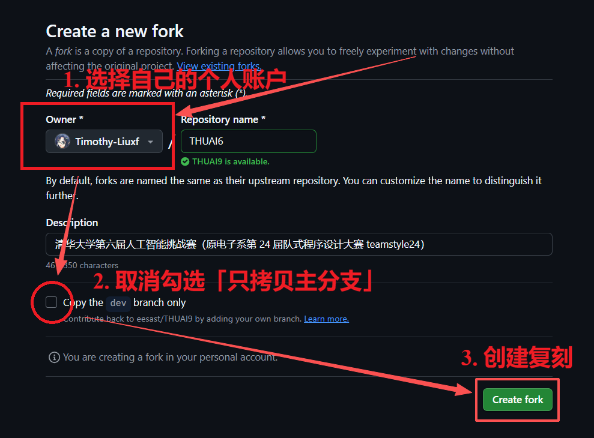

#### Clone This Repository

Your fork initially exists only in the GitHub cloud. Clone it to your computer so you can modify and test the code easily. The remote and local copies are separate repositories and do not need matching parent paths or names, though Git links them together.

Before cloning, make sure that:

- You have found or created a directory in which to store the repository. At least 2 GB of free space is recommended. Avoid Chinese characters in its path if possible, and **never choose a network location such as Tsinghua Cloud Drive**.
- Git is installed and your user name and email address are configured.
- If you use SSH cloning (recommended), you have uploaded an RSA public key to GitHub and configured your network appropriately. See the Git portion of Summer Training for details.

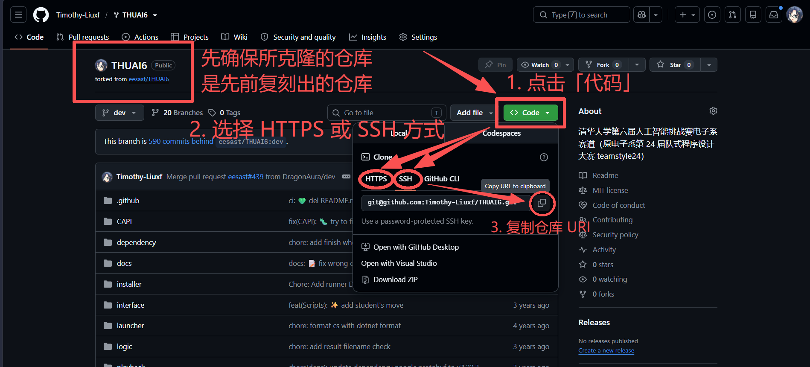

Open any terminal in the local directory—on Windows, you can right-click the directory to open one—and run:

```shell
git clone <repository-URI-copied-earlier>
```

Cloning should finish within a few seconds and create a `dotnet-workshop` child directory containing the project.

If you encounter a network problem, search for a solution based on the symptoms or error message, or ask in the Summer Training group.

### Install the Development Environment

This project requires .NET 10 or later. Visual Studio 2026 or later is the preferred and officially supported development environment.

#### Windows

##### Install the .NET Development Environment

Windows is the project's primary supported operating system. If you have access to a Windows computer, use it for this project.

Visit the [Visual Studio downloads page](https://visualstudio.microsoft.com/downloads/) and download the **Community** edition:


Open the downloaded Visual Studio Installer. If Visual Studio 2026 or later is already installed, search for **Visual Studio Installer** in the Start menu, open it, and select **Modify**. Install the following components.

First, on the **Workloads** tab, select **ASP.NET and web development** and **.NET desktop development**:

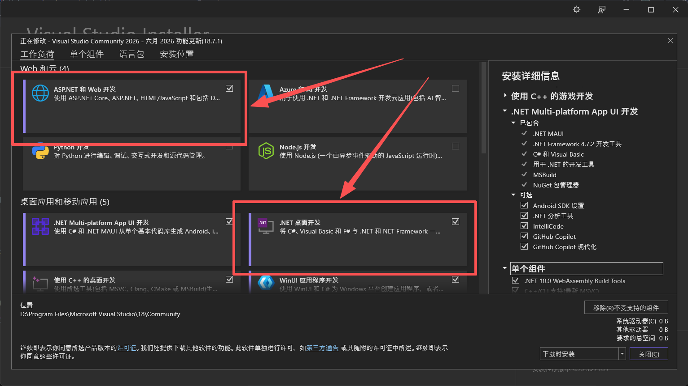

Second, open the **Individual components** tab and make sure that **.NET 10.0 Runtime** and **.NET 10.0 WebAssembly Build Tools** are selected:

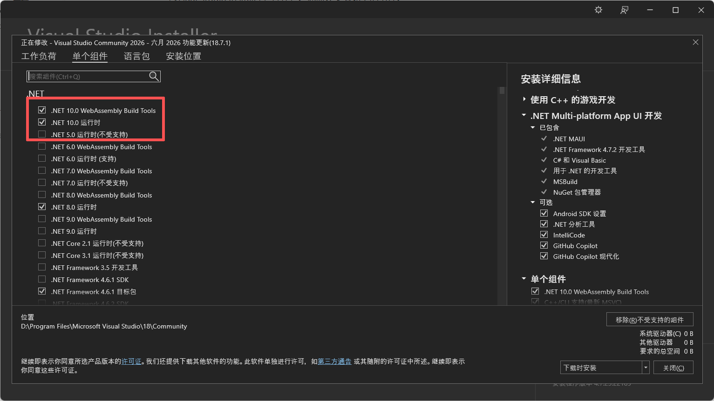

Third, on the **Language packs** tab, select the language you find most comfortable:

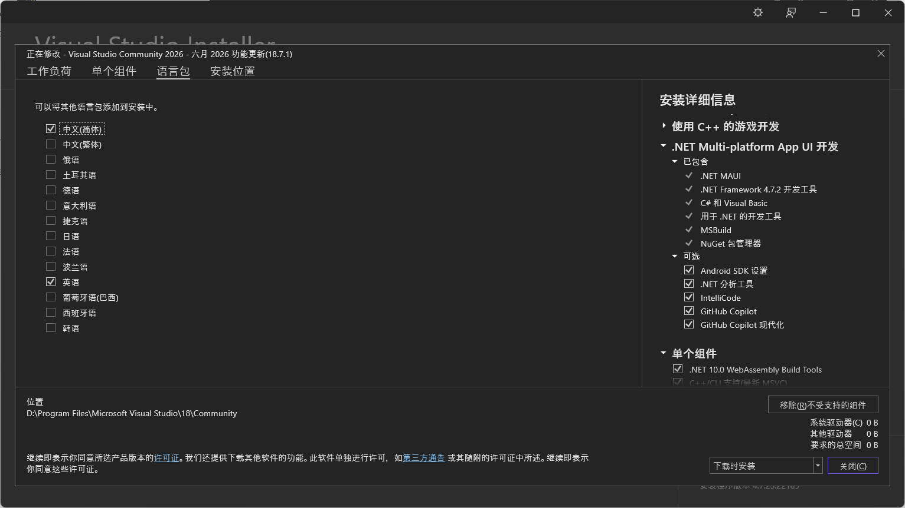

Fourth, use the **Installation locations** tab to set the Visual Studio installation path:


**Install Visual Studio on a drive with plenty of free space, preferably not the system drive.** The system drive is normally `C:`; filling it can cause serious problems. If you do not know which drive is the system drive, run this in CMD:

```cmd
echo %SYSTEMDRIVE%
```

Or run this in PowerShell:

```powershell
echo $env:SYSTEMDRIVE
```

##### Install Avalonia

After Visual Studio finishes installing, open it and choose **Continue without code**:

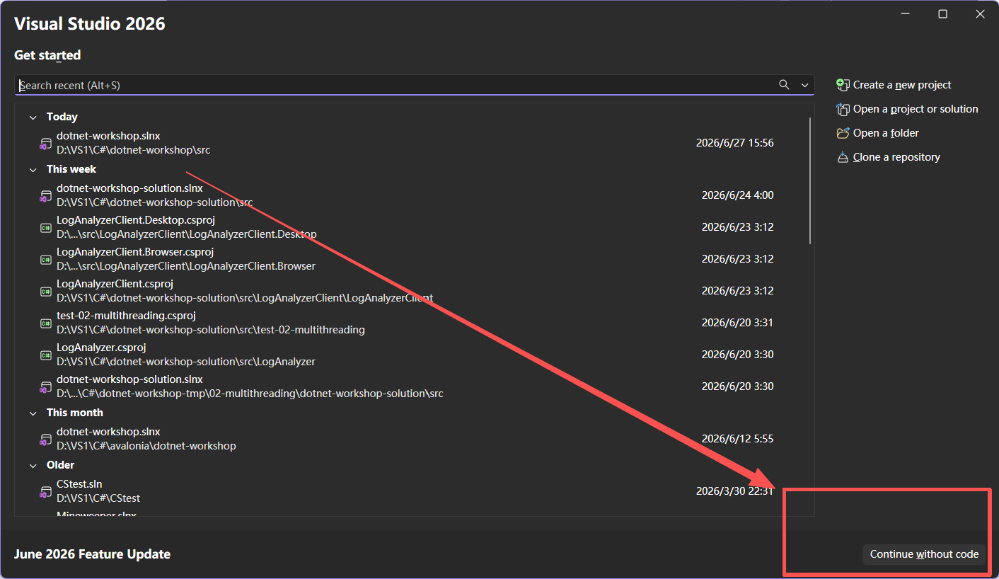

From the top menu bar, select **Extensions** > **Manage Extensions...**:


In the extension manager, open the **Browse** tab, search for **Avalonia**, press Enter, wait for the search to finish, and choose **Avalonia for Visual Studio** and **Avalonia Toolkit** for installation:

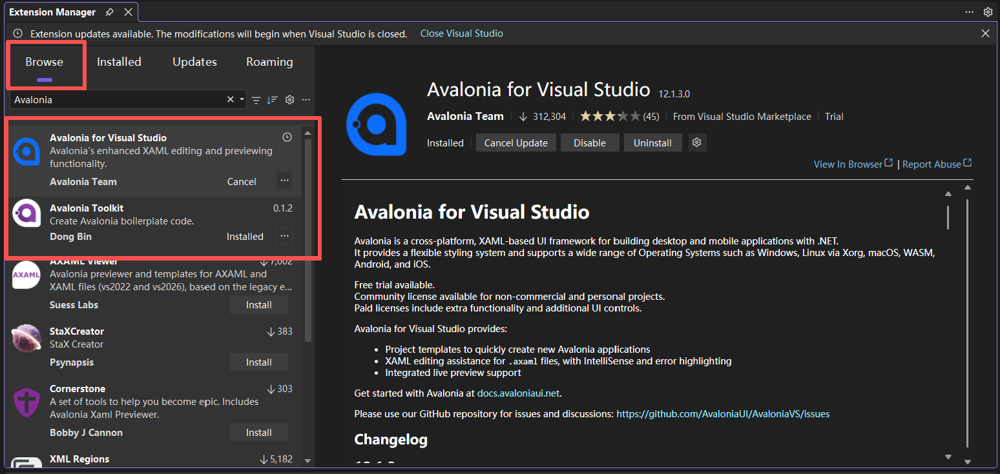

Select the X in the upper-right corner to close Visual Studio:


The installer then asks to apply the extension changes. Select **Modify** and wait for installation to finish.

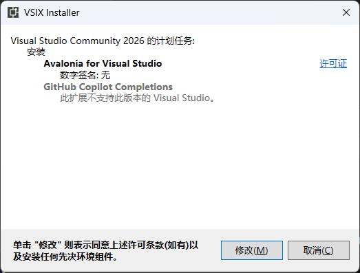

##### Show File Extensions

Windows File Explorer hides file extensions by default, which is unfriendly to software development. We recommend changing the setting so extensions are visible.

On Windows 11, select the three-dot menu shown below, then select **Options** to open Folder Options. On Windows 10, open the **View** tab from the ribbon containing **File**, **Home**, **Share**, and **View**, then select **Options** at the far right.


In Folder Options, open the **View** tab, clear **Hide extensions for known file types**, then select **Apply** or **OK**:

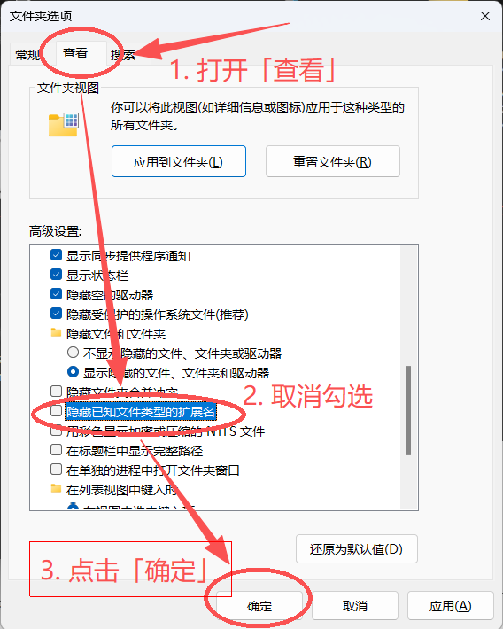

#### Linux / macOS

The development setup has not yet been tested on Linux or macOS—especially macOS—so the following process may have problems.

There is currently no recommended IDE or editor for Linux and macOS. Use Visual Studio Code, Rider, Cursor, Vim, Emacs, or another tool you prefer.

First, install the .NET 10 SDK from the [.NET download page](https://dotnet.microsoft.com/en-us/download/dotnet/10.0). Make sure you install the SDK, not only the runtime. Then open a terminal and run:

```shell
dotnet --list-sdks
```

If the output includes `10.0.x` or a later version, installation succeeded.

Avalonia extension installation differs among editors and IDEs. Follow the extension-installation process for the tool you chose.

## Tasks for This Section

The goal of this section is to configure your environment and run tests.

### Task Description

This preparation section and the first three of the four **basic-feature** sections include unit tests written with [MSTest](https://learn.microsoft.com/en-us/dotnet/core/testing/unit-testing-mstest-intro). After implementing code for a section, run its tests and make sure every test passes.

### (S0.1) Step 1: Run the Test Project

All project and test projects are under `src`. The directory includes four test projects corresponding to this section and the first three basic-feature sections:

```shell
LogParser
+-test-00-prepare
+-test-01-basic
+-test-02-multithreading
+-test-03-async-grpc
```

Your task in this section is to run `test-00-prepare` successfully.

Tests can be run through a graphical interface or the command line. We will begin with the graphical approach.

The graphical workflow differs among IDEs and editors, so this guide describes only Visual Studio.

From the Visual Studio menu bar, select **View** > **Test Explorer**:


After Test Explorer opens and finishes loading, select the test project you want to run. Right-click the project, then select **Run** or **Debug**. **Run** executes the tests normally, while **Debug** runs them under the debugger, stopping at breakpoints and catching exceptions:

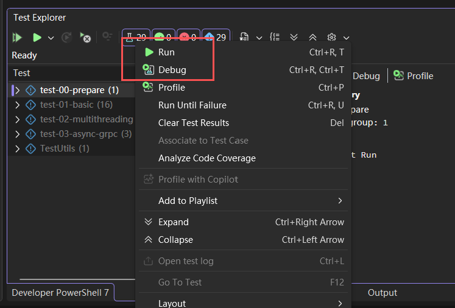

To run every test in the project, select **Run All Tests** in the upper-left corner. You will need this after completing the first three basic-feature sections:

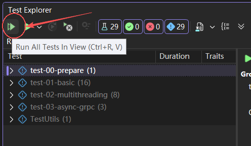

To test the Release configuration, change the configuration at the top of Visual Studio to **Release**:

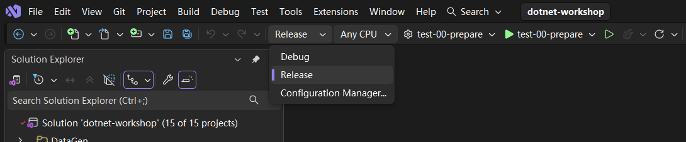

Remember to switch it back to **Debug** during development so you can debug effectively.

To test from the command line, change to the `src` directory and run:

```shell
dotnet test <test-project>
```

Here, `test-project` is the path to a test project:

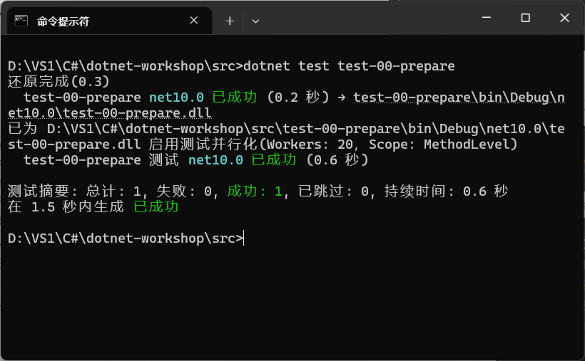

To test the Release configuration, run:

```shell
dotnet test <test-project> -c Release
```

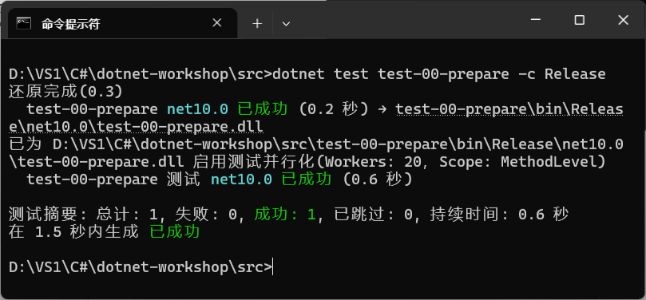

To run all tests, run these commands in `src`:

```shell
dotnet test
dotnet test -c Release
```

After completing the first three basic-feature sections, the result should look like this:


> [!IMPORTANT]
>
> **Your implementation must pass every test in the Release configuration.**

For this section, run `test-00-prepare` and make sure it passes.

> [!NOTE]
>
> **Task 0.1 (T0.1)**
>
> You do not need to modify any code in this section. Run `test-00-prepare`; all tests—those whose names begin with `T0.1`—should pass.
>

## Submitting Assignments

This section is preparatory, so you do not need to submit an assignment yet. It explains the requirements and submission process for later assignments.

### Assignment Requirements

For the best learning experience, complete the work independently while using necessary tools—such as search engines and AI models—to learn and explore unfamiliar topics and improve your development skills.

Each section includes coding tasks and written questions. Its `guidance.md` and `tasks.md` describe the exact requirements, difficulty, and point values.

> [!IMPORTANT]
>
> **Use of Large Language Models**
>
> Large language models provide an important way to work more efficiently, and learning to use them appropriately is an essential skill for future software development. Overreliance on them, however, has disadvantages.
>
> For coding tasks, excessive reliance on a model deprives you of the opportunity to practice development and become familiar with the .NET stack. Think through the problem yourself first; use a model to explore what you do not know and refine your own ideas. Model-generated content is not necessarily correct, so evaluate it critically.
>
> For written work, especially the final lab report, text copied wholesale from a model without thought is easy to recognize: it is vague, inflated, needlessly ornate, short on substance, and extremely difficult to read. Besides eliminating an opportunity to practice, this produces a poor assignment and makes grading painful for the instructor. **Low-quality documents that are obviously generated wholesale by a large language model will be treated as invalid submissions.** Using a model thoughtfully to improve the quality of your writing is, of course, encouraged. The ability to assess and revise writing—whether produced by a person or by a model—is itself an important skill.

Additional assignment rules:

+ In the basic-feature chapters, locations where you may need to add code are marked with `// TODO: Tx.y` or `throw new NotImplementedException("TODO: Tx.y")`.

+ `.github/workflows` contains the continuous-integration configuration that runs automated tests. Projects under `src` whose names begin with `test` or `Test` are unit tests. You **must not modify** either category.

+ `.csproj` files configure projects. Avoid editing them manually until you understand their syntax.

+ The project includes a `Console Test` console application for free-form debugging output. Changes to this project do not affect your grade. To run it in Visual Studio, right-click the project in Solution Explorer—available from **View** in the menu bar—and select **Set as Startup Project**. Its name appears in bold after selection.

  

  To use classes, methods, variables, or other members defined in another project from `Console Test`, add a project reference. Expand `ConsoleTest` in Solution Explorer, right-click **Dependencies**, select **Add Project Reference...**, then select the desired project under **Projects** > **Solution** in the dialog.

  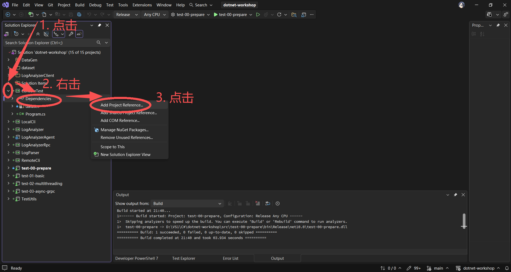

  

### Submission Process

Each chapter in this project corresponds to a separate Git branch:

+ `main`
+ `dev`
+ `homework/01-basic`
+ `homework/02-multithreading`
+ `homework/03-async-grpc`
+ `homework/04-avalonia`
+ `homework/05-advanced`

**The assignment branches in the EESAST repository are open during submission periods and closed at other times.**

Use the following workflow for each assignment:

- Modify the corresponding branch locally.
- Commit the changes to that branch.
- Open a pull request against the corresponding branch in the original repository.
- Associate the pull request with the corresponding issue.
- Review the grading result.

#### i) Modify the Corresponding Branch Locally

After forking every branch from this repository, switch to the appropriate branch locally:

```shell
git checkout "homework/01-basic"
```

If the branch does not exist locally, create it with `-b`:

```shell
git checkout -b "homework/01-basic"
```

To merge changes from another branch into the current one—for example, changes made during `01-basic` that you now need in `02-multithreading`—switch to `homework/02-multithreading` and run:

```shell
git merge "homework/01-basic"
```

This merges the changes from `homework/01-basic` into `homework/02-multithreading`.

#### ii) Commit Changes to the Corresponding Branch

After writing and updating the code, commit the changes with Git. Commit messages must follow the [Conventional Commits specification](https://www.conventionalcommits.org/zh-hans/). Editor extensions such as [Conventional Commits for Visual Studio Code](https://marketplace.visualstudio.com/items?itemName=vivaxy.vscode-conventional-commits) can help.

```shell
git add <files>
git commit -m "<commit-message>"
```

After committing locally, push the changes to your fork in the cloud:

```shell
git push origin "homework/01-basic"
```

#### iii) Open a Pull Request Against the Corresponding Branch

Open your fork on GitHub and switch to the branch you just pushed, such as `homework/01-basic`.

Select **Compare & pull request**, then complete the information on the pull-request creation page.

#### iv) Associate the Pull Request with the Corresponding Issue

In the pull-request template, manually associate the pull request with the corresponding issue.

Add `#ISSUE-NUMBER` to the pull-request body. For example, if the issue ID is 32, add a line containing `#32`:


Find the value of `ISSUE-NUMBER` in the **Sub-issues** section of the [assignment-submission index](https://github.com/eesast/dotnet-workshop/issues/71).

A [sample pull request](https://github.com/eesast/dotnet-workshop/pull/37) is also available for reference.

After making the association, submit the pull request to complete your assignment submission.

#### v) Review the Grading Result

After you open a pull request, GitHub Actions automatically checks whether the submission meets the requirements and passes the unit tests for that chapter. An instructor will grade the assignment only after every check passes and the pull request displays **All checks have passed**:


After grading, the instructor applies one of these labels to the pull request:

- **accepted ✅:** The assignment passed, and the pull request is closed.
- **require revision 🔄:** Changes are required, and the pull request remains open.

If a check fails or the instructor requests a revision, select the failed check to locate the error or follow the instructor's guidance in the pull-request comments. Then repeat step ii to commit and push an update.

## Test Data

All test datasets are under `src/dataset`. **Do not modify them.** The dataset has this structure:

```shell
dataset
|   basic.log           # Example log with three entries
|   basic-fail.log      # Invalid log containing a malformed entry
|   basic-multiple.log  # Log containing multiple valid entries
|
+-multiple-logs         # Multi-file log dataset
    20260701.log
    20260702.log
    ...
    20260730.log
```

The source code that randomly generates test data is under `src/DataGen`. **Do not modify it.** It has this structure:

```shell
DataGen
|   .gitignore  # Git ignore list
|   gen.py      # Generate logs
|   batch.py    # Generate logs in batches
|
+-gen_logs      # Files used to generate logs and metadata for batch generation
|
+-multiple_logs # Output directory for logs generated in batches
```

## Other Information

For an overview of all project tasks, see [tasks.md](./tasks.md).

**We sincerely hope you enjoy learning and gain a great deal from the project!**

## Further Reading

+ [Testing: unit tests and test-driven development (TDD)](https://docs.eesast.com/docs/tools/tdd) (Chinese)
+ [Version control and Git fundamentals](https://docs.eesast.com/docs/tools/git) (Chinese)
+ [The Missing Semester of Your CS Education](https://missing-semester-cn.github.io/) (Chinese)

## Previous / Next

+ Previous: [README](../../README.md)
+ Next: [Tasks in Preparation](./tasks.md)
