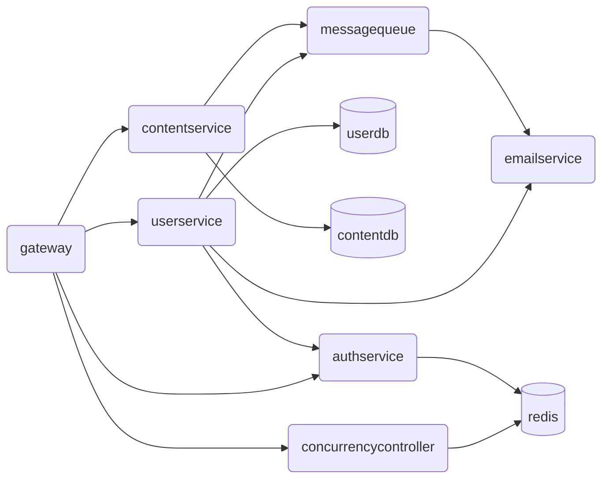
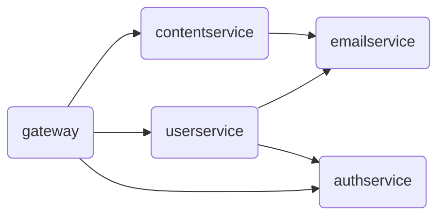

# Guidance for Basic Functions

## Table of Contents

[TOC]

## Learning Objectives

+ Understand the background of cloud-service log analysis.
+ Understand the theme of this project.
+ Become familiar with basic C\# syntax.
+ Experience object-oriented programming concepts.

## Background

### A Glimpse of the Cloud

**Note: This section briefly touches on material from the web track of Summer Training, but it is only background for this workshop. You may skip anything you do not understand.**

The **cloud** encompasses much of the modern internet. We encounter the word everywhere: cloud storage, cloud gaming, ~~cloud gamers complaining everywhere, or games that have been “clouded”~~, and even Apple's “iCloud in Guizhou” service when setting up a new Apple device in China. The cloud seems to have become an essential part of modern life. Almost every internet service we use is deployed in the cloud. Whether we browse a website or use a connected app, we access services deployed there. We will refer to them as **cloud services**.

A **microservice architecture** is a common way to structure a cloud service. Each feature is implemented as a separate service that is independently deployed and run. A simplified microservice architecture for a website backend might look like this:



Here, `gateway` is the main gateway, `userservice` manages users, `contentservice` manages website content, `emailservice` manages email, `authservice` performs authentication and authorization, and `concurrencycontroller` manages concurrency.

For load balancing, fault tolerance, recovery, and similar concerns, each service generally runs several replicas at the same time. Each replica runs in its own container, which you can think of as a separate process.

### Cloud-Service Logs

When debugging an everyday program, we often print statements to trace what it is doing. For example:

```c
#include <stdio.h>
#include <stdlib.h>

double calc_avg(int scores[], int n) {
    if (n == 0) {
        printf("[ERROR] The array is empty!\n");
        exit(EXIT_FAILURE);
    }
    int sum = 0;
    printf("[DEBUG] Starting total-score calculation...\n");
    for (int i = 0; i < n; i++) {
        sum += scores[i];
        printf("[DEBUG] Score %d=%d, running total=%d\n", i + 1, scores[i], sum);
    }
    printf("[DEBUG] Total=%d, count=%d\n", sum, n);
    return (double)sum / n;
}

int main() {
    int scores[5] = {86, 90, 78, 92, 88};
    printf("[DEBUG] Program started\n");
    double avg = calc_avg(scores, 5);
    printf("Average score: %.2f\n", avg);
    return 0;
}
```

The calls to `printf` emit information that is not part of the program's actual feature—in this example, lines beginning with `[DEBUG]` or `[ERROR]`. It helps us trace execution and print errors. This output is called the program's **log**. Running the code above produces this log:

```shell
[DEBUG] Program started
[DEBUG] Starting total-score calculation...
[DEBUG] Score 1=86, running total=86
[DEBUG] Score 2=90, running total=176
[DEBUG] Score 3=78, running total=254
[DEBUG] Score 4=92, running total=346
[DEBUG] Score 5=88, running total=434
[DEBUG] Total=434, count=5
```

That is logging in its simplest form.

What makes logs worth studying? Cloud-service logs are usually less casual. To support automated processing and analysis while a program runs—and to locate faults or exceptions quickly—they contain sufficient information in a consistent format. According to how strictly that format is defined, logs may be **structured**, **semi-structured**, or **unstructured**. The following figure compares them[^1]:


Structured logs are highly regular: all output forms a tidy table that is easy to store directly in a database. Semi-structured logs define some fields while also allowing application-specific information, such as a Message field. Unstructured logs give the application complete freedom over its output. Structured logs are especially machine-friendly, while unstructured logs are highly unpredictable. This workshop focuses on semi-structured logs.

Collecting and analyzing cloud-service logs is an important area of network-systems research. It supports fault diagnosis, anomaly detection, and more. With today's interest in large language models (LLMs), using LLMs to detect anomalies from logs has also become an active research topic.

The workshop's ultimate goal is to implement a simple cloud-service log analysis system. Do not be intimidated by the concepts above: you will work with a greatly simplified, beginner-friendly version.

## Knowledge Primer

This section introduces knowledge needed for the tasks.

### Simple Factory Pattern

The factory pattern is one of the most common design patterns in object-oriented programming. It creates objects while separating the creation process from their use. The **simple factory pattern** is its most basic form.

A simple factory has three roles:

+ **Factory:** Implements the internal logic that creates every instance.
+ **Product:** The abstract base class of all objects to be created; it describes their common interface.
+ **ConcreteProduct:** A concrete product class whose instances are the objects being created.

For example, suppose there are two concrete products:

```csharp
abstract class Product {}
class ConcreteProductA : Product {}
class ConcreteProductB : Product {}
```

A typical `Factory` in the simple factory pattern looks like this:

```csharp
class Factory {
    public static Product CreateProduct(string type) {
        if (type == "A") {
            return new ConcreteProductA();
        } else if (type == "B") {
            return new ConcreteProductB();
        } else {
            // ...
        }
    }
}
```

### Visitor Pattern

The visitor pattern is another common design pattern. It lets external code perform different operations on derived classes that share a base class without modifying those classes. This separates data structures from the operations performed on them. Objects expose a shared visitor interface through polymorphism; to add a new operation, external code implements that interface.

Return to the products from the simple factory example:

```csharp
abstract class Product {}
class ConcreteProductA : Product {}
class ConcreteProductB : Product {}
```

Suppose we hold a `Product` base-class reference but want to perform different operations on product A and product B. With only virtual methods and ordinary polymorphism, we might write:

```csharp
abstract class Product {
    abstract void Print();
}

class ConcreteProductA : Product {
    override void Print() { Print("ConcreteProductA"); }
}

class ConcreteProductB : Product {
    override void Print() { Print("ConcreteProductB"); }
}

var product = Factory.CreateProduct(type);
product.Print();
```

This approach has drawbacks. External code may need to perform many kinds of operations on these objects. Adding a virtual method to `Product` for every operation mixes data storage with behavior that operates on the data. The visitor pattern addresses this problem.

First expose the polymorphic mechanism through a shared `IVisitor` interface, which declares a visit method for each object type:

```csharp
interface IVisitor {
    void Visit(ConcreteProductA product);
    void Visit(ConcreteProductB product);
    // If the language does not support overloading, use names such as VisitA and VisitB.
}
```

Next, use polymorphism to make each object call the appropriate method on `IVisitor`. This is conventionally called the `Accept` method:

```csharp
abstract class Product {
    abstract void Accept(IVisitor visitor);
}

class ConcreteProductA : Product {
    override void Accept(IVisitor visitor) {
        visitor.Visit(this);  // Calls IVisitor.Visit(ConcreteProductA product)
    }
}

class ConcreteProductB : Product {
    override void Accept(IVisitor visitor) {
        visitor.Visit(this);  // Calls IVisitor.Visit(ConcreteProductB product)
    }
}
```

The external visitor interface is now complete. To implement the printing behavior from the earlier example, create a new visitor class that implements `IVisitor`:

```csharp
class PrintVisitor : IVisitor {
    void Visit(ConcreteProductA product) { Print("ConcreteProductA"); }
    void Visit(ConcreteProductB product) { Print("ConcreteProductB"); }
}
```

The original code can then be refactored to:

```csharp
var product = Factory.CreateProduct(type);
var visitor = new PrintVisitor();
product.Accept(visitor);
```

The visitor pattern is widely used in practice. Compiler semantic analysis, for example, commonly uses visitors or optimized variations. [OpenJDK](https://github.com/openjdk) provides a textbook example for analyzing syntax trees: [`Tree` declares an abstract `accept` function](https://github.com/openjdk/jdk/blob/a39a1f10f75c15b93a709eca7bfae2d808cf7b91/src/jdk.compiler/share/classes/com/sun/source/tree/Tree.java#L749), [`TreeVisitor` defines the visitor interface](https://github.com/openjdk/jdk/blob/a39a1f10f75c15b93a709eca7bfae2d808cf7b91/src/jdk.compiler/share/classes/com/sun/source/tree/TreeVisitor.java#L59), and [`JCWhileLoop` implements `accept` so a visitor can semantically analyze a `while` statement](https://github.com/openjdk/jdk/blob/a39a1f10f75c15b93a709eca7bfae2d808cf7b91/src/jdk.compiler/share/classes/com/sun/tools/javac/tree/JCTree.java#L1225).

> An interesting historical example is the contestant API for THUAI (the Tsinghua University Artificial Intelligence Challenge and Department of Electronic Engineering Team Programming Contest), which once used the visitor pattern. See [THUAI6 Issue 17](https://github.com/eesast/THUAI6/issues/17). In THUAI6, contestants wrote AI code for both human and monster factions, using two different interfaces: `IHumanAPI` and `IButcherAPI`. Their `AI` class therefore acted as a visitor. The `StartGame` method on `IGameTimer` served as the `Accept` method, while the `play` methods on the visitor interface `IAI` served as `Visit` methods.

## Tasks for This Section

The goal of this section is to read and analyze cloud-service logs.

### Task Description

This workshop assumes the following cloud-service architecture:



It contains only five services: `gateway`, `userservice`, `contentservice`, `emailservice`, and `authservice`. What those services do and how the topology works are not important here; you can treat them as `a`, `b`, `c`, `d`, and `e`. Every service emits logs in the same format. Depending on the value of `event`, there are **exactly three types**. A typical file containing all three looks like this:

```shell
0,2026-06-05T16:00:29.045Z,userservice-0,"{""severity"": ""INFO"", ""event"": ""call"", ""request-id"": ""3a013a08-6853-49fc-8f06-50daeb5c1e51"", ""target-service"": ""authservice"", ""duration-ms"": 18}"
1,2026-06-05T16:00:31.086Z,userservice-1,"{""severity"": ""INFO"", ""event"": ""request"", ""request-id"": ""1177c344-115e-4f85-b8ec-c9164d132b79"", ""method"": ""GET"", ""path"": ""/api/user/john"", ""status-code"": 404}"
2,2026-06-05T16:05:45.322Z,gateway-0,"{""severity"": ""ERROR"", ""event"": ""internal"", ""exception"": ""System.InvalidOperationException: Failed to load gateway routing configuration.""}"
```

Logs are stored as comma-separated values (CSV). Each row contains:

```csv
lineno,timestamp,pod-name,message
```

+ `lineno`: The log entry's line number within the file.

+ `timestamp`: The time at which the log entry was produced.

+ `pod-name`: The name of the container that produced the entry. It has the form `service-n`, with two components:

  + `service`: The name of the service that produced the entry.
  + `n`: The replica number, because each service runs several replicas at once.

  Names such as `userservice-0`, `userservice-1`, `userservice-2`, `gateway-0`, `gateway-1`, and `emailservice-0` are therefore valid values of `pod-name`.

+ `message`: The entry's detailed information, represented as JSON. The three kinds of logs differ in the contents of `message`.

  + `severity`: The log level. Logs commonly use levels such as `TRACE`, `DEBUG`, `INFO`, `WARNING`, `ERROR`, and `FATAL`. This project supports **exactly three levels**: `INFO` for an ordinary informational entry, `WARNING` for a warning, and `ERROR` for an error.
  + `event`: The event recorded by the entry and therefore its type. **The three log types mentioned above correspond to exactly three possible `event` values:**
    + `call`: This service sent a request to another service. Its `message` contains `request-id`, `target-service`, and `duration-ms`.
    + `request`: This service received a request. Its `message` contains `request-id`, `method`, `path`, and `status-code`.
    + `internal`: An internal failure occurred in this service. Its `message` contains only `exception`, which represents the thrown exception. The value always has the form `ExceptionName: exception message`, with a colon followed by one space between the exception name and message.

You will parse the logs described above.

### (S1.1) Step 1: Implement the Basic Log Parser

Parsing the logs requires reading the CSV file one line at a time and extracting each field from every record. The Message field is JSON and must be parsed again to obtain its internal fields.

The code for this step is in `LogParser`:

```shell
LogParser
|
+-Models
|   LogEntries.cs
|
+-Parser
    LineParser.cs
    LogFileParser.cs
```

Read the provided starter code carefully and complete the unfinished functionality.

> [!NOTE]
>
> **Task 1.1 (T1.1)**
>
> Carefully read the starter code, using the explanation below.

In the starter code, `LogFileParser` in `Parser/LogFileParser.cs` is the public interface for parsing a log file:

```csharp
public class LogFileParser {
    public IEnumerable<LogEntry> Parse(TextReader logFile);
}
```

The `logFile` parameter supplies the file as a stream, while the method yields the parsed `LogEntry` for each line as a stream of results. This makes the results easy to consume:

```csharp
var parser = new LogFileParser();
using var reader = new StreamReader("path/to/logfile");
foreach (var logEntry in parser.Parse(reader)) {
    // ...
}
```

`LogEntry` stores the parsed result of one log entry. C\#'s `record` type is especially well suited to this responsibility. Its definition is in `Models/LogEntries.cs`.

To represent the distinct data stored by the three log types and make later type-specific processing convenient, the result types are `CallLogEntry`, `RequestLogEntry`, and `InternalLogEntry`. All three are records derived from `LogEntry`. `LogEntry` contains fields shared by all three, while each derived record contains fields unique to its log type. These and other required data structures are defined in `Models/LogEntries.cs`.

The starter code contains the basic implementation of `LogFileParser`. It reads the supplied file line by line, separates each line at commas, and passes the resulting fields to `LineParser` for further processing.

`LineParser` uses the **simple factory pattern**. Its `ParseLine` method is the public interface:

```csharp
class LineParser {
    public static LogEntry ParseLine(LogRecord logRecord);
}
```

Given a log row as `logRecord`, `LineParser` identifies the log type and creates the appropriate object to store the result, returning it through the common `LogEntry` base type.

> [!TIP]
>
> Before beginning development, run the following command in a terminal and confirm that the current branch is `homework/01-basic`:
>
> ```shell
> git branch
> ```

> [!NOTE]
>
> **Task 1.2 (T1.2)**
>
> A complete implementation for Call logs is already provided. If you run `test-01-basic`, `TestParseCallLogEntry` in `TestLogFileParserBasic` should pass.
>
> Using that implementation and the “APIs you may find useful” section below as references, implement parsing for Request and Internal logs yourself. When you finish, run `test-01-basic`. All tests in `Test_1_2_LogFileParserBasic`—those whose names begin with `T1.2`—should pass.

**APIs you may find useful:**

+ C\# string operations:
  + Find a substring with `String.IndexOf()`:

    ```csharp
    var str = "abcdefg";
    var index1 = str.IndexOf("cd") // 2
    var index2 = str.IndexOf("hi") // -1
    ```

    For more information, see [`String.IndexOf` on Microsoft Learn](https://learn.microsoft.com/en-us/dotnet/api/system.string.indexof?view=net-10.0).

  + Extract a substring with `String.Substring`:

    ```csharp
    var str = "01234567";
    var str1 = str.Substring(1, 3); // "123"
    var str1 = str.Substring(5); // "567"
    ```

    For more information, see [`String.Substring` on Microsoft Learn](https://learn.microsoft.com/en-us/dotnet/api/system.string.substring?view=net-10.0).

### (S1.2) Step 2: Retrieve Parsed Results

The `Parse` method now provides objects containing the results. However, they arrive as references to the abstract `LogEntry` class. How can we read the data stored in each concrete object?

In this step, expose parsed results as key-value pairs through the `Dump` method of `KeyValueVisitor` in `Visitors\KeyValueVisitor.cs`:

```csharp
class KeyValueVisitor {
    Dictionary<string, string> Dump(LogEntry entry);
}
```

The method receives one parsed result as a `LogEntry` reference and returns a `Dictionary<string, string>` of key-value pairs. The keys for each log type are:

+ Call logs:

  ```csharp
  Dictionary<string, string> {
      ["LineNo"],
      ["Timestamp"],
      ["PodName"],
      ["Severity"],   // "Info" / "Warning" / "Error"
      ["EventType"],  // "Call" / "Request" / "Internal"
      ["RequestId"],
      ["TargetService"],
      ["DurationMs"],
  };
  ```

+ Request logs:

  ```csharp
  Dictionary<string, string> {
      ["LineNo"],
      ["Timestamp"],
      ["PodName"],
      ["Severity"],   // "Info" / "Warning" / "Error"
      ["EventType"],  // "Call" / "Request" / "Internal"
      ["RequestId"],
      ["Method"],
      ["Path"],
      ["StatusCode"],
  };
  ```

+ Internal logs:

  ```csharp
  Dictionary<string, string> {
      ["LineNo"],
      ["Timestamp"],
      ["PodName"],
      ["Severity"],   // "Info" / "Warning" / "Error"
      ["EventType"],  // "Call" / "Request" / "Internal"
      ["ExceptionName"],
      ["ExceptionMessage"],
  };
  ```

Use the **visitor pattern** for this operation.

The code remains under `LogParser`, now with these relevant files:

```shell
LogParser
|
+-Models
|   ILogEntryVisitor.cs
|   LogEntries.cs
|
+-Parser
|   LineParser.cs
|   LogFileParser.cs
+-Visitors
    KeyValueVisitor.cs
```

`Models/ILogEntryVisitor.cs` provides the visitor interface:

```csharp
public interface ILogEntryVisitor<TResult>
{
    TResult Visit(CallLogEntry entry);
    TResult Visit(RequestLogEntry entry);
    TResult Visit(InternalLogEntry entry);
}
```

The abstract `LogEntry` record declares the abstract `Accept` method:

```csharp
public abstract record LogEntry {
    public abstract TResult Accept<TResult>(ILogEntryVisitor<TResult> visitor);
}
```

> [!NOTE]
>
> **Task 1.3 (T1.3)**
>
> Implement `Accept` for each of the three concrete `LogEntry` records, then complete `KeyValueVisitor`, including its `Dump` and `Visit` methods.
>
> The starter code includes the Call-log `Visit` method in `KeyValueVisitor` as an example. When your implementation is complete, run `test-01-basic`. All tests should pass.

## Questions

Create a text file named `report.md` in `docs/01-basic` and answer the following questions there.

### (Q1.1)

In the provided `Parser` starter code:

+ Which statement or statements split a log row at commas? How does the code specify the meaning of each field by its position in the row?
+ When reading the JSON `message` field, which statements in which method determine whether the row is a Call, Request, or Internal log?
+ After identifying the log type, which library method parses the JSON?
  + How does the starter code protect against missing fields—for example, a Call log whose `message` omits `request_id`?
  + The JSON keys use `abc-def` naming, known as kebab case, while the result is stored in properties with `AbcDef` naming, known as Pascal case. How does the starter code tell the JSON parser to perform this naming conversion?

### (Q1.2)

Using a parsed Call event as an example, which methods are called when `Dump` on `KeyValueVisitor` runs? Complete the following call chain; you do not need to include .NET library methods.

+ `Dictionary<string, string> KeyValueVisitor.Dump(LogEntry entry)`
+ ...

> **Function (or method) call-chain example**
>
> Given this program:
>
> ```c
> void f1(int x) {
>     printf("%d\n", x);
> }
> 
> void f2(int x) {
>     f1(x);
> }
> 
> int main(int argc, char* argv[]) {
>     f2(argc);
> }
> ```
>
> Its function call chain is:
>
> + `int main(int argc, char* argv[])`
> + `void f2(int x)`
> + `void f1(int x)`

### (Q1.3)

Did you use AI for this assignment? Based on your answer, choose either (Q1.3.a) or (Q1.3.b).

#### (Q1.3.a)

If you did not use AI, approximately how long did it take to pass every test? How difficult was this assignment compared with assignments from programming courses you have taken? Do you consider your solution sufficiently idiomatic and well designed? If not, what could be improved?

#### (Q1.3.b)

If you used AI, what prompts did you provide? Compared with a solution you could have written using a traditional search engine and your own abilities, what did AI do better? Which parts of its answer were incorrect—or at least worse than your own solution—and why?

## Other Information

For task point values and related details, see [tasks.md](./tasks.md).

## Further Reading

+ [Cloud-native systems and modern computer-network fundamentals](https://docs.eesast.com/docs/web/cloud_native/fundamental): An introduction to cloud services and selected topics in modern computer networks. (Chinese)
+ [Principles and design of highly available systems](https://www.thebyte.com.cn/): A deeper look at cloud-native and distributed systems. (Chinese)
+ [*Clean C++*](https://link.springer.com/content/pdf/10.1007/978-1-4842-2793-0.pdf) and [*Clean C++20*](https://link.springer.com/content/pdf/10.1007/978-1-4842-5949-8.pdf): Good coding practices in software design.

## Previous / Next

+ Previous: [Tasks in Preparation](../00-prepare/tasks.md)
+ Next: [Tasks in Basic Functions](./tasks.md)

## References

[^1]: He, S., Zhang, X., He, P., et al. “An Empirical Study of Log Analysis at Microsoft.” *Proceedings of the 30th ACM Joint European Software Engineering Conference and Symposium on the Foundations of Software Engineering*, 2022, pp. 1465–1476.
