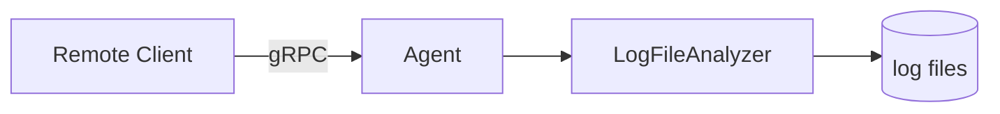
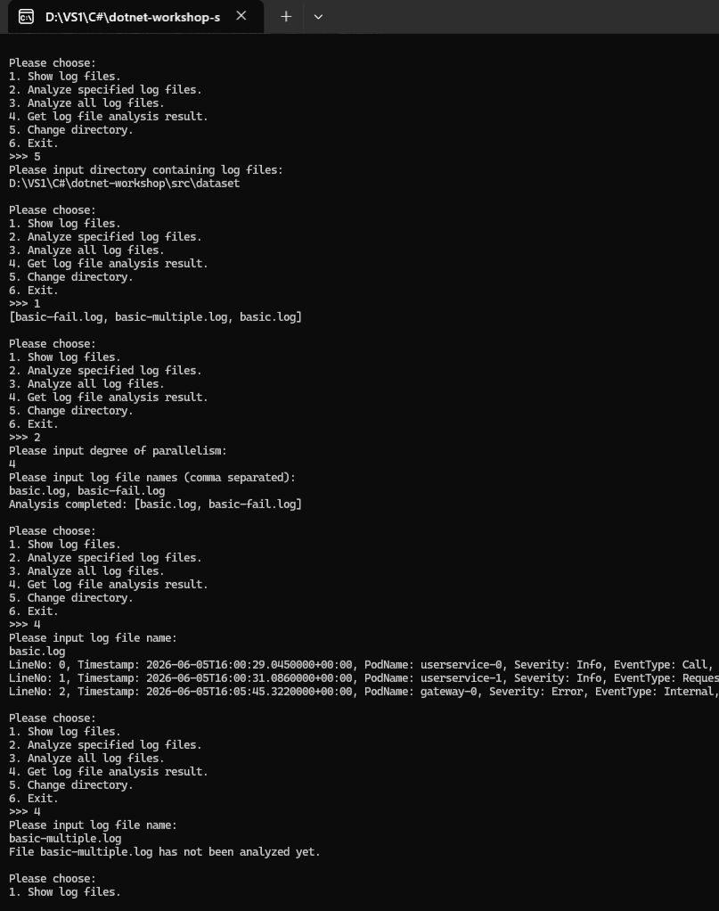
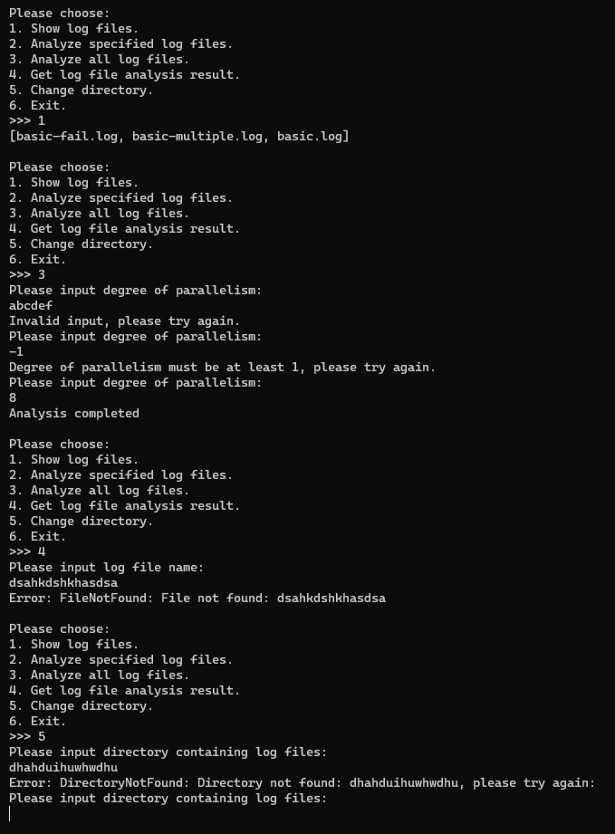

# Guidance for Async and gRPC

## Table of Contents

[TOC]

## Learning Objectives

+ Understand asynchronous programming and experience its advantages.
+ Learn to write asynchronous C\# code with the `async` and `await` keywords.
+ Understand Protocol Buffers (Protobuf) and the gRPC framework.
+ Learn to build a networked application that communicates over gRPC in C\#.

## Background

### Parallel Analysis of Cloud-Service Logs

In the previous section, we implemented parallel log analysis. Real cloud-service logs, however, usually reside on many remote servers or on clusters with many compute nodes, while we may need to inspect them from a local machine. We therefore want to control a log analyzer on a remote server or node and view its results remotely. This requires a way to call methods across machines: network communication.

HTTP and RPC are among the most widely used communication approaches in cloud-native systems. We will use RPC here.

RPC stands for remote procedure call. It is designed to make calling a remote function over a network service feel like calling an ordinary local function. Common RPC frameworks include gRPC and Apache Thrift. This workshop uses Google's Protobuf-based gRPC framework.

In this section, you will write an Agent that runs continuously on a server or node and provides a 24/7 gRPC service. It responds to external gRPC calls by performing tasks such as analyzing logs and returning analysis results. In other words, every feature from the previous section will become remotely controllable:



## Knowledge Primer

To make sure the Summer Training lectures have not left any gaps, this section briefly reviews the knowledge required for the tasks and introduces a few additional concepts.

### Asynchronous Programming

#### Why Do We Need Asynchronous Programming?

Programs can generally be described as CPU-bound (or compute-bound) or I/O-bound. A CPU-bound program spends most of its time executing machine instructions on the CPU and therefore has high CPU utilization; its bottlenecks are usually compute performance and parallelism. An I/O-bound program spends most of its time performing I/O with external devices—for example, communicating over a network, reading or writing disks, or waiting for a printer—instead of using the CPU. Its bottlenecks are usually device bandwidth and latency.

Whether it is a single-threaded exercise from an introductory programming course or the multithreaded cloud-log analyzer from the previous section, the programs we have written so far share one characteristic: function calls proceed in sequence. The program continues only after the current function returns. This style of calling functions is usually called **synchronous** (often abbreviated **sync**). It is generally appropriate for CPU-bound work because, regardless of execution order, the total amount of computation remains fixed and no CPU time is wasted merely waiting.

This section is different because our goal is a networked application that analyzes cloud-service logs remotely. Many networked applications do relatively little computation and are instead limited by network I/O. Imagine an application that must respond to user input or incoming requests while also making requests to other services or databases before it can respond. Suppose a user supplies two numbers, `a` and `b`, and you must call a remote service to obtain `a + b` because the local machine cannot perform the addition. With a synchronous call, the code would look like this:

```csharp
int CalculateAdd(int a, int b) {        // a and b are user input; return a result to the user
    var request = new Request(a, b);     // Construct a network request
    var response = NetworkCall(request); // Send the request and receive a response
    var result = response.Value;         // Read the computed value from the remote response
    return result;                       // Return it to the user
}
```

While `NetworkCall` performs network I/O, the CPU is actually idle. The program is doing nothing but waiting for the response, yet the current thread remains blocked inside `NetworkCall`. If another request arrives or the user tries to interact with the UI, the program cannot step away to handle it. This creates a contradiction: the CPU is free and capable of new work, but the way the program is written prevents it from using that resource. In short, **the programming model limits the program's ability to use available resources**. Two common examples illustrate the problem:

+ **Web backends.** A backend has many responsibilities to handle at once. It may need to serve high-frequency requests from tens of thousands of simultaneous visitors while also making frequent network requests of its own. User profiles and requested resources might live in cloud databases or require calls to other network services.
+ **GUI applications (and web frontends).** A GUI application that requires users to sign in must contact a server, but the interface still needs to respond while it waits—for example, to button presses or a request to close the application. If network I/O blocks the program from handling user interaction, the interface appears frozen, producing a terrible experience. This is the situation you will encounter in `04-avalonia`.

You may be thinking that multithreading solves this problem: use one thread to wait for `NetworkCall` and another to perform other work. That works, but what if three operations are in progress? You need three threads. What about 100 operations, or 10,000? Threads are operating-system resources, and creating them on that scale is expensive. Instead, we want to reuse threads that would otherwise wait on the network, freeing them to perform other work. The programming model that makes this possible is **asynchronous programming** (usually abbreviated **async**).

#### Common Asynchronous Programming Models

There are many models for asynchronous programming. JavaScript, for example, supports the Promise/then model, which uses callbacks to specify what should happen after a network result arrives:

```javascript
networkCall(new request(a, b))  // The call returns a Promise instead of the result
    .then(result => {           // then registers the callback to run after the response arrives
        console.log(result);    // Return the result to the user through the console
    });
// The program can continue without waiting after it sends networkCall
console.log("hello");
```

C++ also has a future-based model, which you will encounter in future team-programming work:

```cpp
var fut = std::async([&]() { return NetworkCall(Request(a, b)).GetResult(); }); // Returns std::future<T>
// You can perform any work here
// Retrieve the result when you need it:
std::cout << fut.get() << std::endl; // Get the result
```

If you are interested in future team-programming development, see [std::async on cppreference.com](https://en.cppreference.com/cpp/thread/async).

This workshop uses neither Promise/then nor futures. It uses the most widespread asynchronous model: async/await. JavaScript and C++20 or later support this model, and it is the primary asynchronous model in C\#:

```csharp
public async Task<int> CalculateAddAsync(int a, int b) { // a and b are user input

    // Construct a network request
    var request = new Request(a, b);
    
    // Send it. await waits for the operation but yields the thread instead of occupying it.
    var response = await NetworkCallAsync(request); 
    
    // When the response arrives, resume on a thread and read the result.
    var result = response.Value;

    // Return the result to the user
    return result;
}
```

When C\# code uses async/await, the .NET runtime schedules work using the built-in [`System.Threading.ThreadPool`](https://learn.microsoft.com/en-us/dotnet/api/system.threading.threadpool?view=net-10.0). **This thread pool has a behavior that may be surprising: by default, when it is saturated, it waits about one second for a thread to become available before expanding the pool.** Work remains blocked during that interval. Until you are certain that you understand the consequences, do not casually use the thread pool or create `Task`s merely on intuition. Most situations that require asynchronous work are already exposed through async APIs in .NET or third-party libraries, so there are relatively few reasons to create a new `Task` yourself.

The synchronization tools used in the previous section—such as `lock` and `Monitor.Wait`—and operations such as `Thread.Sleep(1000)` occupy a real thread. Asynchronous code should use `await Task.Delay(1000)` for delays and use synchronization primitives designed for async code.

This workshop does not require synchronization or mutual exclusion within asynchronous network code, so you need not wrestle with that combination. The parallel analysis in the previous section was an application of multithreading that optimized CPU work during log parsing. It is not the kind of asynchronous programming discussed in this section, even though file access involves disk I/O and thread pools are also often used for short CPU-bound work.

### Singleton Pattern

In `01-basic`, we used the simple factory and visitor design patterns. This section introduces another design pattern: the **singleton pattern**.

The central idea is to allow only one instance of a particular class throughout the lifetime of a program and to provide a global access point for that instance. A singleton usually has two defining elements:

- A private constructor, which prevents callers from creating instances directly with `new`.
- A static method or property that provides access to the sole instance.

Singletons may be lazy or eager. A lazy singleton is created on first use, while an eager singleton is created when the program initializes. Lazy implementations are more complex because they must account for thread safety and may use approaches such as double-checked locking (DCL), though they can accept parameters dynamically at runtime. Our needs are simple, so this section uses the most basic eager singleton:

```csharp
class Singleton {
    // Constructor
    private Singleton() {}
    // Initialize the static singleton field and expose it through a getter
    public static GrpcLogEntryVisitor Instance { get; } = new();
}
```

### Dependency Injection

Dependency injection (DI) is a common programming technique widely used by network services. Frameworks such as ASP.NET for C\# and Spring for Java treat it as a first-class feature. This section uses ASP.NET's dependency-injection facilities to start the gRPC service.

Suppose there are two classes, `A` and `B`. If `A` uses capabilities provided by `B`, we say that `A` depends on `B`. Before `A` can call a method on `B`, an instance of `B` must exist. If `A` does not create that instance itself, but instead receives it from external code through its constructor or a setter, the dependency has been injected. Dependency injection promotes loose coupling between implementations, extensibility, and unit testing. For example:

```csharp
class Model;

interface IDatabase;
class RemoteDatabase : IDatabase;
class FakeDatabase : IDatabase;

class Service {
    private readonly Model _model;
    private readonly IDatabase _db;
    
    public Service(Model model, IDatabase db) {
        _model = model;
        _db = db;
    }
}
```

Here, external code must instantiate the `Model` and an implementation of `IDatabase` on which `Service` depends, then pass both objects to the `Service` constructor.

## Tasks for This Section

### Task Description

Implement an Agent that runs continuously on a server or node and exposes a gRPC service. Its interface resembles the `LogFileAnalyzer` interface from the previous section. `LogAnalyzerAgentService` in `LogAnalyzerRpc/Protos/log_analyzer.proto` defines the service:

```protobuf
service LogAnalyzerAgentService {
	rpc Ping(google.protobuf.Empty) returns (google.protobuf.Empty);
	rpc GetAgentStatus(google.protobuf.Empty) returns (AgentStatusResponse);
	rpc ChangeDirectory(ChangeDirectoryRequest) returns (ChangeDirectoryResponse);
	rpc GetLogFiles(google.protobuf.Empty) returns (GetLogFilesResponse);
	rpc AnalyzeAll(AnalyzeAllRequest) returns (AnalyzeAllResponse);
	rpc AnalyzeFiles(AnalyzeFilesRequest) returns (AnalyzeFilesResponse);
	rpc GetAnalysisResult(GetAnalysisResultRequest) returns (stream GetAnalysisResultResponse);
}
```

Important details include:

+ `Ping`: gRPC connects lazily—when the first service call is made, rather than when the client object is created—so `Ping` tests whether the service is reachable.

+ `OperationStatusMessage`: Almost every operation returns this message to indicate whether it succeeded. It contains:

  + `success`: `true` if the operation is valid; otherwise, `false`.
  + `code`: If `success` is `true`, the value is `NO_AGENT_ERROR`. Otherwise, it is one of the following:
    + `INVALID_ARGUMENT`: The client supplied an invalid argument.
    + `DIRECTORY_NOT_FOUND`: The log directory specified by the client does not exist.
    + `FILE_NOT_FOUND`: The log file specified by the client does not exist.
    + `INVALID_OPERATION`: The client attempted an invalid operation—for example, no log directory has been selected, or the client asks an Agent to start another analysis while it is already analyzing logs.
    + `INTERNAL_ERROR`: An internal error occurred in the Agent.
  + `message`: If `success` is `true`, this is the empty string `""`. Otherwise, it contains information such as a user-facing error or the message from an exception thrown inside the Agent.

+ `ChangeDirectory`: Compared with `ChangeDirectory` in the previous section, the gRPC version returns two additional fields so the next section can immediately show the Agent's full path and the logs in the newly selected directory:

  + `current_directory`: The Agent's current log-directory path.
  + `file_names`: The names of all log files in that directory.

+ `GetAnalysisResult`: Retrieves the analysis result for a specified file. Its response is a stream of `GetAnalysisResultResponse` messages:

  ```protobuf
  message GetAnalysisResultResponse {
  	oneof payload {
  		AnalysisResultHeaderMessage header = 1;
  		LogEntryMessage log_entry = 2;
  	}
  	OperationStatusMessage status = 3;
  }
  ```

  The service behaves as follows:

  + If the requested file does not exist, it returns one `GetAnalysisResultResponse` whose `status` marks the operation as invalid.
  + If the file has not been analyzed or its analysis failed, the operation itself succeeds and the service returns one `GetAnalysisResultResponse` whose `payload` is `header`.
  + If analysis succeeded, the operation succeeds. The service first returns a `GetAnalysisResultResponse` whose `payload` is `header`, then streams a sequence of responses whose payloads are `log_entry`. Each response represents one log entry, in file order. A gRPC response has a maximum size, while a log file may be very long, so the entries are returned across multiple streamed messages.

### (S3.1) Step 1: Implement the gRPC Agent

You will implement an Agent that hosts a gRPC service. The code for this step is organized as follows:

```shell
src
|
+---LogAnalyzerAgent
|   |   appsettings.json              # Startup settings
|   |   appsettings.Development.json  # Development startup settings
|   |   Program.cs                    # Entry point, gRPC configuration, and dependency injection
|   |
|   +---Properties
|   |       launchSettings.json       # Development launch settings
|   |
|   +---Applications
|   |       AgentSession.cs           # gRPC request-handling logic
|   |
|   \---Services
|           AgentService.cs           # gRPC service
|
+---LogAnalyzerRpc
    |   GrpcLogEntryVisitor.cs        # Converts log results to Protobuf message types
    |   GrpcTypeConverter.cs          # Converts between internal C# types and Protobuf messages
    |
    \---Protos
            log_analyzer.proto        # Defines Protobuf messages and the gRPC service
```

#### Type Conversion

`LogAnalyzerRpc/Protos/log_analyzer.proto` contains the complete definition of the gRPC service exposed by the Agent.

Because gRPC transports Protobuf message types, you must convert between those messages and the data types used by `LogParser` and `LogAnalyzer`.

1. First, convert the different `LogEntry` types. Use the visitor pattern from `01-basic` to convert each parsed `LogEntry` to the `LogEntryMessage` defined by Protobuf. This conversion belongs in `GrpcLogEntryVisitor` in `LogAnalyzerRpc/GrpcLogEntryVisitor.cs`. It is stateless—there is no intermediate data to retain—so use the **singleton pattern** to give the class a single instance. The starter code implements conversion for `CallLogEntry`; add conversions for the other two types.
2. To give every type a consistent conversion interface, put all conversion logic in the static `ConvertToGrpc` and `ConvertFromGrpc` methods of `GrpcTypeConverter` in `LogAnalyzerRpc/GrpcTypeConverter.cs`. These methods wrap use of `GrpcLogEntryVisitor` and convert several other enumeration types. Complete `GrpcTypeConverter`.

#### Agent Implementation

Next, complete `LogAnalyzerAgent`.

To simplify unit testing, the `LogAnalyzerAgent` project divides the gRPC service into two parts. `AgentService` in `Services/AgentService.cs` is the gRPC service entry point and hosts the service, but it contains no request-processing logic. That logic lives in `AgentSession` in `Applications/AgentSession.cs`. `AgentService` forwards user requests to an `AgentSession`, which in turn uses the previously implemented `LogFileAnalyzer` to analyze logs.

The constructors of `AgentSession` and `AgentService` look like this:

```csharp
class AgentSession {
    private readonly LogFileAnalyzer _analyzer;
    private readonly ILogger _logger;

    public AgentSession(LogFileAnalyzer analyzer, ILoggerFactory loggerFactory);
}

class AgentService : LogAnalyzerAgentService.LogAnalyzerAgentServiceBase {
    private readonly AgentSession _session;

    public AgentService(AgentSession session);
}
```

`ILogger` is the common logging interface provided by .NET, while `ILoggerFactory` creates loggers. The latter is effectively an application of the factory method pattern, which `04-avalonia` will introduce. The Agent is itself a type of cloud service and produces information while it runs. Pass that information to `_logger`, which formats it according to the logger created by the concrete logging factory supplied from outside.

There is a chain of dependencies: `AgentService` depends on `AgentSession`, which depends on `LogFileAnalyzer` and `ILoggerFactory`. The required instances must be passed in from outside through their constructors—in other words, through **dependency injection**.

We host the gRPC service with [gRPC on .NET](https://learn.microsoft.com/en-us/aspnet/core/grpc/?view=aspnetcore-10.0), supported by [ASP.NET](https://dotnet.microsoft.com/en-us/apps/aspnet). The startup code is in `LogAnalyzerAgent/Program.cs`; it is complete and does not need to be changed. ASP.NET has built-in dependency injection. Rather than manually creating instances with `new`, register the types that it should create. ASP.NET then creates the instances and injects their dependencies automatically.

The service is **stateful**: it must retain the selected log directory, current analysis results, and other information. Register its components as singletons. ASP.NET registers singletons through `AddSingleton`, as shown in `Program.cs`:

```csharp
builder.Services.AddSingleton<LogFileAnalyzer>();   
builder.Services.AddSingleton<AgentSession>();
builder.Services.AddSingleton<AgentService>();
```

After setting `LogAnalyzerAgent` as the startup project in Visual Studio, debugging it starts a gRPC service listening at the `"applicationUrl"` specified in `Properties/launchSettings.json`.

> To run the generated `.exe` directly from the project's `bin` directory, set the `ASPNETCORE_URLS` environment variable. A service bound to `localhost` or `127.0.0.1` is accessible only from the local machine; one bound to `0.0.0.0` is accessible from other hosts. If your machine is reachable from the public internet, take appropriate precautions against denial-of-service attacks.
>
> **Windows**
>
> CMD:
>
> ```cmd
> > set ASPNETCORE_URLS=http://localhost:7777
> > .\<path>\LogAnalyzerAgent.exe
> ```
>
> PowerShell:
>
> ```powershell
> PS> $env:ASPNETCORE_URLS="http://localhost:7777"
> PS> .\<path>\LogAnalyzerAgent.exe
> ```
>
> **Linux / macOS**
>
> ```bash
> export ASPNETCORE_URLS="http://localhost:7777"
> ./<path>/LogAnalyzerAgent
> ```

For this step, complete `GrpcLogEntryVisitor`, `GrpcTypeConverter`, `AgentSession`, and `AgentService`.

> [!NOTE]
>
> **Task 3.1 (T3.1)**
>
> Complete `GrpcLogEntryVisitor`, `GrpcTypeConverter`, `AgentSession`, and `AgentService` to finish the Agent.
>
> After completing your implementation, run `test-03-async-grpc`. All tests should pass.
> 
> **Tips:**
> 
> 1. Use the `LocalCli` implementation from the previous section as a reference. Move the code that calls `LogAnalyzerAgent` into `AgentSession` to save considerable time and effort.
> 2. If your implementation has a bug that you cannot locate immediately, you may begin S3.2 first.

> [!IMPORTANT]
>
> The Agent is a long-running service and **must never** crash because of an invalid request or an internal error; otherwise, the service becomes unavailable (or, in everyday terms, “the site goes down”). **Handle errors carefully and catch exceptions.** See the example in `AgentSession`.

**APIs you may find useful:**

+ Returning a stream from a gRPC server:

  ```protobuf
  service UtilsService {
  	rpc Iota(IotaRequest) returns (stream IotaResponse);
  }
  
  message IotaRequest {
    int32 x = 1;
    int32 y = 2;
  }
  
  message IotaResponse {
    int32 value = 1;
  }
  ```

  ```csharp
  public override async Task Iota(IotaRequest request, IServerStreamWriter<IotaResponse> responseStream, ServerCallContext context) {
      for (int i = request.X; i < request.Y; ++i) {
          await responseStream.WriteAsync(new IotaResponse() { Value = i });
      }
  }
  ```

+ Receiving the corresponding stream in a gRPC client:

  ```csharp
  var request = new IotaRequest() { X = 0, Y = 10 };
  
  // A streaming response is necessarily asynchronous, so call Iota rather than IotaAsync here.
  using var call = client.Iota(request);
  
  // 1. Read each item in turn
  await foreach (var response in call.ResponseStream.ReadAllAsync()) {
      Console.WriteLine(response.Value);
  }
  
  // 2. Read through the end of the stream and produce a List
  var response_list = await call.ResponseStream.ReadAllAsync().ToListAsync();
  ```

### (S3.2) Step 2: A Remote Interactive Console

The Agent is now largely complete, but debugging it directly is relatively difficult because it is a networked application. The next section also asks you to build a GUI client, at which point you would otherwise need to reason about GUI behavior and gRPC client calls simultaneously. To become familiar with gRPC client calls first, implement a remote interactive console named `RemoteCli`.

In the previous section, you implemented a local interactive console named `LocalCli`. Now write `RemoteCli`, a client version that communicates with the gRPC service.

The code for this step is in `RemoteCli/Program.cs`.

The heart of gRPC is RPC: remote procedure call. In modern programming languages, a “procedure” is represented by a function or method. The point of RPC is to make calling a network service feel like calling a local function. You can therefore adapt `LocalCli` into `RemoteCli`: replace its calls to `LogFileAnalyzer` with corresponding gRPC calls, then make the adjustments needed for remote use.

This console program does not need to respond to user input while a gRPC call is in progress, so synchronous and asynchronous calls would behave similarly. To prepare for the GUI in the next section, however, **every gRPC call from `RemoteCli` must be asynchronous**. Call the async form of each gRPC method—the version whose name ends in `Async`. `RemoteCli` will consequently contain many `async` methods, and its C\# `Main` method has already been declared `async`. For an example, see `var response = await client.ChangeDirectoryAsync(request)` in the starter implementation of `InputDirectory`. It calls `client.ChangeDirectoryAsync`, not `client.ChangeDirectory`.

Debugging now differs from earlier sections. Previously, you debugged one executable at a time. A networked application requires both server and client to run, while Visual Studio can debug only one program at once. Start one of the programs outside Visual Studio. Set one project as the startup project in Visual Studio (see `guidance.md` in `00-prepare`) and launch the other executable manually. A compiled .NET executable appears under `bin/[Debug|Release]/net10.0/` in the directory containing its project's `.csproj` file, and it has the same name as the project.

One possible finished interface looks like this:



Your program must be robust enough to handle invalid input without crashing, as shown below:



> [!NOTE]
>
> **Task 3.2 (T3.2)**
>
> Complete the implementation in `RemoteCli/Program.cs`.
>
> After finishing, create a text file named `report.md` in `docs/03-async-grpc`. Describe the features you implemented and include screenshots of the complete program (using the examples above for reference) and robustness tests with various invalid inputs.
>
> **Tip:** Adapt your `LocalCli` implementation from the previous section by replacing its calls to `LogAnalyzerAgent` with the corresponding gRPC calls. This can save considerable time and effort.

## Questions

Answer the questions in `docs/03-async-grpc/report.md`. All questions in this section are open-ended; describe your genuine experience.

### (Q3.1)

How did developing a networked application differ from developing the non-networked applications you had written before? What additional difficulties and complexities did it introduce?

### (Q3.2)

Did you use AI for this assignment? Based on your answer, choose either (Q3.2.a) or (Q3.2.b).

#### (Q3.2.a)

If you did not use AI, approximately how long did the entire `03-async-grpc` section take? Did you use a traditional search engine? Was this section significantly harder than writing an ordinary non-networked application? Did you get stuck anywhere for a long time? If so, where?

#### (Q3.2.b)

If you used AI, what prompts did you provide? Did you ask about APIs, gRPC, or a specific implementation technique; ask it to write part of the assignment; or ask it to explain the starter code? Were any of its answers incorrect? If so, which ones? Did AI teach you anything about asynchronous programming, gRPC, or another topic that you had not known or had found difficult to understand?

For task point values and related details, see [tasks.md](./tasks.md).

## Further Reading

+ [Learn C++20 coroutines step by step](https://timothy-liuxf.github.io/tm-blogs/blogs/zh-CN/c_cpp/cpp-coroutine.html): Understand `async`, `await`, and `yield return` more deeply through C++ coroutines. (Chinese)
+ [Stackful and stackless coroutines](https://mthli.xyz/stackful-stackless/): Learn the difference between stackful coroutines, such as goroutines in Go, and stackless coroutines, such as C\#'s `async`, `await`, and `yield return`. (Chinese)

## Previous / Next

+ Previous: [Tasks in Multithreading](../02-multithreading/tasks.md)
+ Next: [Tasks in Async and gRPC](./tasks.md)
