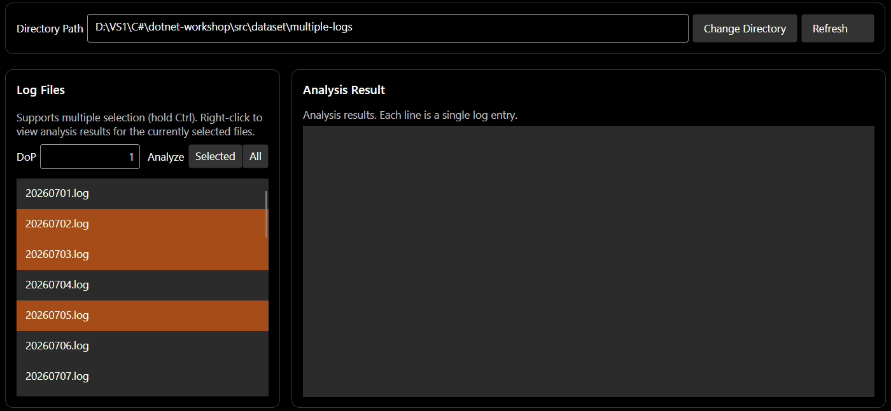
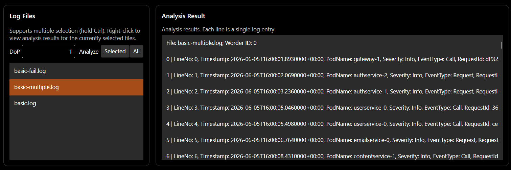
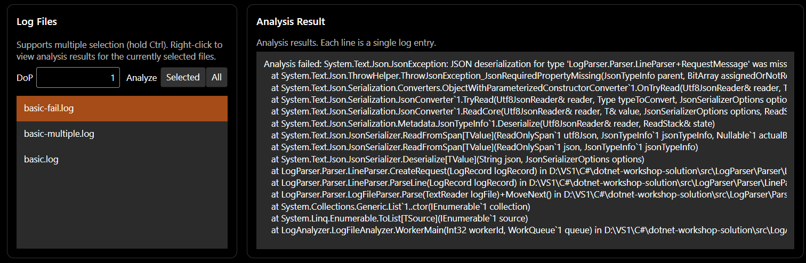

# Guidance for Avalonia

## Table of Contents

[TOC]

## Learning Objectives

+ Understand graphical user interface applications.
+ Learn the fundamentals of building a GUI application with Avalonia UI.
+ Learn the fundamentals of implementing the MVVM pattern with `CommunityToolkit.Mvvm`.

**An unexpected learning objective:**

+ Understand an application of the factory method pattern.

## Background

This section needs little introduction. In the previous section, we built a console client—and its usability was terrible! It is time to build an attractive GUI client.

[Avalonia UI](https://avaloniaui.net/) is a cross-platform GUI framework based on .NET. It is often described as “cross-platform [WPF](https://learn.microsoft.com/en-us/dotnet/desktop/wpf/overview/).” WPF is Microsoft's official .NET GUI framework for Windows and pioneered the MVVM pattern, an architecture now widely used for web frontends—most notably by [Vue.js](https://cn.vuejs.org/).

Let's get started!

## Knowledge Primer

To make sure the Summer Training lectures have not left any gaps, this section briefly reviews the knowledge required for the tasks and introduces a few additional concepts.

### Factory Method Pattern

In `01-basic`, we learned about the simple factory pattern. One limitation of a simple factory is that a single method on a single factory class contains all object-creation logic. If different classes require entirely different creation logic, that logic must live in different places, or different roles must be responsible for creation, it cannot sensibly be kept together. In that situation, use the **factory method pattern**.

We mentioned this pattern in `03-async-grpc` while introducing `ILogger`. In the factory method pattern, separate factories instantiate different classes, while the factories share a common interface. For example:

```csharp
abstract class Product {}
class ConcreteProductA : Product {}
class ConcreteProductB : Product {}

interface IFactory {
    Product CreateProduct(string args);
}

class ConcreteFactoryA : IFactory {
    Product CreateProduct(string args) {
        return new ConcreteProductA(args);
    }
}

class ConcreteFactoryB : IFactory {
    Product CreateProduct(string args) {
        return new ConcreteProductB(args);
    }
}
```

The factory can then be used as follows:

```csharp
class FactoryMethodPatternDemo {
    private readonly IFactory _factory;
    
    public FactoryMethodPatternDemo(IFactory factory) {
        _factory = factory;
    }
    
    public void UseProduct(string args) {
        var product = _factory.CreateProduct(args);
        // Use product
    }
}
```

## Tasks for This Section

### Task Description

Build a graphical user interface (GUI) client to replace the `RemoteCli` created in the previous section. It must include all of `RemoteCli`'s functionality.

### (S4.1) Step 1: Implement the GUI Client

All code for this step is in `src/LogAnalyzerClient`, organized as follows:

```shell
LogAnalyzerClient
|
+---LogAnalyzerClient            # Project containing almost all of the graphical interface
|   |   App.axaml                # Application entry point (XAML portion)
|   |   App.axaml.cs             # Application entry point (C# portion)
|   |   ViewLocator.cs
|   |
|   +---Services                 # gRPC-related services
|   |       IClientFactory.cs    # Interface for the gRPC Client factory
|   |       AppService.cs        # Registers the gRPC Client factory
|   |
|   +---Views                    # User interfaces (views)
|   |       MainWindow.axaml     # Main application window
|   |       MainWindow.axaml.cs
|   |       MainView.axaml       # Content displayed in the main window
|   |       MainView.axaml.cs
|   |
|   +---Styles                   # Styles
|   |       Controls.axaml       # Styles for the controls
|   |
|   +---ViewModels               # View models
|   |       ViewModelBase.cs     # Common base class for all view models
|   |       MainViewModel.cs     # View model for MainView
|   |
|   +---Models                   # Data structures used to store data
|   |       RemoteModels.cs      # Stores log file names and log-analysis results
|   |
|   +---Dialogs                         # Definitions for temporary pop-up dialogs
|   |       ConnectDialog.axaml         # Dialog for connecting to an Agent
|   |       ConnectDialog.axaml.cs
|   |       MessageDialog.axaml         # Message box for temporary notifications
|   |       MessageDialog.axaml.cs
|   \---Helpers                         # Utility classes
|           DialogHelper.cs             # Handles dialog logic and simplifies use of Dialogs
|           ClientInternalException.cs  # Represents exceptions inside the client
|
\---LogAnalyzerClient.Desktop           # Desktop client (Windows, Linux, and macOS)
        Program.cs                      # Entry point for the Desktop program
                                        # 1. Register the gRPC Client factory
                                        # 2. Call LogAnalyzerClient to open the GUI
```

First, consider how the gRPC Client is created and connected to the Agent. Although this workshop runs only on desktop platforms (Windows, Linux, and macOS), the application remains extensible to platforms such as Android, iOS, and browsers. A gRPC Client is created differently on different platforms. If you are interested, see “Avalonia UI on the Web and Mobile” and “Additional Difficulties in Building a WebAssembly Client” in the [development log](../../DEVLOG.md). For this reason, the logic that creates a desktop gRPC Client lives in `LogAnalyzerClient.Desktop`, which specifically builds the desktop program, rather than in the cross-platform `LogAnalyzerClient` project.

The application may need to create a gRPC Client more than once—for example, because the user can switch to a remote Agent at a different address. The creation logic in `LogAnalyzerClient.Desktop` must therefore be available as a reusable method. We use a **factory method** for this purpose.

`LogAnalyzerClient/Services/IClientFactory.cs` defines the factory interface:

```csharp
using LogAnalyzerAgentServiceClient = LogAnalyzerAgentService.LogAnalyzerAgentServiceClient;

public interface IClientFactory {
    LogAnalyzerAgentServiceClient CreateClient(string address);
}
```

It accepts the address of a remote Agent and returns a gRPC Client. `LogAnalyzerClient/Services/AppService.cs` defines a property through which the Client factory is registered:

```csharp
public static class AppService
{
    public static IClientFactory ClientFactory { get; set; } = new NullClientFactory();
}
```

In the `LogAnalyzerClient.Desktop` project, `Program.cs` implements a factory that creates the desktop gRPC Client:

```csharp
internal class ClientFactory : IClientFactory {
    public LogAnalyzerAgentServiceClient CreateClient(string address) {
        var channel = GrpcChannel.ForAddress(address);
        var client = new LogAnalyzerAgentServiceClient(channel);
        return client;
    }
}
```

After the program starts but before the GUI opens, the `Main` method instantiates the factory and registers it with `AppService`:

```csharp
[STAThread]
public static void Main(string[] args) {
    AppService.ClientFactory = new ClientFactory();  // Register the factory
    // Open the GUI window
}
```

Part of the `LogAnalyzerClient` interface has already been implemented. It currently provides:

+ A menu bar at the top of the window.

  + **Connect to Agent.** The `Connect...(_C)` item in the `File(_F)` menu accepts an address and connects to an Agent. It is bound to the `ConnectCommand` relay command, which calls `ConnectAsync` in `ViewModels`.

+ A status bar at the bottom of the window. It shows the current connection state, the remote Agent's address, and the selected log directory.

+ A **Change Directory** button and input box. Enter the log directory on the Agent's server, then select **Change Directory** to switch directories.

+ A degree-of-parallelism input. The box to the right of **DoP** accepts a nonnegative integer for the analysis degree of parallelism.

+ A list of the files in the log directory. The **Log Files** pane displays files from that directory. The example below contains `basic.log`, `basic-fail.log`, and `basic-multiple.log`:

  

Read the existing implementation and use it as a reference while completing the remaining features.

> [!IMPORTANT]
>
> + **A GUI application has only one UI thread to render its interface and respond to user actions. To avoid blocking that thread and making the application appear frozen, every gRPC request must be asynchronous and must be `await`ed.** For the underlying principles, review the “Knowledge Primer” in `03-async-grpc`.
> + **A GUI application must never crash because of invalid user input or an internal error. Validate input, handle exceptions, and show error information to the user in a message box.**

Complete the following features:

+ **Refresh button.** Refresh the file list in the log directory (the list under **Log Files**). `MainView.axaml` in the starter code already binds the button to `RefreshCommand`; implement `RefreshAsync` in the view model.

+ **Analyze multiple selected files.** The file list under **Log Files** supports multiple selection. Hold Ctrl and left-click the files you want to select:

  

  Under MVVM, the view model cannot retrieve every selected item in the list box; it can retrieve only the most recently selected item. The `ListBox` therefore has a `LogFileListBox_SelectionChanged` callback. Each mouse selection causes that method in `MainView.axaml.cs` to update `SelectedFiles` in the view model.

  In `MainView.axaml`, the **Selected** button next to **Analyze** is bound to `AnalyzeSelectedFilesCommand`. Implement `AnalyzeSelectedFilesAsync`: call the `AnalyzeFiles` RPC with `SelectedFiles` as its argument.

+ **Analyze all files.** Add an **All** button after the **Selected** button beside **Analyze**:

  

  The **All** button must call the `AnalyzeAll` RPC to analyze every file.

+ **Analyze a specified file.** In the starter code, the **Log Files** list already has a context menu (`ListBox.ContextMenu`) containing an `Analyze File(_A)` item:

  

  `MainView.axaml` already binds this item to `AnalyzeRightClickedFileCommand`, while `SelectedItem="{Binding SelectedLogFile, Mode=OneWayToSource}"` binds the current selection to `SelectedLogFile`. Implement `AnalyzeRightClickedFileAsync` so the command analyzes that one file.

+ **View analysis results.**

  + The **Log Files** context menu in the starter code also contains `View Analysis Results(_V)`, bound to `GetAnalysisResultCommand`. Implement `GetAnalysisResultAsync` so selecting that item displays the analysis result for the chosen log file.

  + Complete the presentation of log-analysis results. They appear in the list box beneath **Analysis Result**:

    ```xml
    <ListBox Name="ResultEntryListBox"
             Grid.Row="2"
             ItemsSource="{Binding ResultEntries, Mode=OneWay}">
        <ListBox.ItemTemplate>
            <DataTemplate x:DataType="models:LogFields">
                <TextBlock Text="{Binding Summary, Mode=OneWay}" TextWrapping="NoWrap" />
            </DataTemplate>
        </ListBox.ItemTemplate>
    </ListBox>
    ```

    Its contents are bound to `ResultEntries`, whose item type is `LogFields` (defined in `Models/RemoteModels.cs`). The `Summary` property of `LogFields` determines what the list displays.

    Implement the file-analysis result display. The following examples show possible presentations for a successful analysis, a failed analysis, and a file that has not been analyzed. You may use or adapt them as you like:

    

    

    

> [!NOTE]
>
> **Task 4.1 (T4.1)**
>
> Implement every feature described above. A [sample UI](https://eesast.github.io/dotnet-workshop/demo/) is available for reference.
>
> After finishing your implementation, create a text file named `report.md` in `docs/04-avalonia`. Describe the features you implemented and include screenshots of the complete application and of robustness tests using various invalid inputs.
>
> **Tip:** Use your `RemoteCli` implementation from the previous section as a reference. Move its gRPC-related code into this project and replace its console error output with message boxes. This can save considerable time and effort.

> [!IMPORTANT]
>
> The Agent is a long-running service and **must never** crash because of an invalid request or an internal error; otherwise, the service becomes unavailable (or, in everyday terms, “the site goes down”). **Handle errors carefully and catch exceptions.** See the example in `AgentSession`.

**APIs you may find useful:**

[`CommunityToolkit.Mvvm`](https://learn.microsoft.com/en-us/dotnet/communitytoolkit/mvvm/) simplifies MVVM development. For example, to create a public property in a view model, add `[ObservableProperty]` to a private field:

```csharp
using CommunityToolkit.Mvvm.ComponentModel;

partial class MainViewModel {
    [ObservableProperty]
    private string _greeting = "Welcome to Avalonia!";
}
```

`CommunityToolkit.Mvvm` then generates approximately the following code behind the scenes for you to call directly:

```csharp
partial class MainViewModel {
    public partial string Greeting {
        get => _greeting;
        set => SetProperty(ref _greeting, value);
    }
}
```

In simplified form, `SetProperty` works as follows:

```csharp
bool SetProperty<T>(ref T field, T newValue, string? propertyName = null)
{
    OnPropertyChanging(propertyName);
    field = newValue;
    OnPropertyChanged(propertyName);
    return true;
}
```

You only need to use the generated `Greeting` property.

To create a command handler, decorate it with `[RelayCommand]`:

```csharp
using CommunityToolkit.Mvvm.Input;

partial class MainViewModel {
    [RelayCommand]
    private async Task PressAsync() {
        // ...
    }
}
```

The framework generates approximately the following code behind the scenes:

```csharp
partial class MainViewModel {
    private RelayCommand? pressCommand;
    public IRelayCommand PressCommand => pressCommand ??= new RelayCommand(PressAsync);
}
```

You can bind the generated `PressCommand` directly to a control's `Command` property in an `.axaml` file:

```xml
<Button Content="Press" Command="{Binding PressCommand}" />
```

## Questions

Answer the questions in `docs/04-avalonia/report.md`. All questions in this section are open-ended; describe your genuine experience.

### (Q4.1)

How did developing a GUI application differ from developing the console applications you had written before? What additional difficulties or complexities did GUI development introduce? Did writing a GUI application deepen your understanding of asynchronous programming with `async` and `await`? Did asynchronous programming create any additional problems for you? Explain your view.

### (Q4.2)

Did you use AI for this assignment? Based on your answer, choose either (Q4.2.a) or (Q4.2.b).

#### (Q4.2.a)

If you did not use AI, approximately how long did the entire `04-avalonia` section take? Did you use a traditional search engine? Was this section significantly harder than writing an ordinary console application? Did you get stuck anywhere for a long time? If so, where?

#### (Q4.2.b)

If you used AI, what prompts did you provide? Did you ask about APIs, gRPC, or a specific implementation technique; ask it to write part of the assignment; or ask it to explain the starter code? Were any of its answers incorrect? If so, which ones? Did AI teach you anything about asynchronous programming, gRPC, or another topic that you had not known or had found difficult to understand?

For task point values and related details, see [tasks.md](./tasks.md).

## Further Reading

None yet; to be added.

## Previous / Next

+ Previous: [Tasks in Async and gRPC](../03-async-grpc/tasks.md)
+ Next: [Tasks in Avalonia](./tasks.md)
