# 準備工作指引

## 目錄

[TOC]

## 學習目標

+ 了解工程的學習要求
+ 進行 .NET 環境的設定
+ 了解作業要求與繳交方式

## 專案介紹

### 章節劃分

本專案以雲端服務記錄解析為背景，目標是透過 .NET 技術堆疊，帶領同學掌握 .NET 開發所需的知識。內容主要分為三個部分：

+ 準備工作：設定環境，並了解作業要求與繳交方式
  + `00-prepare`
+ 基礎功能：基礎功能的主要學習目標是帶領學生熟悉基本的語法和介面。本部分的難度較為簡單，解答自由度不高，自由發揮的空間較少，主要專案目標在於讓學生建立基本的專案基礎
  + `01-basic`
  + `02-multithreading`
  + `03-async-grpc`
  + `04-avalonia`
+ 進階任務：著重培養自主探索與學習能力。題目限制較少、解答自由度較高，同學可以充分發揮創意，打造屬於自己的軟體專案
  + `05-advanced`

### 符號約定

本專案使用「Xx.y(.z(.w))」形式的符號。其中：

+ X：表示符號代表的含義。當 X 取值為：
  + T：表示 **任務（Task）** 或 **測試（Test）** ；
  + S：表示 **步驟（Step）** ；
  + Q：表示 **問答（Question）** ；
+ x.y(.z(.w)) 表示序號，阿拉伯數字（1，2，3，…）表示順序關係，拉丁字母（a，b，c，…）表示並列關係：
  + x：為章節號
  + y：為章節內的編號
  + z 和 w：為章節內編號內的小編號（如有）

章節（Chapter）序號使用兩位數字表示，如 `01`、`02`、……，等等。如遇到存在歧義的上下文，則使用 C 字母：`C01`、`C02`、……

## 環境設定

### Git 安裝

開始專案前，請先安裝 [Git](https://git-scm.com/) 作為版本控制工具。

### 複製專案

#### 建立存放庫分支（Fork this Repository）

此存放庫隸屬於 EESAST 組織，且不允許直接推送。若要修改程式碼，請先將[此存放庫](https://github.com/eesast/dotnet-workshop)建立分支至自己的個人帳戶。原始存放庫與分支存放庫是兩個獨立的存放庫，擁有者與名稱皆可不同，但 GitHub 會記錄兩者的關聯：

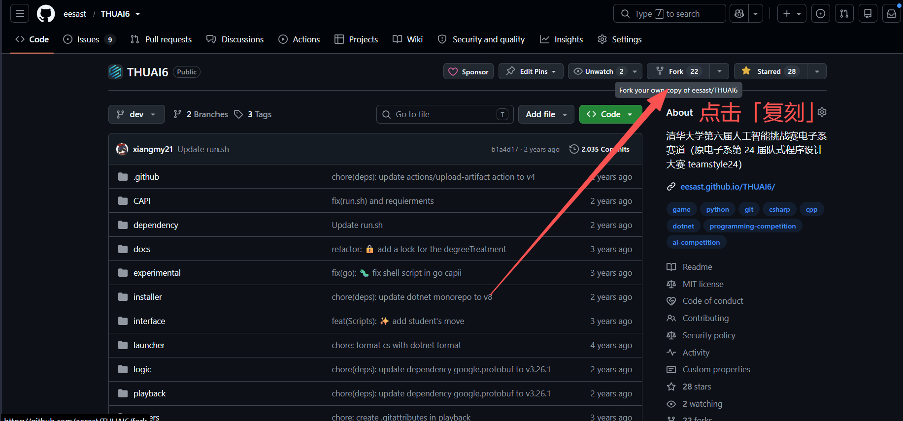


#### 複製存放庫（Clone this Repository）

建立分支後，存放庫仍只位於 GitHub 雲端。若要方便地修改與測試程式碼，請將它複製到本機電腦。遠端與本機存放庫同樣是彼此獨立、但由 Git 關聯的兩份存放庫。

複製前請確認：

- 在電腦中找到或建立用來存放存放庫的資料夾，建議至少保留 2 GB 空間。路徑中盡量不要包含中文，**也切勿使用清華雲端硬碟等網路位置！**
- 電腦已安裝 Git，並設定使用者名稱與電子郵件地址。
- 若使用 SSH Clone（建議），請先將 RSA 公鑰上傳至 GitHub，並完成適當的網路設定；詳情請參閱暑培的 Git 部分。


在本機資料夾中開啟任意終端機（可從滑鼠右鍵選單開啟），然後執行：

```shell
git clone <先前複製的存放庫-URI>
```

複製通常會在數秒內完成，並在目前資料夾中建立名為 `dotnet-workshop` 的子資料夾，也就是本專案。

若遇到網路問題，請依現象或錯誤訊息搜尋解決方案，也可以在暑培群組中反映。

### 開發環境安裝

本專案使用 .NET 10 或更新版本的 .NET 開發環境，建議優先使用 Visual Studio（2026 或更新版本）作為開發工具。

#### Windows

##### .NET 開發環境安裝

Windows 是本專案優先支援的作業系統；如果同學手邊有 Windows 電腦，請使用 Windows。

前往 [Visual Studio 官方網站](https://visualstudio.microsoft.com/zh-hant/downloads/)，選擇「Community」版本下載：

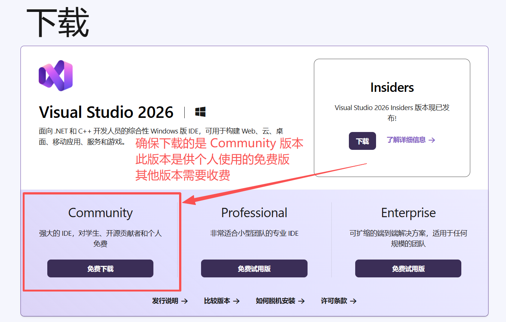

下載完成後，開啟 Visual Studio Installer。如果電腦已安裝 Visual Studio 2026 或更新版本，也可以在「開始」功能表搜尋並開啟 Visual Studio Installer，再按一下「修改」。接著請安裝下列元件。


第一，勾選頂部「工作負荷」索引標籤中的 **「ASP.NET 和 Web 開發」** 以及 **「.NET 桌面開發」** 這兩項：


第二，進入頂部的「單一元件」索引標籤，確保 「.NET 10.0 執行階段」 和 「.NET 10.0 WebAssembly Build Tools」 被勾選：


第三，在頂端的「語言套件」索引標籤中，勾選你最習慣的語言：


第四，在頂部「安裝位置」索引標籤中設定你的 Visual Studio 的安裝路徑，例如：

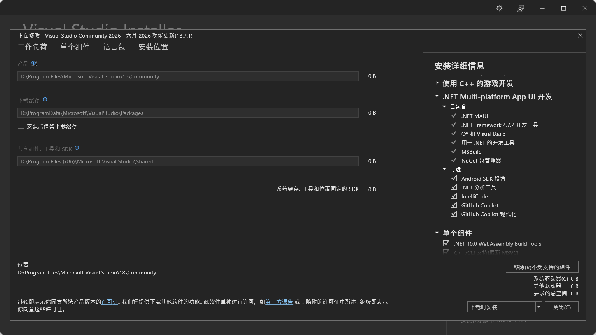

**請確務必保請安裝在一個比較充裕的磁碟中，並且盡量不要安裝在系統盤。**系統盤通常是 C 盤，這個盤如果滿了會很麻煩。如果不確定自己的系統盤，可以在 CMD 中輸入：

```cmd
echo %SYSTEMDRIVE%
```

或在 PowerShell 中輸入：

```powershell
echo $env:SYSTEMDRIVE
```

檢視系統盤。


##### Avalonia 安裝

Visual Studio 安裝完成後，開啟 Visual Studio，選擇「繼續但無需程式碼（Continue without code）」：


在頂部選單欄中，選擇「擴充（Extensions）」中的「管理擴充...（Manage Extensions...）」選單項目：

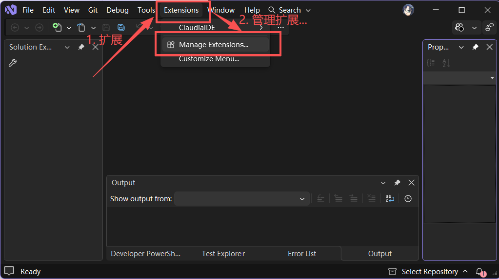


在擴充功能管理視窗的「瀏覽（Browse）」索引標籤中搜尋「Avalonia」，按下 Enter 並等待搜尋完成，再選擇「Avalonia for Visual Studio」和「Avalonia Toolkit」進行安裝：


隨後，按一下右上角的叉，關閉 Visual Studio：

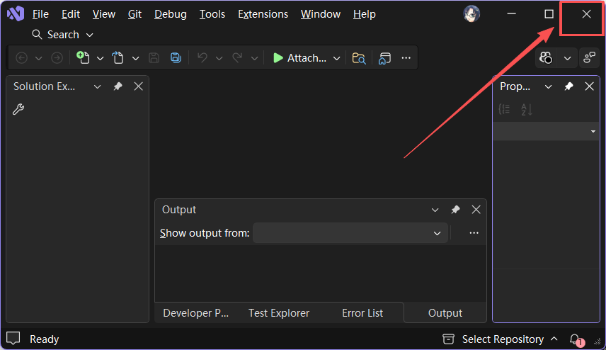


關閉後，會快顯如下安裝擴充的提示，按一下 **「修改(M)」** ，然後一直等待到安裝完成即可。


##### 顯示副檔名

此外，Windows 的檔案總管預設會隱藏副檔名，這對軟體開發十分不便。因此，建議調整設定，讓副檔名保持顯示。

以 Windows 11 為例，先按一下下圖中的三個點，再選擇「選項」以開啟資料夾選項。若使用 Windows 10，請在檔案總管頂端選擇「檢視」索引標籤，再按一下最右側的「選項」。

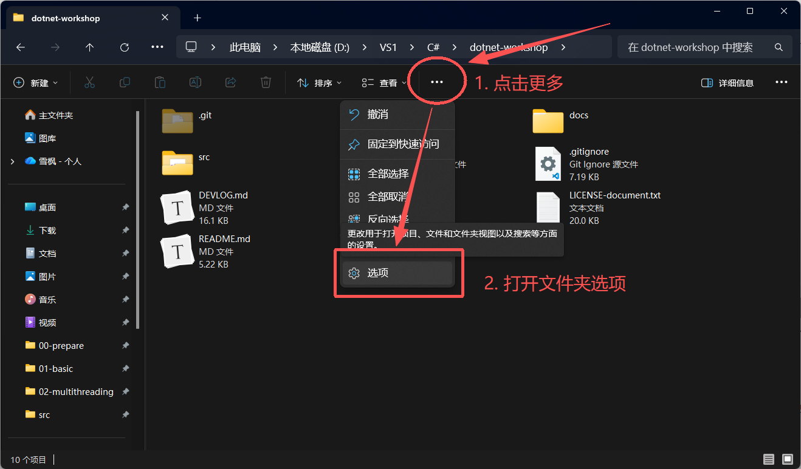


開啟後，如下圖所示，在「檢視」索引標籤中找到「隱藏已知檔案類型的副檔名」，然後**取消勾選**，再按一下底部的「套用」或「確定」：


#### Linux / macOS

Linux 和 macOS 作業系統（尤其是 macOS 作業系統）開發環境的安裝尚未測試過，以下安裝過程可能存在問題。

Linux 和 macOS 目前沒有特別建議的整合式開發環境或編輯器，可依個人偏好使用 Visual Studio Code、Rider、Cursor、Vim、Emacs 等工具進行開發。

首先，前往 .NET 下載網站安裝 .NET 10 SDK（請注意是 SDK，不是 Runtime）：[https://dotnet.microsoft.com/zh-tw/download/dotnet/10.0](https://dotnet.microsoft.com/zh-tw/download/dotnet/10.0)。依照畫面指示完成安裝後，開啟終端機並輸入：

```shell
dotnet --list-sdks
```

如果包含 `10.0.x` 及以上，即表示安裝成功。

不同程式碼編輯器或整合式開發環境安裝 Avalonia 擴充功能的方式各異，請依所用工具的擴充功能（Extensions）安裝流程操作。

## 本節任務

本節目標是設定環境以及執行測試。

### 任務描述

在本節以及 **基礎功能** 四個章節的前三個章節中，每一節均使用 [MSTest](https://learn.microsoft.com/zh-tw/dotnet/core/testing/unit-testing-mstest-intro) 編寫了若干單元測試。在你完成你的程式碼實作後，你必須要執行測試，確保你的實作能夠透過該節的全部測試。

### （S0.1）Step 1：執行測試專案

本專案的所有專案與測試專案均位於 `src` 目錄中。該目錄包含四個測試，分別對應本節與基礎功能的前三個章節：

```shell
LogParser
+-test-00-prepare
+-test-01-basic
+-test-02-multithreading
+-test-03-async-grpc
```

本節任務是將測試 `test-00-prepare` 執行透過。

執行測試有使用圖形化介面和使用命令列兩種方式。首先介紹使用圖形化介面的執行方式。

不同的整合式開發環境或編輯器有不同的圖形化執行方式，本文件僅介紹如何在 Visual Studio 中執行測試。

在 Visual Studio 的選單欄，按一下「檢視（View）」中的「測試資源管理器（Test Explorer）」：

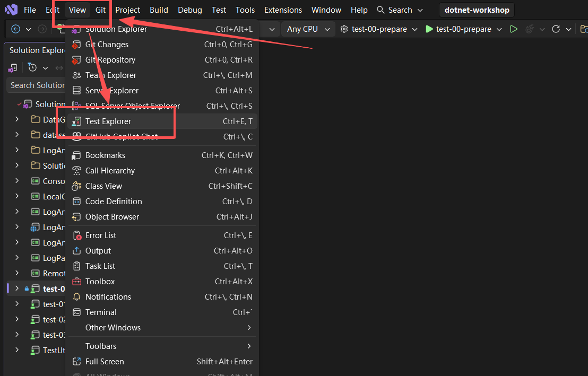


接著會開啟測試總管視窗。載入完成後，選取要執行的測試專案，按一下滑鼠右鍵開啟快顯功能表，再選擇「執行（Run）」或「偵錯（Debug）」。前者會直接執行測試；後者會在偵錯工具中執行，因此能停在中斷點或攔截例外狀況，方便偵錯：


如果你要執行本專案的所有測試，可以按一下左上角的「執行全部測試」按鈕（完成基礎功能的前三節後，需要按下此按鈕進行測試）：


如果要在 Release 設定下執行測試，需要將頂部的設定改為 Release：


但注意，在開發時需要記得將設定改回 Debug 以便於 Debug。


如果你想要使用命令列來進行測試，需要 `cd` 進入 `src` 目錄當中，執行命令：

```shell
dotnet test <test-project>
```

其中，`test-project` 是測試專案的路徑，如下圖所示：


如果要以 Release 設定執行測試，需要執行命令：

```shell
dotnet test <test-project> -c Release
```


如果要執行全部測試，你只需要在 `src` 目錄中執行命令：

```shell
dotnet test
dotnet test -c Release
```

即可。完成基礎功能的前三節後，執行結果應如下：

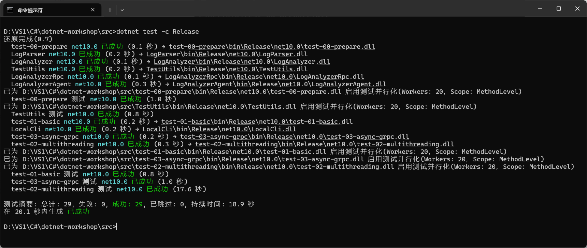


> [!IMPORTANT]
>
> **在本專案中，你必須讓自己的實作在 Release 設定下通過所有測試！！！**


在本節中，你需要執行 `test-00-prepare` 讓測試通過。

> [!NOTE]
>
> **任務 0.1（T0.1）**
>
> 在本節中，你無需修改任何程式碼。執行測試 `test-00-prepare`，你將會通過所有測試（即 `T0.1` 開頭的全部測試）。
>

## 作業繳交

本節為準備環節，你無須進行作業繳交。但本節將會介紹以後的作業要求和繳交方式。

### 作業要求

為了獲得較好的練習效果，建議同學獨立完成作業，並適度運用搜尋引擎、大型語言模型等工具，查找不熟悉的知識並加以探索，逐步提升開發能力。

每一節的作業分為程式碼作業與問答作業；詳細要求、難易度和配分會列在各章的 `guidance.md` 與 `tasks.md` 中。

> [!IMPORTANT]
>
> **關於大型語言模型的使用**
>
> 大型語言模型固然提供了提升效率的新途徑，學會妥善運用它也是未來從事軟體開發的重要技能。不過，過度依賴模型也有不少缺點。
>
> 對於程式碼作業，過度依賴大型語言模型會讓我們失去鍛鍊開發能力、熟悉 .NET 技術堆疊的機會。建議同學先獨立思考，再把模型當作探索未知與完善想法的工具。模型產生的內容未必正確，因此務必保有自己的判斷能力。
>
> 對於問答作業，尤其是最後的實驗報告，若未經思考便完全採用大型語言模型產生的文字，內容往往會充滿明顯的 AI 痕跡，最常見的問題是 **空泛、華而不實、盲目吹捧，而且文件極難閱讀**。這不僅會讓你失去鍛鍊的機會，作業成果也不會理想，還會增加講師批閱的負擔。因此，**若文件品質低落，而且明顯是完全依賴大型語言模型一次產生，將視為無效文件**。當然，如果同學能妥善運用大型語言模型提升文件品質，我們十分鼓勵；辨別並改善文件品質（無論內容由人或大型語言模型撰寫）也是一項重要技能。

此外，作業還有幾點注意事項：

+ 在基礎功能章節中，程式碼作業通常會以 `// TODO: Tx.y` 或 `throw new NotImplementedException("TODO: Tx.y")` 標示可能需要補上程式碼的位置。

+ `.github/workflows` 目錄包含執行自動化測試所需的 CI 設定，`src` 目錄中名稱以 `test` 或 `Test` 開頭的專案則是單元測試。這兩類內容均**禁止更改**。

+ `.csproj` 是專案設定檔；若尚未熟悉其語法，建議不要手動修改。

+ 為方便同學偵錯，專案提供 `Console Test` 主控台專案，可自由輸出資訊；對這個專案的任何修改都不會影響評分。若要在 Visual Studio 中執行它，請在方案總管（可從選單列的「檢視（View）」開啟）以滑鼠右鍵按一下該專案，選擇「設定為啟始專案（Set as Startup Project）」。設定後，專案名稱會以粗體顯示：

  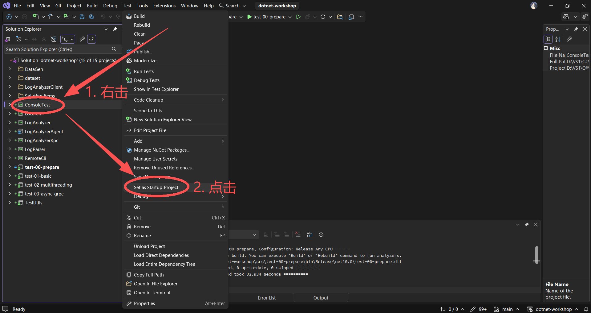

  要透過該 `Console Test` 專案引用其他專案所定義的類、方法、變數等，需要設定專案引用。先按一下解決方案資源管理器的 `ConsoleTest` 專案左側的展開符號展開專案，右擊「外部依賴項（Dependencies）」，按一下「新增專案引用...（Add Project Reference...）」，並在快顯的視窗的「專案（Projects）-> 解決方案（Solution）」索引標籤內勾選要引用的專案即可：

  

  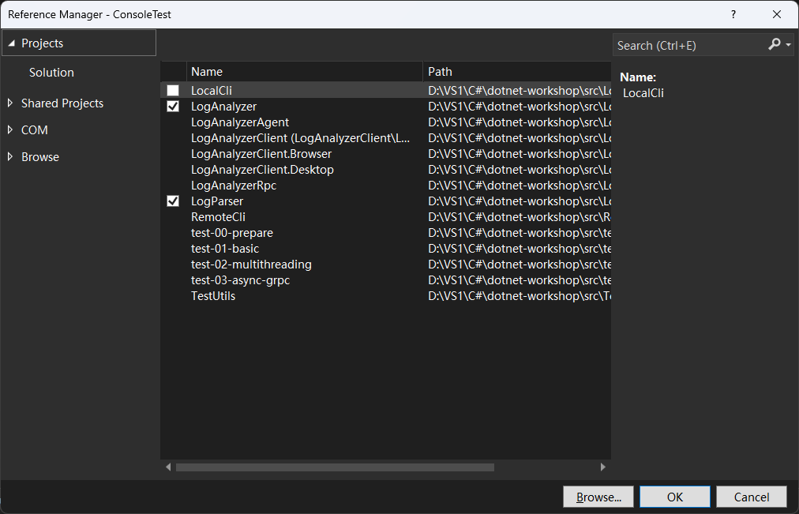

### 繳交方式

本專案的每個章節都對應一個獨立的 Git 分支。分支如下：

+ `main`
+ `dev`
+ `homework/01-basic`
+ `homework/02-multithreading`
+ `homework/03-async-grpc`
+ `homework/04-avalonia`
+ `homework/05-advanced`

**EESAST 存放庫的分支只會在作業繳交期間開放。**

每一講皆依照下列流程繳交作業：

- 本機修改對應分支
- 將修改認可（提交）至對應分支
- 向此存放庫的對應分支提出 PR
- 關聯 PR 到對應 issue
- 檢視作業批改結果

#### i) 本機修改對應分支

建立本存放庫的分支後，請在本機切換至對應分支再開始修改：

```shell
git checkout "homework/01-basic"
```

如果分支不存在，請使用 `-b` 建立：

```shell
git checkout -b "homework/01-basic"
```

如果你想把其他分支的修改合併到目前分支，例如你在開發 `01-basic` 時修改了一些內容，想把修改更新到 `02-multithreading`，可以在進入 `homework/02-multithreading` 分支後執行命令：

```shell
git merge "homework/01-basic"
```

即可從 `homework/01-basic` 拉取更改合併到  `homework/02-multithreading` 分支。

#### ii) 將修改認可（提交）至對應分支

完成程式碼後，請使用 Git 認可（提交）變更。認可訊息（提交訊息）須遵循 [Conventional Commits 規範](https://www.conventionalcommits.org/zh-hans/)；部分編輯器擴充功能也能提供協助，例如 Visual Studio Code 的 [Conventional Commits](https://marketplace.visualstudio.com/items?itemName=vivaxy.vscode-conventional-commits)：

```shell
git add <files>
git commit -m "<commit-message>"
```

執行 `git commit` 後，變更會提交至本機存放庫；接著將它推送至雲端的分支存放庫：

```shell
git push origin "homework/01-basic"
```

#### iii) 向本存放庫對應分支提出 PR

開啟 GitHub 上的分支存放庫頁面，切換至剛才推送的分支（例如 `homework/01-basic`）。

按一下 **Compare & Pull Request**，並在 PR 建立頁面填寫相關資訊。

#### iv) 關聯 PR 到對應 Issue

在 PR 模板填寫介面，需手動關聯 PR 到對應 issue。

你可以在 PR 正文中手動關聯對應 issue，方法是新增 `#ISSUE-NUMBER` 到正文後。例如，需要連結的 issue 對應的 id 是 32，則新增一行 `#32`：

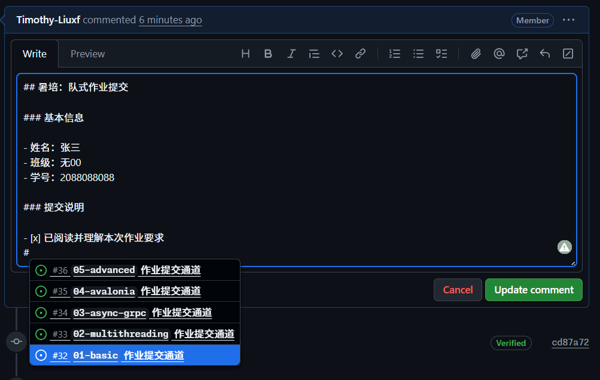

`ISSUE-NUMBER` 可以在 [作業繳交通道一覽](https://github.com/eesast/dotnet-workshop/issues/71) 中的 Sub-issues 區域檢視。

此外，我們提供了 [範例 PR](https://github.com/eesast/dotnet-workshop/pull/37) 供參考。


關聯完成後，提出 PR，則作業繳交完畢。

#### v) 檢視作業批改結果

提出 PR 後，GitHub Actions 會自動執行，檢查提交內容是否符合要求，並確認它能通過該章節的單元測試。只有在所有檢查皆通過（顯示 **All checks have passed**）後，講師才會批改：

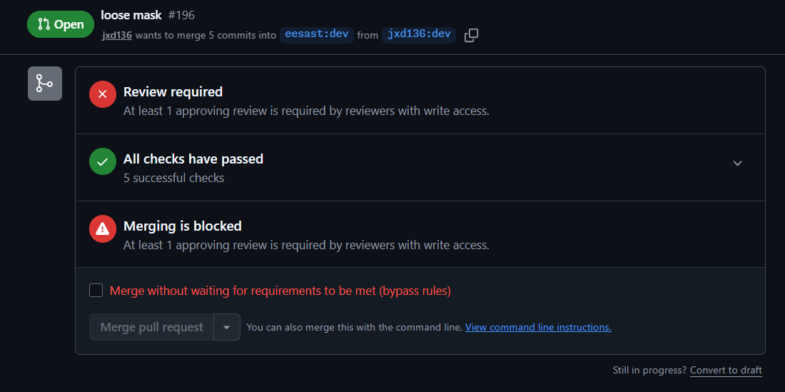


講師批改後，會在 PR 上加上下列標籤：

- accepted ✅：作業通過，PR 會被關閉。
- require revision 🔄：需要修改，PR 保持 open 狀態。

若檢查未通過或講師要求修改，請開啟失敗的檢查以查看錯誤位置，或依照 PR 留言中的講師說明修改內容，再重複步驟 ii 提交更新。

## 測試資料

本專案的測試資料集均位於 `src/dataset` 中，**禁止修改**。測試資料集如下：

```shell
dataset
|   basic.log           # 範例記錄，共三條
|   basic-fail.log      # 錯誤記錄，含有錯誤的記錄格式
|   basic-multiple.log  # 多條記錄，含有多條正確的記錄
|
+-multiple-logs         # 多檔案記錄資料
    20260701.log
    20260702.log
    ...
    20260730.log
```

用於產生隨機測試資料的原始碼位於 `src/DataGen` 中， **禁止更改** 。產生測試資料的程式碼結構如下：

```shell
DataGen
|   .gitignore  # Git Ignore List
|   gen.py      # 產生記錄
|   batch.py    # 批次產生記錄
|
+-gen_logs      # 產生記錄的一些檔案和批次產生記錄時的元資料目錄
|
+-multiple_logs # 批次產生記錄時的記錄檔產生目錄
```

## 其他

如需查看本專案的所有任務概覽，請參閱 [tasks.md](./tasks.md)。

**衷心祝愿大家學習愉快，收獲滿滿！**

## 延伸閱讀

+ [測試：單元測試、測試驅動的開發（TDD）](https://docs.eesast.com/docs/tools/tdd)
+ [版本管理與 Git 基礎](https://docs.eesast.com/docs/tools/git)
+ [計算機教育中缺失的一課](https://missing-semester-cn.github.io/)

## 上一篇 / 下一篇

+ 上一篇：[README](../../README.md)
+ 下一篇：[準備工作任務](./tasks.md)

