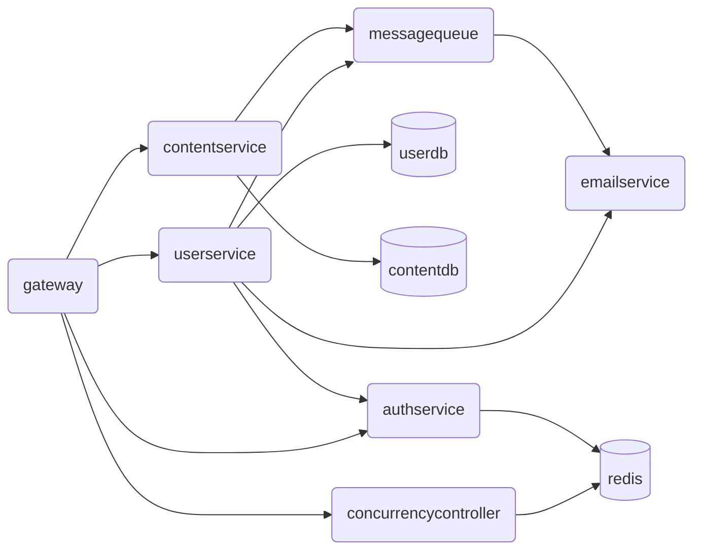
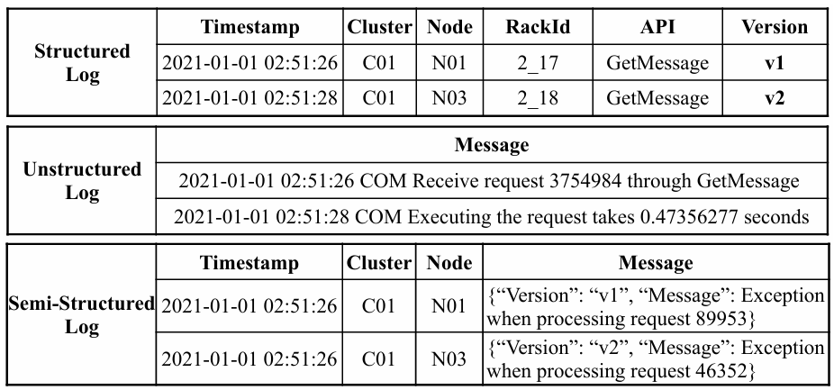
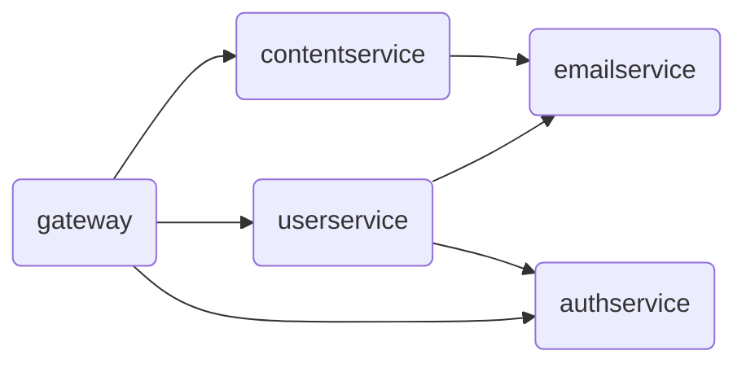

# 基礎功能指引

## 目錄

[TOC]

## 學習目標

+ 了解雲端服務記錄解析的背景
+ 了解本專案的主題
+ 熟悉 C\# 語言的基礎語法
+ 體會面向物件的程式設計思想 

## 背景介紹

### 雲端服務一瞥

**注意：本節可能略微涉及到暑培網站部分內容，但對本 workshop 來說僅作為背景，讀者可以不必理解，不理解處跳過即可。**

「雲端（cloud）」涵蓋了現代網際網路中的大多數內容，我們在生活中幾乎隨處都能見到「雲端」，例如耳熟能詳的雲端硬碟，或近年流行的雲端遊戲，~~以及隨處可見的雲端玩家酸民，又或者我們把一款遊戲雲端化了~~；Apple 使用者在設定新裝置時也會遇到 iCloud。如今，「雲端」似乎已成為現代生活不可或缺的一部分。我們日常使用的網際網路服務幾乎都部署在雲端；無論是瀏覽網頁，還是使用各種連網 App 用戶端，都在存取部署於雲端的網際網路服務。以下將這類服務簡稱為 **雲端服務（cloud service）**。

微服務（microservice）架構是雲端服務的一種常見架構。在這種架構中，雲端服務的每個功能都被做成單獨的服務，各自獨立地部署和執行。例如，一個簡化的網站後端微服務架構如下：



其中，`gateway` 是主要閘道，`userservice` 負責使用者管理，`contentsevice` 負責網站內容，`emailservice` 管理電子郵件，`authservice` 處理權限驗證，`concurrencycontroller` 則負責並行控制。

一般而言，為了負載平衡、容錯與復原，每項服務通常會同時執行多個複本，每個複本各自在獨立的容器中執行（可將每個複本理解成一個獨立處理序）。

### 雲端服務記錄

平常撰寫程式並進行偵錯時，我們通常會印出一些訊息，協助追蹤程式的執行情形，例如：

```c
#include <stdio.h>
#include <stdlib.h>

double calc_avg(int scores[], int n) {
    if (n == 0) {
        printf("[ERROR] 陣列長度為零！\n");
        exit(EXIT_FAILURE);
    }
    int sum = 0;
    printf("[DEBUG] 開始計算總分...\n");
    for (int i = 0; i < n; i++) {
        sum += scores[i];
        printf("[DEBUG] 第 %d 個成績=%d, 目前總分=%d\n", i + 1, scores[i], sum);
    }
    printf("[DEBUG] 總分=%d, 人數=%d\n", sum, n);
    return (double)sum / n;
}

int main() {
    int scores[5] = {86, 90, 78, 92, 88};
    printf("[DEBUG] 程式開始執行\n");
    double avg = calc_avg(scores, 5);
    printf("平均分是：%.2f\n", avg);
    return 0;
}
```

裡面我們用 `printf` 輸出了很多我們的程式功能本身無關的資訊（在上面的範例程式碼中以 `[DEBUG]`、`[ERROR]` 等開頭），來幫助我們追蹤程式的執行、列印錯誤資訊等。而這類輸出資訊，我們稱之為程式的 **記錄（log）** 。例如上面的程式碼執行之後，程式的 **記錄** 為：

```shell
[DEBUG] 程式開始執行
[DEBUG] 開始計算總分...
[DEBUG] 第 1 個成績=86, 目前總分=86
[DEBUG] 第 2 個成績=90, 目前總分=176
[DEBUG] 第 3 個成績=78, 目前總分=254
[DEBUG] 第 4 個成績=92, 目前總分=346
[DEBUG] 第 5 個成績=88, 目前總分=434
[DEBUG] 總分=434, 人數=5
```

以上就是最簡單的記錄。

記錄有什麼值得研究的呢？雲端服務的記錄通常不是隨意產生的。為了在程式執行期間批次處理與分析記錄，並迅速找出應用程式的故障或例外狀況，記錄必須提供足夠資訊並遵循固定格式。依格式的嚴謹程度，可分為**結構化記錄（structured logs）**、**半結構化記錄（semi-structured logs）**與**非結構化記錄（unstructured logs）**。下圖清楚比較了這三類記錄[^1]：



如圖所示，結構化記錄具有嚴謹格式，所有輸出資訊會組成整齊的表格，方便直接寫入資料庫；半結構化記錄具有部分固定欄位，也允許加入應用程式本身的資訊（Message 欄位）；非結構化記錄的自由度最高，應用程式可以自行決定輸出內容。結構化記錄很適合機器處理，非結構化記錄卻難以預測，因此本 workshop 將著重於半結構化記錄。

收集與分析雲端服務記錄是網路領域的重要研究方向，可用於故障診斷、異常偵測等工作。隨著大型語言模型（LLM）快速發展，運用 LLM 根據記錄偵測異常也成為新的熱門研究主題。

本 workshop 的最終目標，是實作一套簡易的雲端服務記錄分析系統。別被前面的內容嚇到；我們要處理的是大幅簡化、適合初學者的版本。

## 知識補充

我們在這裡先介紹一下本節任務用到的一些需要補充的知識。

### 簡單工廠模式

工廠模式（Factory Pattern）是物件導向程式設計中最常用的設計模式之一。它提供了一種建立物件的方式，使得建立物件的過程與使用物件的過程分離。其中，簡單工廠模式是工廠模式中最簡單的一類。

簡單工廠模式包含如下三個角色：

+ Factory：工廠，負責實作建立所有實例的內部邏輯
+ Product：抽象產品，是需要建立的所有物件的基底類別，負責描述所有要建立的物件的公開介面
+ ConcreteProduct：具體產品；建立的每個物件都是某個具體產品類別的執行個體

例如有兩個具體產品：

```csharp
abstract class Product {}
class ConcreteProductA : Product {}
class ConcreteProductB : Product {}
```

在簡單工廠模式下，一個典型的 `Factory` 範例如下：

```csharp
class Factory {
    public static Product CreateProduct(string type) {
        if (type == "A") {
            return new ConcreteProductA();
        } else if (type == "B") {
            return new ConcreteProductB();
        } else {
            // ...
        }
    }
}
```

### 訪問者模式

訪問者模式（Visitor Pattern）也是常用的設計模式。它讓外部程式能對共用同一基底類別的不同衍生類別採取不同行為，而不必修改這些類別本身，藉此分離資料結構與作用於其上的操作。在此模式中，待操作的物件透過多型提供統一的訪問者介面；需要加入新操作時，只要實作指定的訪問者介面即可。

我們仍用之前介紹簡單工廠模式時提供的案例為例：

```csharp
abstract class Product {}
class ConcreteProductA : Product {}
class ConcreteProductB : Product {}
```

當我們持有了對指定物件的基底類別引用 `Product` 時，我們希望對產品 A 和 B 分別執行不同的操作。若直接使用多型、虛方法等去做，我們通常需要這樣寫：

```csharp
abstract class Product {
    abstract void Print();
}

class ConcreteProductA : Product {
    override void Print() { Print("ConcreteProductA"); }
}

class ConcreteProductB : Product {
    override void Print() { Print("ConcreteProductB"); }
}

var product = Factory.CreateProduct(type);
product.Print();
```

但這樣寫存在諸多不便。例如，如果我們需要在外部使用這些物件，可能會對這些物件施加多種行為。如果這樣的話，我們需要為每一種行為均在 `Product` 中新增一個虛方法，導致資料的儲存以及對資料的操作行為混雜在一起。而訪問者模式就是來解決這一問題的。

在訪問者模式中，我們把多型機制暴露為一個統一的 `IVisitor` 介面，介面內定義對不同物件的訪問方法的方法簽名：

```csharp
interface IVisitor {
    void Visit(ConcreteProductA product);
    void Visit(ConcreteProductB product);
    // 如果你使用的語言不支援函式重載，你也可以把方法名定義為 VisitA、VisitB 等
}
```

隨後，我們要利用多型機制，讓 `IVisitor` 對不同的物件呼叫不同的訪問方法，我們稱之為 `Accept` 方法：

```csharp
abstract class Product {
    abstract void Accept(IVisitor visitor);
}

class ConcreteProductA : Product {
    override void Accept(IVisitor visitor) {
        visitor.Visit(this);  // 呼叫 IVisitor.Visit(ConcreteProductA product)
    }
}

class ConcreteProductB : Product {
    override void Accept(IVisitor visitor) {
        visitor.Visit(this);  // 呼叫 IVisitor.Visit(ConcreteProductB product)
    }
}
```

這樣，我們就成功編寫了訪問者模式中對外提供的訪問者介面。如果我要實作之前的功能，我只需要去編寫一個全新的訪問者類別，繼承 `IVisitor` 介面即可：

```csharp
class PrintVisitor : IVisitor {
    void Visit(ConcreteProductA product) { Print("ConcreteProductA"); }
    void Visit(ConcreteProductB product) { Print("ConcreteProductB"); }
}
```

隨後，我們即可將原來的程式碼重構為：

```csharp
var product = Factory.CreateProduct(type);
var visitor = new PrintVisitor();
product.Accept(visitor);
```

訪問者模式的實際用途非常廣泛，例如編譯器常在語意分析階段採用訪問者模式或其最佳化變體。[OpenJDK](https://github.com/openjdk) 就以典型方式運用此模式分析語法樹：[`Tree` 定義了 `accept` 抽象函式](https://github.com/openjdk/jdk/blob/a39a1f10f75c15b93a709eca7bfae2d808cf7b91/src/jdk.compiler/share/classes/com/sun/source/tree/Tree.java#L749)，[`TreeVisitor` 定義訪問者介面](https://github.com/openjdk/jdk/blob/a39a1f10f75c15b93a709eca7bfae2d808cf7b91/src/jdk.compiler/share/classes/com/sun/source/tree/TreeVisitor.java#L59)，而 [`JCWhileLoop` 類別則實作 `accept`，讓 `Visitor` 對 `while` 迴圈陳述式進行語意分析](https://github.com/openjdk/jdk/blob/a39a1f10f75c15b93a709eca7bfae2d808cf7b91/src/jdk.compiler/share/classes/com/sun/tools/javac/tree/JCTree.java#L1225)。

> 有趣的是，THUAI（清華大學人工智能挑戰賽暨電子系隊式程式設計大賽）的選手介面也曾使用訪問者模式，參見 [THUAI6 Issue 17](https://github.com/eesast/THUAI6/issues/17)。在 THUAI6 中，選手需要同時為人類陣營和魔物陣營編寫 AI 程式碼，存在 `IHumanAPI`、`IButcherAPI` 兩套不同的邏輯用於供給選手來呼叫。因此，選手編寫 AI 程式碼的類 `AI` 就成為了訪問者。因此，在 `IGameTimer` 介面中提供了 `StartGame` 方法作為 `Accept` 方法；而 `IAI` 介面作為訪問者介面，提供了 `play` 方法作為 `Visit` 方法。


## 本節任務

本節目標是實作對雲端服務記錄的讀取和分析。

### 任務描述

本 workshop 假定雲端服務的架構如下：



其只包含 `gateway`、`userservice`、`contentservice`、`emailservice` 和 `authservice` 五個服務（服務是什麼以及拓撲結構是什麼其實並不重要，也用不上，在本 workshop 中你把它們當成 `a`、`b`、`c`、`d`、`e` 就可以了），且各服務產生的記錄格式完全相同，並且根據 `event` 的不同， **有且僅有三類** 。一個包含三類記錄的典型的記錄檔內容如下圖所示：

```shell
0,2026-06-05T16:00:29.045Z,userservice-0,"{""severity"": ""INFO"", ""event"": ""call"", ""request-id"": ""3a013a08-6853-49fc-8f06-50daeb5c1e51"", ""target-service"": ""authservice"", ""duration-ms"": 18}"
1,2026-06-05T16:00:31.086Z,userservice-1,"{""severity"": ""INFO"", ""event"": ""request"", ""request-id"": ""1177c344-115e-4f85-b8ec-c9164d132b79"", ""method"": ""GET"", ""path"": ""/api/user/john"", ""status-code"": 404}"
2,2026-06-05T16:05:45.322Z,gateway-0,"{""severity"": ""ERROR"", ""event"": ""internal"", ""exception"": ""System.InvalidOperationException: Failed to load gateway routing configuration.""}"
```

可以看到，記錄以一個 CSV 格式（逗號分隔格式）儲存，CSV 的每一行內容分別為：

```csv
lineno,timestamp,pod-name,message
```

+ `lineno`：該行記錄在檔案內的行號

+ `timestamp`：產生這條記錄時的時間戳

+ `pod-name`：產生這條記錄的容器名。可以看到，容器名的構成為 `service-n`，由兩部分組成：

  + `service`：即產生這條記錄的服務名
  + `n`：由於每一個服務會同時執行多個副本，因此用 `n` 代表副本的序號

  因此，諸如 `userservice-0`、`userservice-1`、`userservice-2`、`gateway-0`、`gateway-1`、`emailservice-0` 等都是合法的 `pod-name`。

+ `message` 記錄的具體資訊，以 JSON 格式組織，且本專案中的三類記錄的不同體現在 `message` 中的不同。

  + `severity`：記錄層級。一條記錄通常包含「等級」，如 `TRACE`、`DEBUG`、`INFO`、`WARNING`、`ERROR`、`FATAL` 等等。本專案 **包含且僅包含三種等級** ：`INFO`（表示這是一條普通訊息）、`WARNING`（表示這是一條警告資訊）和 `ERROR`（表示這是一條錯誤資訊）
  + `event`：本條記錄發生的事件，標識了本條記錄的類別。 **之前所屬的記錄分為三類即是三種不同的 `event`** 。 **`event` 的取值有且僅有以下三種** ：
    + `call`：表示本服務向其他服務發出了一次要求。此類記錄的 `message` 包含以下欄位：`request-id`、`target-service`、`duration-ms`
    + `request`：表示本服務收到了一次要求。此類記錄的 `message` 包含以下欄位：`request-id`、`method`、`path`、`status-code`
    + `internal`：表示本服務發生了一次內部故障。此類記錄的 `message` 僅包含 `exception` 欄位，代表服務拋出的例外狀況，且欄位值固定為 `ExceptionName: exception message` 格式（例外狀況名稱和例外狀況資訊之間用冒號後緊跟一個空格來分隔）。

本節擬對以上描述的記錄進行解析。

### （S1.1）Step 1：記錄解析基礎功能實作

要對記錄進行解析，需要對儲存記錄的 CSV 檔案逐行讀取檔案內容，並取得 CSV 每行記錄的各個欄位的值。尤其對於 JSON 格式的 Message 欄位，還需要進一步使用 JSON 解析器進行解析，以得到內部各個欄位的值。

本步驟的程式碼位於 `LogParser` 目錄中，程式碼結構如下：

```shell
LogParser
|
+-Models
|   LogEntries.cs
|
+-Parser
    LineParser.cs
    LogFileParser.cs
```

你的任務是要仔細閱讀我們所給的基礎程式碼架構，並將功能補充完整。

> [!NOTE]
>
> **任務 1.1（T1.1）**
>
> 請參考下方說明，仔細閱讀程式碼架構。

在提供的程式碼架構中，`Parser/LogFileParser.cs` 內的 `LogFileParser` 類別是對外提供的記錄檔解析介面，其定義如下：

```csharp
public class LogFileParser {
    public IEnumerable<LogEntry> Parse(TextReader logFile);
}
```

`logFile` 參數以資料流形式向介面提供記錄檔內容，介面也會逐筆傳回每一行的解析結果 `LogEntry`，讓我們能方便地取得結果：

```csharp
var parser = new LogFileParser();
using var reader = new StreamReader("path/to/logfile");
foreach (var logEntry in parser.Parse(reader)) {
    // ...
}
```

`LogEntry` 是用來儲存記錄解析結果的類別（在 C\# 中，可使用 `record` 型別處理這類用途），其定義位於 `Models/LogEntries.cs`。

為了清楚儲存三種記錄的解析結果，並方便後續分別處理，我們將三類結果定義為 `CallLogEntry`、`RequestLogEntry` 與 `InternalLogEntry`（皆為 `record` 型別），且都繼承自 `LogEntry`。`LogEntry` 包含三類記錄共用的欄位，三個衍生類別則各自包含該類記錄特有的欄位。這些資料結構與其他必要結構都位於 `Models/LogEntries.cs`。

基礎程式碼已提供 `LogFileParser` 的基本實作。它會逐行讀取指定的記錄檔，以逗號切分內容，再將結果交給 `LineParser` 進一步解析。

`LineParser` 採用 **簡單工廠模式** ，其 `ParseLine` 方法是 `LineParser` 的公開介面：

```csharp
class LineParser {
    public static LogEntry ParseLine(LogRecord logRecord);
}
```

每收到一行記錄 `logRecord`，`LineParser` 便會在內部解析並識別記錄類型，再建立相應的物件儲存解析結果，最後統一以 `LogEntry` 基底類別傳回。

> [!TIP]
>
> 開始開發前，請在終端機輸入下列命令，確認目前位於 `homework/01-basic` 分支：
>
> ```shell
> git branch
> ```

> [!NOTE]
>
> **任務 1.2（T1.2）**
>
> 我們已經提供 Call 類型記錄的完整實作。執行測試 `test-01-basic` 後，`TestLogFileParserBasic` 中的 `TestParseCallLogEntry` 應能通過。
>
> 請參考 Call 類型記錄的完整實作，以及本文件末尾的「可能用到的知識或介面」一節，親自實作 request 與 internal 類型記錄的解析。完成後執行測試 `test-01-basic`，你的實作應能通過 `Test_1_2_LogFileParserBasic` 中的所有測試（即以 `T1.2` 開頭的所有測試）。

**可能會用到的 API：**

+ 可能用到的 C\# 字串操作：
  + 查找子串：`String.IndexOf()`

    ```csharp
    var str = "abcdefg";
    var index1 = str.IndexOf("cd") // 2
    var index2 = str.IndexOf("hi") // -1
    ```

    更多請參照：[String.IndexOf 方法 (System) - Microsoft Learn](https://learn.microsoft.com/zh-tw/dotnet/api/system.string.indexof?view=net-10.0)

  + 取得子串：`String.Substring`

    ```csharp
    var str = "01234567";
    var str1 = str.Substring(1, 3); // "12"
    var str1 = str.Substring(5); // "567"
    ```

    更多請參照：[String.Substring 方法 (System) - Microsoft Learn](https://learn.microsoft.com/zh-tw/dotnet/api/system.string.substring?view=net-10.0)


### （S1.2）Step 2：取得解析結果

現在，我們可以透過 `Parse` 方法來取得儲存記錄解析結果的物件。但此時，我們得到的是一系列 `LogEntry` 這個抽象類別的引用，我們如何從這個抽象類別的引用中取得到實際物件內部儲存的內容呢？

本步驟約定以鍵值對形式取得解析結果，對應介面是 `Visitors\KeyValueVisitor.cs` 中 `KeyValueVisitor` 類別的 `Dump` 方法：

```csharp
class KeyValueVisitor {
    Dictionary<string, string> Dump(LogEntry entry);
}
```

該介面的輸入是每一條記錄的解析結果物件的引用 `LogEntry`，傳回一個由鍵值對組成的字典 `Dictionary<string, string>`。對每種記錄，其鍵分別為：

+ Call 類型記錄：

  ```csharp
  Dictionary<string, string> {
      ["LineNo"],
      ["Timestamp"],
      ["PodName"],
      ["Severity"],   // "Info" / "Warning" / "Error"
      ["EventType"],  // "Call" / "Request" / "Internal"
      ["RequestId"],
      ["TargetService"],
      ["DurationMs"],
  };
  ```

+ Request 類型記錄：

  ```csharp
  Dictionary<string, string> {
      ["LineNo"],
      ["Timestamp"],
      ["PodName"],
      ["Severity"],   // "Info" / "Warning" / "Error"
      ["EventType"],  // "Call" / "Request" / "Internal"
      ["RequestId"],
      ["Method"],
      ["Path"],
      ["StatusCode"],
  };
  ```

+ Internal 類型記錄：

  ```csharp
  Dictionary<string, string> {
      ["LineNo"],
      ["Timestamp"],
      ["PodName"],
      ["Severity"],   // "Info" / "Warning" / "Error"
      ["EventType"],  // "Call" / "Request" / "Internal"
      ["ExceptionName"],
      ["ExceptionMessage"],
  };
  ```

我們將使用 **訪問者模式** 來進行這項操作。

本步驟的程式碼依然位於 `LogParser` 目錄中，程式碼結構如下：

```shell
LogParser
|
+-Models
|   ILogEntryVisitor.cs
|   LogEntries.cs
|
+-Parser
|   LineParser.cs
|   LogFileParser.cs
+-Visitors
    KeyValueVisitor.cs
```

我們在 `Models/ILogEntryVisitor.cs` 中提供了訪問者介面：

```csharp
public interface ILogEntryVisitor<TResult>
{
    TResult Visit(CallLogEntry entry);
    TResult Visit(RequestLogEntry entry);
    TResult Visit(InternalLogEntry entry);
}
```

抽象類別 `LogEntry` 定義了抽象方法 `Accept`：

```csharp
public abstract record LogEntry {
    public abstract TResult Accept<TResult>(ILogEntryVisitor<TResult> visitor);
}
```

> [!NOTE]
>
> **任務 1.3（T1.3）**
>
> 你需要為三種具體的 `LogEntry` 提供 `Accept` 的實作，並完成 `KeyValueVisitor` 的實作，包括實作 `Dump` 方法和 `Visit` 方法。
>
> 基礎程式碼已提供 `KeyValueVisitor` 中處理 Call 類型的 `Visit` 方法作為參考。完成實作後，執行測試 `test-01-basic`，你的程式應能通過所有測試。

## 問答題

請在 `docs/01-basic` 目錄新增 `report.md` 文字檔，並在其中回答問答題。

### (Q1.1)

在提供的 `Parser` 程式碼架構中：

+ 哪一行或哪幾行陳述式會以逗號切分記錄？程式碼如何指定每一行中各欄位所代表的意義？
+ 讀取記錄中 JSON 格式的 `message` 欄位時，程式在哪個方法、透過哪些陳述式判斷該筆記錄的類型（Call / Request / Internal）？
+ 確定記錄種類後，我們呼叫了哪個程式庫方法來解析 JSON？
  + 進一步，我們的架構程式碼是如何防止記錄中有欄位缺失的？（例如所給的 Call 記錄的 `message` 中缺失 `request_id` 欄位）
  + 更進一步，記錄中的 JSON 鍵採用 `abc-def` 命名法（kebab case），解析結果卻儲存在採用 `AbcDef` 命名法（Pascal case）的屬性裡。基礎程式碼如何指示 JSON 解析器完成這項命名轉換？

### (Q1.2)

以 Call 事件的解析結果為例，呼叫 `KeyValueVisitor.Dump` 後，還會依序呼叫哪些方法？請補完下列方法呼叫鏈（不必列出 .NET 內建程式庫）：

+ `Dictionary<string, string> KeyValueVisitor.Dump(LogEntry entry)`
+ ……

> **函式（或方法）呼叫鏈範例**
>
> 對於如下程式：
>
> ```c
> void f1(int x) {
>     printf("%d\n", x);
> }
> 
> void f2(int x) {
>     f1(x);
> }
> 
> int main(int argc, char* argv[]) {
>     f2(argc);
> }
> ```
>
> 函式呼叫鏈表示為：
>
> + `int main(int argc, char* argv[])`
> + `void f2(int x)`
> + `void f1(int x)`

### (Q1.3)

本次作業中，你是否使用了 AI？根據你的使用情況，在以下 (Q1.3.a) (Q1.3.b) 兩個問題中選擇一題作答：

#### (Q1.3.a)

如果沒有使用 AI，你花了大約多長時間通過所有測試？你認為本次作業相比於你曾經上過的程式設計課程的作業難度如何？你認為你自己的作答是否足夠標準？如果不，你覺得你的作答有哪裡不夠完美？

#### (Q1.3.b)

如果使用了 AI，你使用了哪些提示詞？相較於只使用傳統搜尋引擎並自行作答，AI 的回答好在哪裡？哪些回答有問題，或至少不如你自己的答案？請說明理由。

## 其他

關於本節的任務配分等資訊，請參閱 [tasks.md](./tasks.md)。

## 延伸閱讀

+ [雲端原生與現代計算機網路基礎](https://docs.eesast.com/docs/web/cloud_native/fundamental)：初步了解什麼是雲端服務，以及現代計算機網路的部分知識
+ [深入高可用系統原理與設計](https://www.thebyte.com.cn/)：深入了解雲端原生以及分布式系統
+ [Clean C++](https://link.springer.com/content/pdf/10.1007/978-1-4842-2793-0.pdf) 與 [Clean C++20](https://link.springer.com/content/pdf/10.1007/978-1-4842-5949-8.pdf)：了解軟體設計當中的優良程式碼習慣

## 上一篇 / 下一篇

+ 上一篇：[準備工作任務](../00-prepare/tasks.md)
+ 下一篇：[基礎功能任務](./tasks.md)

## 參考文獻

[^1]: He S, Zhang X, He P, et al. An empirical study of log analysis at Microsoft[C]//Proceedings of the 30th ACM Joint European Software Engineering Conference and Symposium on the Foundations of Software Engineering. 2022: 1465-1476.

