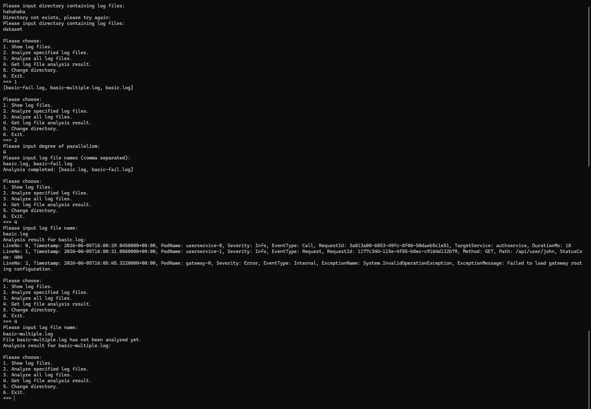

# 多執行緒指引

## 目錄

[TOC]

## 學習目標

+ 了解多執行緒程式設計
+ 了解並行環境下的同步和互斥
+ 學會處理多執行緒環境下的資料競爭問題

## 背景介紹

### 雲端服務記錄的平行解析

上一節完成了基本的記錄解析功能。然而，實際的雲端服務會產生大量記錄，並分散儲存在許多檔案中。若逐一解析每個檔案，龐大的工作量會使處理時間長到難以接受。

因此，在本節，我們將利用多執行緒機制，實作對雲端服務記錄的平行解析。例如雲端服務在八天內產生了如下八個檔案：

```shell
+-Logs
  20260701.log
  20260702.log
  20260703.log
  20260704.log
  20260705.log
  20260706.log
  20260707.log
  20260708.log
```

如果我們開啟 3 個執行緒進行解析，假設：

```shell
執行緒 0：解析 20260701.log、20260704.log、20260707.log
執行緒 1：解析 20260702.log、20260705.log、20260708.log
執行緒 2：解析 20260703.log、20260706.log
```

那麼解析的時間將會大大縮短。

## 知識補充

我們在這裡先回顧一下本節任務用到的一些需要的知識，並對一些額外用到的知識進行補充。

### 處理序與執行緒

程式執行時，作業系統會營造一種假象：彷彿只有這一個程式在電腦上執行，而且獨占處理器與記憶體等資源，即使電腦只有單核心 CPU、單一記憶體模組也是如此。回想學習 C 語言程式設計時，我們從不擔心指標越界會誤改其他程式的記憶體，也不必擔心其他程式因指標越界而改到自己的記憶體，導致變數值意外變動。這是因為作業系統已將不同程式彼此隔離，讓它們無法看見對方。這種獨立且隔離的執行中程式，就是一個**處理序（process）**。處理序彼此獨立、互不干擾；每次執行一個程式，就是啟動一個處理序。

許多程式不只需要同時處理一件事。前面介紹的處理序會從頭到尾依序執行，這稱為單執行緒執行；但當多項工作必須同時進行時，單執行緒便無法滿足需求。此時，我們需要在同一處理序內同時執行多個**執行緒（thread）**。與彼此獨立的處理序不同，同一處理序中的執行緒會共用部分資源，例如同一個虛擬位址空間。

### 同步與互斥

進行多執行緒程式設計時，多個執行緒可能「同時」存取同一塊記憶體或同一個變數，此時執行緒之間就存在**資料競爭（data race）**。我們需要透過互斥機制避免資料競爭；同時，若要讓多個執行緒彼此協作並控制執行順序，也必須進行同步。

> 請注意，這裡的「同時」加上了引號。由於暫存器最佳化、多核心共用快取等因素，此處的「同時」與現實世界中時間意義上的同時並不完全相同。因此，程式設計領域會以一套新的語意來定義這種「同時」，相關抽象通常稱為**記憶體屏障（memory barrier 或 memory fence）**。這類問題也稱為**並行（concurrency）**問題，與現實時間意義上的**平行處理（parallelism）**屬於不同層次的概念。

#### 臨界區段與互斥鎖

討論資料或資源競爭時，我們將存取共用資料的程式片段稱為**臨界區段（critical section）**。因此，避免資料競爭就等同於避免多個執行緒同時進入臨界區段。通常可使用**互斥鎖（mutex）**解決這個問題：

```c
int mutex = 1; // 定義一個互斥鎖

void thread() {
    lock(&mutex);   // 進入臨界區段時為互斥鎖加鎖，如果有其他執行緒已加鎖則會原地等待
    // 臨界區段
    unlock(&mutex); // 離開臨界區段時為互斥鎖解鎖，允許其他執行緒加鎖
}
```

#### 監視器與條件變數：生產者消費者問題

很多時候，何時鎖定或解鎖必須依多個執行緒之間的共用狀態判斷。例如經典的**生產者—消費者問題（producer-consumer problem）**：

想像一個容量為 N 的倉庫：生產者不定期向倉庫放入一件商品，消費者不定期從中取走一件商品。倉庫已滿時，生產者不能繼續放入商品，只能等待空位出現；倉庫為空時，消費者也必須等到有商品後才能取用。

假設生產者與消費者各自是一個執行緒。生產者執行緒將商品放入倉庫，消費者執行緒則從倉庫取出商品，兩者存取倉庫時會形成資料競爭。因此，存取倉庫的程式碼應視為臨界區段，並以互斥鎖保護。是否能繼續執行則取決於倉庫目前的狀態；無法執行時應釋放互斥鎖並等待，一旦條件成立，便立即鎖定互斥鎖，進入臨界區段存取倉庫。

解決這類問題的方法之一是使用**監視器（monitor）**。監視器有 Hansen 模型[^1]、Hoare 模型[^2] 與 MESA 模型[^3] 三種，其中以 MESA 模型最為常見。

**條件變數（condition variable）** 就是監視器 MESA 模型的一種實作[^3]。條件變數有三個基本操作：

+ `wait`：將互斥鎖解鎖的同時進入休眠狀態（被喚醒時會重新加鎖互斥鎖）
+ `signal`：喚醒一個被休眠的執行緒
+ `broadcast`：喚醒所有休眠的執行緒

為了簡化問題，假設倉庫容量無限，則生產者消費者問題解決如下

```c
int mtx = 1;           // 定義互斥鎖 mutex
condition_variable cv; // 定義條件變數
int buffer = 0;        // 倉庫目前具有的商品數

void producer() {
    while (1) {
        produce();      // 生產一個商品
        lock(&mtx);     // 鎖住互斥鎖，準備新增商品
        buffer += 1;    // 進入臨界區段，放入商品
        signal(&cv);    // 多了一個商品了，喚醒一個消費者提醒它可以取商品了（如有）
        unlock(&mtx);   // 新增商品完畢，解鎖互斥鎖
    }
}

void consumer()
{
    while (1)
    {
        lock(&mtx);            // 我要取商品，鎖住互斥鎖
        while (buffer == 0) {  // 檢查是否有商品
            wait(&cv, &mtx);   // 沒有商品，解鎖互斥鎖並開始原地等待
            // 被喚醒並鎖定互斥鎖；`wait` 結束，進入下一輪迴圈重新檢查是否有商品
        }
        buffer -= 1;           // 取用商品
        unlock(&mtx);          // 取完商品解鎖互斥鎖
        consume();             // 享用剛取到的商品
    }
}
```

> [!IMPORTANT]
>
> 注意：由於一些原因，條件變數可能存在 **虛假喚醒（spurious wakeup）** 的問題，對條件變數的判斷條件不能用 `if`，必須用 `while` 在被喚醒後對條件再次檢查。

> [!TIP]
>
> 為什麼稱為「監視器」？
>
> 英文 monitor 在中國大陸常意譯為「管程」。它最初不只是一般的條件變數，或 C\# `Monitor` 類別中的一組方法，而是一種獨立的程式設計模型（可參閱 Hoare 模型的參考文獻[^2]；此外，[Java 的 `synchronized` 套用於方法時](https://docs.oracle.com/javase/tutorial/essential/concurrency/syncmeth.html)，也在一定程度上反映了監視器的原始設計）。它與處理序、執行緒、共常式一樣，都是對程式執行結構的抽象；「管程」一詞中的「程」也反映了這層關係。台灣通常將 monitor 直譯為「監視器」，並使用「處理序」、「執行緒」與「共常式」等術語（參閱[附錄 A](../appendix/appendix-a-glossary.md)）。

### 佇列

**佇列（queue）** 是一種常見的先進先出的資料結構。我們可以把一些物件逐個放入佇列（enqueue），也可以隨時從佇列中取出之前放入的物件（dequeue）。像我們排隊買東西一樣，越是先到商店的人（先被放入佇列的物件）會越是先被店員接待（從佇列中取出），因此取出的物件的順序與放入物件的順序一致，例如：

```c
queue q; // 定義一個佇列

q.enqueue(1); // 放入 1，目前佇列：1
q.enqueue(2); // 放入 2，目前佇列：1，2
q.enqueue(3); // 放入 3，目前佇列：1，2，3
int x1 = q.dequeue(); // 取出 1，目前佇列：2，3
int x2 = q.dequeue(); // 取出 2，目前佇列：3
q.enqueue(4); // 放入 4，目前佇列：3，4
int x3 = q.dequeue(); // 取出 3，目前佇列：4
int x4 = q.dequeue(); // 取出 4，目前佇列為空
```

## 本節任務

本節將在 `01-basic` 的基礎上，編寫目錄層級的記錄分析器並實作平行解析。

### 任務描述

本節要實作 `LogFileAnalyzer` 類別來完成相關功能，並提供下列介面：

```csharp
class LogFileAnalyzer {
    // 建構函式，透過參數指定記錄檔所在目錄，掃描並取得其中所有副檔名為 .log 的檔案
    LogFileAnalyzer(string? directoryPath);
    // 更改記錄檔所在目錄，重新掃描並取得其中所有副檔名為 .log 的檔案
    void ChangeDirectory(string? directoryPath);
    // 檢視目錄中所有記錄檔的檔案名稱
    IReadOnlyList<string> GetLogFiles();
    // 開啟 `degreeOfParallelism` 個平行任務，解析全部記錄檔
    // `degreeOfParallelism` 為 0 表示平行任務數與邏輯處理器個數相同
    void AnalyzeAll(int degreeOfParallelism);
    // 開啟 `degreeOfParallelism` 個平行任務，解析指定的檔案名稱為 fileNames 的這些檔案
    // `degreeOfParallelism` 為 0 表示平行任務數與邏輯處理器個數相同
    void AnalyzeFiles(int degreeOfParallelism, IEnumerable<string> fileNames);
    // 取得檔案名稱為 `fileName` 檔案的解析結果，如果有則存入 `result` 中並傳回 true，否則傳回 `false`
    bool TryGetAnalysisResult(string fileName, out AnalysisResult? result);
}
```

### （S2.1）Step 1：執行緒安全佇列

首先要實作一個執行緒安全的佇列。當不同執行緒同時存取其中的元素時，這個佇列必須避免發生資料競爭。

C\# 已提供執行緒安全的 [BlockingCollection<T>](https://learn.microsoft.com/zh-tw/dotnet/standard/collections/thread-safe/blockingcollection-overview)。不過，為了練習多執行緒程式設計，本節要請同學自行「造輪子」：以 C\# 內建但不具執行緒安全性的 [Queue<T>](https://learn.microsoft.com/zh-tw/dotnet/api/system.collections.generic.queue-1?view=net-10.0) 為基礎，實作一個執行緒安全的佇列。

要實作的執行緒安全佇列位於 `LogAnalyzer/WorkQueue.cs`，介面如下：

```csharp
class WorkQueue<T> {
    // 向佇列中放入一個元素
    void Enqueue(T item);
    // 結束放入元素
    void CompleteAdding();
    // 從佇列中取出一個元素。
    // A. 如果佇列中有元素：立即取出該元素到 item，傳回 true
    // B. 如果佇列中無元素：若已結束放入元素，則直接傳回 false，item 設定為 default
    // 如果佇列中無元素：若未結束放入元素，則進行等待：
    //   直到有元素被放入，執行 A
    //   直到結束放入，執行 B
    bool TryDequeue([NotNullWhen(true)] out T? item);
}
```

提示：這是一個典型的無限倉庫容量的生產者消費者問題——`Enqueue` 是生產者，`Dequeue` 是消費者，但比之前介紹的多了一個結束放入的操作。因此，需要定義一個標記是否結束的變數，且結束放入時，需要喚醒全部的消費者（`broadcast` 操作）；並且，消費者在取用商品（包括被喚醒）時，需要同時檢查是否有商品以及是否結束了放入兩個判斷條件，如果有商品則取出商品，無商品且發現結束了放入則傳回 `false`。

**注意：小心對內部資料結構以及標記是否放入結束這兩個共用變數的互斥。**

> [!NOTE]
>
> **任務 2.1（T2.1）**
>
> 請完成 `LogAnalyzer/WorkQueue.cs` 中的 `WorkQueue<T>` 的實作。
>
> 當你完成你的實作後，執行測試 `test-02-multithreading`，你將會通過 `Test_2_1_WorkingQueue` 中的全部測試（即 `T2.1` 開頭的全部測試）。

**可能會用到的 API：**

+ C\# 佇列 `Queue<T>` 操作：

  ```csharp
  var q = new Queue<int>();
  q.Enqueue(1);        // 放入佇列
  int x = q.Dequeue(); // 從佇列中取出元素
  ```

+ C\# 互斥鎖操作：

  在 C\# 中，任何一個 **參考型別** 的物件均可作為互斥鎖，且 C\# 提供了 `lock` 關鍵字作為語法糖：

  ```csharp
  lock (obj) { // 進入此花括號時對 `obj` 加鎖
      // 臨界區段
  } // 離開此花括號時對 `obj` 解鎖
  ```

  上述程式碼等價於：

  ```csharp
  Monitor.Enter(obj);
  try {
      // 臨界區段
  } finally {
      Monitor.Exit(obj); // 防止臨界區段內程式碼拋出例外狀況導致沒有解鎖，因此解鎖邏輯放入 `finally` 塊
  }
  ```

+ C\# 監視器（條件變數）操作：

  C\# 的監視器採用 MESA 模型，即條件變數，其操作位於 `Monitor` 類別中：

  ```csharp
  lock (obj) {
      while (condition) {
          Monitor.Wait(obj); // wait 操作
      }
      Monitor.Pulse(obj);    // signal 操作
      Monitor.PulseAll(obj); // broadcast 操作
  }
  ```

### （S2.2）Step 2：平行記錄分析

本步驟的程式碼位於 `LogAnalyzer` 目錄中，程式碼結構如下：

```shell
LogAnalyzer
    AnalysisResult.cs
    LogFileAnalyzer.cs
    WorkQueue.cs
```

在本專案的基礎功能部分中，我們假設記錄檔的副檔名為 `.log`。使用者只要指定記錄檔所在的目錄，系統就會自動掃描其中副檔名為 `.log` 的檔案，並視需要進行分析。你的任務是仔細閱讀我們提供的基礎程式碼，完成 `AnalyzeAll`、`AnalyzeFiles`、`RunWorkers` 三個方法，以及其他尚未完成的部分。

`LogFileAnalyzer` 需要實作如下介面：

```csharp
class LogFileAnalyzer {
    string? CurrentDirectory { get; } // 取得記錄檔所在目錄
    bool HasDirectory { get; }        // 是否設定了記錄檔所在目錄
    bool IsAnalyzing { get; }         // 是否正在分析記錄
    LogFileAnalyzer(string? directoryPath = null); // 建構函式，參數為記錄檔所在目錄
    bool ChangeDirectory(string? directoryPath);   // 設定或更改記錄檔所在目錄
    IReadOnlyList<string> GetLogFiles();           // 取得記錄檔所在目錄中全部記錄檔的檔案名稱
    
    // 取得檔案名稱為 `fileName` 的記錄檔的分析結果
    // 如果檔案不存在則傳回 `false`，存在則傳回 `true` 並將結果存入 result
    bool TryGetAnalysisResult(string fileName, out AnalysisResult? result);
    
    // 開啟至多 degreeOfParallelism 個執行緒分析全部記錄檔
    // degreeOfParallelism 為 0 則最大執行緒數為本機邏輯處理器數量
    // 等待分析完畢後該方法才傳回
    void AnalyzeAll(int degreeOfParallelism);
    
    // 開啟至多 degreeOfParallelism 個執行緒分析 `fileName` 中指定的記錄檔
    // degreeOfParallelism 為 0 則最大執行緒數為本機邏輯處理器數量
    // 等待分析完畢後該方法才傳回
    void AnalyzeFiles(int degreeOfParallelism, IEnumerable<string> fileNames)
}
```

此外，對這些方法的部分要求如下：

+ `TryGetAnalysisResult` 取得的 `AnalysisResult`應滿足約束：
  + 當尚未完成分析時，`State` 的值為 `NotAnalyzed`，`Entries` 此時為空陣列；
  + 當分析完成後，`State` 的值為 `Succeeded`，且分析結果放在 `Entries` 中；
  + 當分析發生錯誤時（例如記錄的格式不正確），`State` 的值為 `Failed`，並把錯誤資訊放在 `ErrorMessage` 中，`Entries` 為空陣列。
+ `AnalyzeAll` 與 `AnalyzeFiles` 應跳過已分析且已儲存結果的檔案，以節省運算資源。`AnalyzeFiles` 應呼叫 `RunWorkers` 分配分析工作；`RunWorkers` 建立的執行緒應以 `WorkerMain` 作為進入點。

> [!TIP]
>
> 本步驟內容需要用到你在上一節 `01-basic` 中的實作，因此你需要將上一節在 `homework/01-basic` 中改動的內容同步到本節。先確認你現在所處的分支：
> 
> ```shell
> git branch
> ```
> 
> 為 `homework/02-multithreading` 分支，然後進行 `merge` 操作：
> 
> ```shell
> git merge "homework/01-basic"
> ```
> 
> 即可將 `homework/01-basic` 的內容同步到 `homework/02-multithreading` 分支。
>
> 後續的章節均會以此方式進行 `merge` 操作，將不再復述。

> [!NOTE]
>
> **任務 2.2（T2.2）**
>
> 請完成 `LogAnalyzer/LogFileAnalyzer.cs` 中的 `LogFileAnalyzer` 的實作。
>
> 當你完成你的實作後，執行測試 `test-02-multithreading`，你將會通過所有測試。
>
> **提示：** 如果發現你的實作存在 bug 且一時間找不到 bug 位置，你可以先進行 S2.3 的實作。

**可能會用到的 API：**

+ 建立 C\# 檔案資料流：`var reader = new StreamReader(filePath);` 會依檔案路徑 `filePath` 建立用來讀取檔案的資料流物件 `reader`。
+ C\# 檔案資訊存取操作 `FileInfo`：
  + 取得檔案的名稱：`Name`
  + 取得檔案的完整路徑：`FullName`
+ C\# 建立型別為 `T` 的空陣列：`Array.Empty<T>()`
+ C\# 從例外狀況取得文字資訊：`ex.Message` 可取得例外狀況訊息；`ex.ToString()` 除了訊息外，還包含 [stack trace](https://stackoverflow.com/questions/3988788/what-is-a-stack-trace-and-how-can-i-use-it-to-debug-my-application-errors) 等更詳細的資訊

### （S2.3）Step 3：一個簡要的主控台互動介面

現在，我們已完成一套較完整的記錄解析系統。為方便後續偵錯，接下來請實作一個非常簡單的主控台互動介面。

`LocalCli/Program.cs` 已提供程式碼架構，只要完成其餘部分並呼叫先前寫好的 `LogFileAnalyzer`。你需要完成下列功能：

+ `InputDirectory`：輸入記錄檔所在目錄，並建立 `analyzer` 物件
+ `ShowLogFiles`：檢視目錄中包含哪些檔案（呼叫 `LogFileAnalyzer.GetLogFiles`）
+ `AnalyzeFiles`：輸入一串以逗號分隔的檔案名稱，分析指定的記錄檔（呼叫 `LogFileAnalyzer.AnalyzeFiles`）
+ `AnalyzeAll`：分析全部記錄檔（呼叫 `LogFileAnalyzer.AnalyzeAll`）
+ `GetAnalysisResult`：輸入一個檔案名稱，輸出分析結果（呼叫 `LogFileAnalyzer.TryGetAnalysisResult`）：
  + 尚未分析的檔案應顯示提示訊息
  + 對分析成功的檔案，呼叫 `KeyValueVisitor.Dump` 輸出結果
  + 對分析失敗的檔案，輸出錯誤資訊（`AnalysisResult.ErrorMessage`）
+ 例外狀況處理：（Important!!!）`LogFileAnalyzer` 遇到錯誤輸入時，會傳回 `false` 或擲回例外狀況。為了確保程式具備足夠的強健性，你必須攔截這些例外狀況，告知使用者輸入無效並要求重新輸入，避免整個程式因此崩潰！

完成後的介面可參考下列範例：



> [!NOTE]
>
> **任務 2.3（T2.3）**
>
> 請完成 `LocalCli/Program.cs` 中的實作。
>
> 完成實作後，請在 `docs/02-multithreading` 目錄新增 `report.md` 文字檔，介紹已實作的功能，並附上完整功能（可參考上方範例）與強健性測試（各種無效輸入情況）的螢幕擷取畫面。

**可能會用到的 API：**

+ C\# 字串操作：

  + `string.Join`：使用分隔符號連接可列舉型別（如清單）中的元素：

    ```csharp
    var list = new List<int> { 1, 2, 3 };
    var str = string.Join(", ", list); // str = "1, 2, 3"
    ```

  + `string.Split`：用分隔符對字串進行切分：

    ```csharp
    var str = "1,2,3";
    var result = str.Split(','); // result = { "1", "2", "3" }
    ```
    
  + `string.Trim`：傳回一個去除字串兩邊的空白字元的新字串：

    ```csharp
    var str = "  abc    ";
    var result = str.Trim(); // result = "abc"
    ```

  + `string.IsNullOrEmpty`：判斷字串是否為空

    ```csharp
    var b1 = string.IsNullOrEmpty("");    // true
    var b2 = string.IsNullOrEmpty("abc"); // false
    ```

+ LINQ 操作：LINQ 是 C\# 中較進階的語法，能大幅簡化各種可列舉型別的操作。其中的方法語法（method syntax）尤其能減少許多迴圈；如果初學者尚未掌握，也可以使用一般迴圈完成任務。有興趣的同學可以參考官方文件：[撰寫 LINQ 查詢 - C#](https://learn.microsoft.com/zh-tw/dotnet/csharp/linq/get-started/write-linq-queries)。以下是幾個較常用的 LINQ 方法：

  + `Where`：依條件篩選元素
  + `Select`：對元素進行轉換
  + `OrderBy`：按指定的鍵排序

  LINQ 方法會傳回 `IEnumerable<T>`，這是一種利用**共常式（coroutine）**技術實現延遲評估的型別；C\# 可透過 `yield return` 產生這類結果。你可以使用 `foreach` 逐一走訪，也可以呼叫 `ToList` 等方法，將其轉換成清單或其他容器。

## 問答題

請在 `docs/02-multithreading/report.md` 中回答問答題。

### (Q2.1)

本問題考察關於臨界區段的理解。

我們將存取臨界資源的程式片段稱為臨界區段。在我們的多執行緒程式中，臨界資源就是不同執行緒共用的變數。請問：

+ `WorkQueue<T>` 類別中的共用變數有哪些？是透過什麼保護其免於資料競爭（data race）呢？
+ `LogFileAnalyzer` 類別中的共用變數有哪些？是透過什麼保護其免於資料競爭呢？
+ 如果條件變數使用 `if` 而非 `while` 判斷，發生虛假喚醒時（在 UNIX-like 系統中，由於 UNIX 信號等機制，即使沒有人呼叫過 `signal` 或 `broadcast`，正在 `wait` 的條件變數也可能被喚醒），會造成什麼後果？請結合無限容量倉庫的生產者—消費者問題簡要說明。

### (Q2.2)

在提供的 `LogFileAnalyzer` 程式碼架構中：

+ 哪一段程式碼會掃描指定目錄中所有副檔名為 `.log` 的記錄檔？如果還要遞迴取得所有子目錄中的記錄檔，應如何修改（簡要回答即可）？

### (Q2.3)

本次作業中，你是否使用了 AI？根據你的使用情況，在以下 (Q2.3.a) (Q2.3.b) 兩個問題中選擇一題作答：

#### (Q2.3.a)

如果沒有使用 AI，你大約花了多久才通過所有測試？和修過的程式設計課程作業相比，你認為這次作業的難度如何？是否曾使用傳統搜尋引擎協助？你認為本節難度偏低、適中，還是偏高？

#### (Q2.3.b)

如果使用了 AI，你給予 AI 的提示詞是什麼？你對 AI 的使用是詢問 AI 一些介面的用法或是在某處的寫法，還是讓 AI 幫你寫一部分作業程式碼，又或是讓 AI 給你講解程式碼架構？AI 的解答是否出現過錯誤（如果有，是哪些）？你認為本節的難度是偏低、適中，還是偏高？

## 其他

關於本節的任務配分等資訊，請參閱 [tasks.md](./tasks.md)。

## 延伸閱讀

+ [多執行緒與非同步](https://docs.eesast.com/docs/languages/CSharp/CSharp_2_multithread)：了解更多關於多執行緒與非同步的知識

## 上一篇 / 下一篇

+ 上一篇：[基礎功能任務](../01-basic/tasks.md)
+ 下一篇：[多執行緒任務](./tasks.md)

## 參考文獻

[^1]: [Hansen, P. B. (1973). Operating system principles. Prentice-Hall, Inc..](https://dl.acm.org/doi/abs/10.5555/540365)
[^2]: [Hoare, C. A. R. (1974). Monitors: An operating system structuring concept. Communications of the ACM, 17(10), 549-557.](https://dl.acm.org/doi/abs/10.1145/355620.361161)
[^3]: [Lampson, B. W., & Redell, D. D. (1980). Experience with processes and monitors in Mesa. Communications of the ACM, 23(2), 105-117.](https://dl.acm.org/doi/pdf/10.1145/358818.358824)
