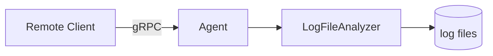

# 非同步與 gRPC 指引

## 目錄

[TOC]

## 學習目標

+ 了解什麼是非同步程式設計，體會非同步程式設計的優點
+ 學會在 C\# 中使用 `async` 和 `await` 關鍵字進行非同步程式設計
+ 了解 Protobuf 與 gRPC 架構
+ 學會使用 C\# 撰寫以 gRPC 通訊的網路應用程式

## 背景介紹

### 雲端服務記錄的平行解析

上一節完成了記錄的平行解析功能。然而，實際的雲端服務記錄通常位於遠端的多部伺服器，或包含多個運算節點的叢集上，而我們可能需要在本機檢視這些記錄。我們希望能從本機操控遠端伺服器或節點上的記錄解析程式，執行解析並檢視結果。因此，我們需要一種能跨電腦呼叫方法的機制，也就是網路通訊。

在雲端原生領域，最常用的通訊方式是 HTTP 與 RPC；本節選擇以 RPC 實作這項功能。

RPC 是 Remote Procedure Call（遠端程序呼叫）的縮寫，設計理念是讓我們能像呼叫一般函式一樣，透過網路呼叫遠端函式。常見的 RPC 架構包括 gRPC、Apache Thrift 等；本節採用 Google 開發、以 Protobuf 為基礎的 gRPC。

本節將撰寫一個可常駐於伺服器或節點的 Agent，全天候提供 gRPC 服務。外部程式可透過 gRPC 要求它執行記錄分析、傳回結果等操作，讓上一節完成的功能都能從遠端控制，如圖所示：



## 知識補充

為防止涉及到暑培的講解死角，我們在這裡先快速回顧一下本節任務用到的一些需要的知識，並對一些額外用到的知識進行補充。

### 非同步

#### 為什麼需要非同步？

程式通常可分為 CPU 密集型（或運算密集型）與 I/O 密集型。前者在大部分執行時間內由 CPU 執行機器指令，呈現較高的 CPU 使用率，效能瓶頸通常來自 CPU 運算能力或平行程度；後者則將大部分時間花在周邊裝置的 I/O 上，例如網路通訊、磁碟讀寫或等待印表機，此時 CPU 並未充分使用，效能瓶頸通常來自周邊裝置的頻寬或延遲。

無論是我們在程式設計課程中編寫的單執行緒程式，還是我們在上一節編寫的雲端服務記錄平行解析這樣的多執行緒程式，這些程式都有一個特點——任何的函式呼叫均是順序的，即一個函式執行完畢後再才能繼續向下執行程式。這樣對函式的呼叫方式通常稱作 **同步（synchronization，通常簡寫作 sync）**。這種方式在通常在 CPU 密集型程式是沒有問題的，因為無論程式以何種順序進行執行，其所需的計算總量（CPU 總計算量）都是固定的，不存在任何的浪費。

本節的目標是撰寫能從遠端解析雲端服務記錄的網路應用，情況就不一樣了。網路應用的運算量未必很大，效能瓶頸往往出在網路 I/O。這類應用通常必須一邊處理使用者輸入或網路要求，一邊向其他服務或資料庫發出要求，取得結果後再回覆使用者。假設使用者輸入 `a` 和 `b`，而程式必須呼叫遠端服務才能取得 `a + b`（本機無法自行計算）；若仍採用先前的同步呼叫方式，就需要：

```csharp
int CalculateAdd(int a, int b) {	     // a 和 b 為使用者輸入，需要為使用者傳回結果
    var request = new Request(a, b);     // 建立一個網路要求
    var response = NetworkCall(request); // 發出網路要求，取得回應
    var result = response.Value;         // 從遠端發回的回應中取得計算結果
    return result;                       // 將結果傳回給使用者
}
```

這會產生一個結果：執行網路 I/O `NetworkCall` 時，CPU 其實處於閒置狀態，程式只是在等待網路回應；然而，目前的執行緒卻會封鎖在 `NetworkCall`。如果這時還有其他工作，例如使用者送來新的要求，或需要與 UI 互動，程式便無法抽身處理。這就形成了矛盾：CPU 明明閒置而且有能力處理新工作，程式的寫法卻無法運用這些閒置資源。也就是說，**程式的寫法限制了它運用資源的能力**。以下是兩個典型案例：

+ 網站後端。網站後端通常需要同時處理許多工作：一方面要回應高頻率的使用者要求，因為網站可能同時有上萬名訪客；另一方面也可能需要頻繁發出網路要求，才能完成使用者的操作，因為個人資訊或欲存取的資源可能儲存在雲端資料庫中，也可能必須呼叫其他網路服務才能取得。
+ 圖形介面程式（或網站前端）也會遇到相同問題。假設程式必須連線至伺服器讓使用者登入；即使正在等待伺服器回應，使用者仍可能按下按鈕或關閉程式。若網路操作封鎖了程式，使它無法處理介面互動，畫面就會看似當機，造成非常糟糕的使用體驗。下一節 `04-avalonia` 就會處理這種情境。

你可能會想到利用多執行緒解決這個問題：建立兩個執行緒，一個等待 `NetworkCall`，另一個繼續工作。這確實可行，但若同時有三件事、100 件事，甚至 10,000 件事，就得建立同樣數量的執行緒。執行緒畢竟是作業系統層級的資源，大量建立會帶來極高的成本。因此，我們希望能重複使用等待網路的執行緒，讓它們不必封鎖，而能騰出來處理其他工作。能達成這項目標的程式設計模型，就是**非同步（asynchronous，通常簡寫為 async）**。

#### 常見的非同步程式設計模型

實作非同步的程式設計模型有很多種，例如 JavaScript 的 Promise-Then 模型，利用回呼函式來設定取得網路結果之後做什麼事情：

```javascript
networkCall(new request(a, b))  // 網路呼叫不直接傳回結果，而是傳回一個 Promise 物件
    .then(result => {           // Promise 存在 then 方法，用來設定要求傳回後要做的事情（回呼函式）
        console.log(result);    // 把結果傳回給使用者（主控台輸出）
    });
// 在發出 networkCall 後，程式還可以接著做其他事，無需等待（主控台輸出）
console.log("hello");
```

除了 Promise-Then 模型之外，還有 C++ 的 Future 模型，這是我們在未來的隊式開發中要用到的：

```cpp
var fut = std::async([&]() { return NetworkCall(Request(a, b)).GetResult(); }); // 傳回一個 std::future<T>
// 你可以在這裡做任何事情
// 等到你需要結果的時候，你可以再取得結果：
std::cout << fut.get() << std::endl; // 取得結果
```

對未來隊式開發感興趣的同學可以參考 [std::async - cppreference.com](https://en.cppreference.com/cpp/thread/async) 詳細了解。

但本 workshop 使用的既不是 Promise-Then 模型，也不是 Future 模型，而是應用最廣泛的非同步模型——async-await 模型。該模型是 JavaScript 和 C++20 及以上都支援的模型，也是 C\# 首要支援的非同步模型：

```csharp
public async Task<int> CalculateAddAsync(int a, int b) { // a 和 b 為使用者輸入

    // 建立一個網路要求
    var request = new Request(a, b);
    
    // 發出網路要求，await 用於等待非同步要求，但等待之前便讓出執行緒，不會佔用執行緒
    var response = await NetworkCallAsync(request); 
    
    // 遠端回應到達後，重新佔用一個執行緒，從遠端發回的回應中取得計算結果
    var result = response.Value;

    // 將結果傳回給使用者
    return result;
}
```

使用 async-await 模型進行非同步程式設計時，C\# 的 .NET 執行階段會透過內建的 [System.Threading.ThreadPool 類別](https://learn.microsoft.com/zh-tw/dotnet/api/system.threading.threadpool?view=net-10.0) 排程執行緒。**這個執行緒集區有一項容易忽略的行為：預設狀況下，集區用滿後會等待約 1 秒；若仍無執行緒可用，才會擴充集區。**等待期間會持續封鎖。因此，在確定用途之前，不要隨意自行操作執行緒集區或建立 `Task`。多數需要非同步處理的情境，都已有 .NET 或第三方程式庫提供封裝好的非同步介面，真正需要自行建立新 `Task` 的場合並不多。

請注意，上一節多執行緒內容所使用的 `lock`、`Monitor.Wait` 等同步與互斥機制，以及常見的 `Thread.Sleep(1000)`，都會占用實際執行緒。在非同步程式設計中，等待時應使用 `await Task.Delay(1000)`，同步與互斥也應採用適合非同步情境的機制。

本 workshop 不會討論網路應用在非同步程式設計中的同步與互斥，因此不必在此深入研究。上一節使用同步、互斥與平行解析，是為了以多執行緒加速 CPU 執行記錄解析的工作；雖然其中也有檔案讀寫的磁碟 I/O，而且短小的 CPU 密集型工作通常會重複使用執行緒集區，但這些都不是本節所說的非同步程式設計目標。

### 單例模式

在 `01-basic` 一節中，我們使用了簡單工廠模式和訪問者模式兩種設計模式。本節我們將接觸到一種新的設計模式——單例模式（Singleton Pattern）。

單例模式的核心概念是：在整個程式執行期間，某個類別只允許存在一個物件執行個體，並提供全域存取點以取得該執行個體。通常包含以下兩個要點：

- 私有建構函式：防止外部透過 `new` 直接建立物件
- 靜態執行個體存取方法或屬性：向外部提供取得唯一物件執行個體的入口

單例模式可分為延遲初始化（lazy initialization）與立即初始化（eager initialization）兩類：前者在第一次使用物件時才建立物件，後者則在程式初始化時立即建立。延遲初始化較複雜，需要處理執行緒安全等問題，也有 DCL 等多種實作方式，但便於在執行期間動態傳入參數以建構物件。本節需求較單純，因此採用最簡單的立即初始化單例模式：

```csharp
class Singleton {
    // 建構函式
    private Singleton() {}
    // 初始化靜態單例為靜態欄位，並提供 get 屬性作為取得單例的介面
    public static GrpcLogEntryVisitor Instance { get; } = new();
}
```

### 相依性插入

相依性插入（Dependency Injection, DI）是一種常用的程式設計范式，在網路服務應用當中廣泛使用。C\# 的 ASP.NET 架構、Java 的 Spring 架構等都把相依性插入作為一等公民來支援。本節將使用 C\# 的 ASP.NET 中的相依性插入范式來啟動 gRPC 服務。

假設有兩個類別 `A` 與 `B`，當 `A` 使用 `B` 提供的功能時，我們稱 `A` 相依於 `B`。`A` 呼叫 `B` 的方法前，必須先有一個 `B` 物件。如果 `A` 不直接建立該物件，而由外部負責建立，再透過 `A` 的建構函式或 setter 方法傳入，這種程式設計模式就稱為相依性插入。它有助於降低實作類別之間的耦合、提升應用程式的可擴充性，並方便單元測試。以下是一個範例：

```csharp
class Model;

interface IDatabase;
class RemoteDatabase : IDatabase;
class FakeDatabase : IDatabase;

class Service {
    private readonly Model _model;
    private readonly IDatabase _db;
    
    public Service(Model model, IDatabase db) {
        _model = model;
        _db = db;
    }
}
```

該例子中，`Service` 依賴的 `Model` 和 `IDatabase` 均需要外部來建立執行個體 `Model` 物件和某個實作了 `IDatabase` 的類別的物件，透過建構函式傳給 `Service`。

## 本節任務

### 任務描述

本節需要實作一個常駐執行在伺服器或節點上的 Agent 程式，對外開放 gRPC 服務。服務的介面與我們在上一節實作的 `LogFileAnalyzer` 提供的介面類似。服務介面定義在 `LogAnalyzerRpc/Protos/log_analyzer.proto` 中的 `LogAnalyzerAgentService` 中：

```protobuf
service LogAnalyzerAgentService {
	rpc Ping(google.protobuf.Empty) returns (google.protobuf.Empty);
	rpc GetAgentStatus(google.protobuf.Empty) returns (AgentStatusResponse);
	rpc ChangeDirectory(ChangeDirectoryRequest) returns (ChangeDirectoryResponse);
	rpc GetLogFiles(google.protobuf.Empty) returns (GetLogFilesResponse);
	rpc AnalyzeAll(AnalyzeAllRequest) returns (AnalyzeAllResponse);
	rpc AnalyzeFiles(AnalyzeFilesRequest) returns (AnalyzeFilesResponse);
	rpc GetAnalysisResult(GetAnalysisResultRequest) returns (stream GetAnalysisResultResponse);
}
```

一些需要注意的資訊介紹如下：

+ `Ping`：由於 gRPC 是 lazy 連接，即在第一次呼叫服務時而非連接建立時連接，因此 `Ping` 用於測試服務是否連通

+ `OperationStatusMessage`：幾乎所有操作都需要傳回此資訊，用來表示操作是否成功。它包含以下欄位：

  + `success`：如果操作合法，則值為 `true`，否則為 `false`
  + `code`：如果 `success` 為 `true`，則 `code` 值為 `NO_AGENT_ERROR`，否則：
    + `INVALID_ARGUMENT`：用戶端輸入的參數非法
    + `DIRECTORY_NOT_FOUND`：用戶端指定的記錄目錄不存在
    + `FILE_NOT_FOUND`：用戶端指定的記錄檔不存在
    + `INVALID_OPERATION`：用戶端執行了無效操作，例如尚未指定記錄目錄，或向正在分析記錄的 Agent 發出新的分析要求
    + `INTERNAL_ERROR`：Agent 發生了內部錯誤
  + `message`：如果 `success` 為 `true`，則 `message` 為空字串 `""`；否則包含錯誤資訊，例如提示訊息或 Agent 內部拋出的例外狀況資訊

+ `ChangeDirectory`：gRPC 中的 `ChangeDirectory` 相比比上一節中的 `ChangeDirectory` 需要額外傳回兩個欄位，方便下一節中當選擇了新的目錄後立刻顯示 Agent 完整路徑以及目錄中存在的記錄檔：

  + `current_directory`：Agent 目前記錄目錄路徑
  + `file_names`：記錄目錄中的全部記錄檔名

+ `GetAnalysisResult`：取得指定檔案的分析結果。這個方法會以串流傳回一系列 `GetAnalysisResultResponse`。

  ```protobuf
  message GetAnalysisResultResponse {
  	oneof payload {
  		AnalysisResultHeaderMessage header = 1;
  		LogEntryMessage log_entry = 2;
  	}
  	OperationStatusMessage status = 3;
  }
  ```

  分為以下幾種情況：

  + 若使用者指定的檔案不存在，則只傳回一個 `GetAnalysisResultResponse`，透過 `status` 指定操作無效；
  + 若指定的檔案尚未有分析結果，或分析失敗，則操作成功，且只傳回一個 `GetAnalysisResultResponse`，`payload` 為 `header`
  + 若指定檔案分析成功，先傳回一個 `payload` 為 `header` 的 `GetAnalysisResultResponse`，再以串流依檔案順序傳回一系列 `payload` 為 `log_entry` 的 `GetAnalysisResultResponse`，每個回應對應記錄檔中的一筆記錄。由於 gRPC 的單次回應有長度上限，而記錄檔可能很長，因此需要分批串流傳回

### （S3.1）Step 1：實作 gRPC 服務的 Agent

我們將實作一個啟動了 gRPC 服務的 Agent。本步驟程式碼結構如下：

```shell
src
|
+---LogAnalyzerAgent
|   |   appsettings.json              # 啟動參數設定
|   |   appsettings.Development.json  # 開發環境啟動參數設定
|   |   Program.cs                    # 程式入口與 gRPC 服務設定及相依性插入
|   |
|   +---Properties
|   |       launchSettings.json       # 開發環境啟動設定
|   |
|   +---Applications
|   |       AgentSession.cs           # gRPC 服務處理邏輯
|   |
|   \---Services
|           AgentService.cs           # gRPC 服務
|
+---LogAnalyzerRpc
    |   GrpcLogEntryVisitor.cs        # 將記錄解析結果型別轉換為 Protobuf 訊息型別
    |   GrpcTypeConverter.cs          # 進行記錄解析系統內部 C# 類型與 Protobuf 訊息型別的互相轉換
    |
    \---Protos
            log_analyzer.proto        # 定義 Protobuf 訊息型別與 gRPC 服務
```

#### 型別轉換

`LogAnalyzerRpc/Protos/log_analyzer.proto` 包含 Agent 對外開放的所有 gRPC 服務定義。

由於 gRPC 只傳輸 Protobuf 定義的訊息型別，因此你必須在 `LogParser`、`LogAnalyzer` 使用的資料型別與 Protobuf 訊息型別之間進行轉換。

1. 首先轉換幾種 `LogEntry` 類型。請使用 `01-basic` 學到的訪問者模式，將記錄解析所得的 `LogEntry` 型別轉換成 Protobuf 定義的 `LogEntryMessage`。轉換邏輯位於 `LogAnalyzerRpc/GrpcLogEntryVisitor.cs` 的 `GrpcLogEntryVisitor` 類別。由於這項工作是無狀態的（不需要儲存任何中間資料），因此我們以**單例模式**實作該類別。基礎程式碼已提供 `CallLogEntry` 的轉換，請補上另外兩種類型。
2. 為所有型別提供統一的轉換介面。請將轉換邏輯寫入 `LogAnalyzerRpc/GrpcTypeConverter.cs` 的 `GrpcTypeConverter` 類別，並分別放在 `ConvertToGrpc` 與 `ConvertFromGrpc` 靜態方法中。這些方法應封裝 `GrpcLogEntryVisitor` 的使用方式，並處理其他幾種列舉型別。請補完 `GrpcTypeConverter`。

#### Agent 實作

隨後，我們將完成 `LogAnalyzerAgent` 的實作。

在專案 `LogAnalyzerAgent` 中，為了方便進行單元測試，我們將 gRPC 服務拆成兩部分。`Services/AgentService.cs` 中的 `AgentService.cs` 是 `gRPC` 服務的入口類，負責開啟 `gRPC` 服務。但該類不負責處理任何邏輯，我們把處理要求的邏輯移到 `Applications/AgentSession.cs` 的 `AgentSession` 類別中。`AgentService` 會把使用者要求轉發給 `AgentSession` 類別的物件，而 `AgentSession` 則呼叫我們之前編寫的 `LogFileAnalyzer` 類別的物件來進行記錄分析。

`AgentSession` 和 `AgentService` 的建構函式如下：

```csharp
class AgentSession {
    private readonly LogFileAnalyzer _analyzer;
    private readonly ILogger _logger;

    public AgentSession(LogFileAnalyzer analyzer, ILoggerFactory loggerFactory);
}

class AgentService : LogAnalyzerAgentService.LogAnalyzerAgentServiceBase {
    private readonly AgentSession _session;

    public AgentService(AgentSession session);
}
```

其中，`ILogger` 是 .NET 庫提供的記錄公開介面，而 `ILoggerFactory` 是建立記錄的介面（這實質上是「工廠方法模式（Factory Method Pattern）」的應用，我們將在 `04-avalonia` 一節中介紹）。它是做什麼的呢？眾所周知，我們的 `Agent` 本質上也是一種雲端服務，它的執行也會產生很多需要輸出的資訊，這些都可以輸出為記錄。我們將要輸出的資訊交給 `_logger` 進行輸出，`_logger` 會幫助我們進行格式化。具體的格式依賴於外部傳入的具體記錄工廠類別產生的記錄類所設定的記錄格式。

這裡存在依賴關係：`AgentService` 依賴 `AgentSession`，而 `AgentSession` 依賴 `LogFileAnalyzer` 和 `ILoggerFactory`。外部需要透過建構函式來傳入它們所依賴的物件，即需要進行 **相依性插入** 。

我們使用 [ASP.NET](https://dotnet.microsoft.com/zh-tw/apps/aspnet) 支援的 [gRPC on .NET](https://learn.microsoft.com/zh-tw/aspnet/core/grpc/?view=aspnetcore-10.0) 來託管 gRPC 服務。啟動程式碼位於 `LogAnalyzerAgent/Program.cs`，基礎程式碼已將它完整實作，無需修改。ASP.NET 內建相依性插入功能；我們不必手動以 `new` 建立物件，只要向 ASP.NET 註冊所需型別，架構便會自動建立執行個體並插入相依性。

由於這是**具狀態服務**，需要保留目前選取的記錄目錄與分析結果等狀態，因此要將它註冊為單例。ASP.NET 使用 `AddSingleton` 註冊單例，請參考 `Program.cs` 的下列程式碼片段：

```csharp
builder.Services.AddSingleton<LogFileAnalyzer>();   
builder.Services.AddSingleton<AgentSession>();
builder.Services.AddSingleton<AgentService>();
```

當你在 Visual Studio 中將 `LogAnalyzerAgent` 設為啟動專案後，在 Visual Studio 中偵錯 `LogAnalyzerAgent`，它將會在 `Properties/launchSettings.json` 中指定的 `"applicationUrl"` 位址上監聽 gRPC 服務。

> 如果你想直接執行 `.exe` 程式（會產生在專案的 `bin` 目錄中），需要設定環境變數 `ASPNETCORE_URLS`（在 `localhost` 與 `127.0.0.1` 上開啟的服務僅供本機存取；在 `0.0.0.0` 上開啟的服務可由其他主機存取。如果你的主機位於公用網路，請注意防範 DDoS 攻擊）：
>
>  **Windows**
>
>  CMD：
>
>  ```cmd
>  > set ASPNETCORE_URLS=http://localhost:7777
>  > .\<path>\LogAnalyzerAgent.exe
>  ```
>
>  PowerShell：
>
>  ```powershell
>  PS> $env:ASPNETCORE_URLS="http://localhost:7777"
>  PS> .\<path>\LogAnalyzerAgent.exe
>  ```
>
>  **Linux / macOS**
>
>  ```bash
>  export ASPNETCORE_URLS="http://localhost:7777"
>  ./<path>/LogAnalyzerAgent
>  ```


在本步驟，你的任務是完成 `GrpcLogEntryVisitor`、`GrpcTypeConverter`、`AgentSession`、`AgentService` 的實作。

> [!NOTE]
>
> **任務 3.1（T3.1）**
>
> 請完成 `GrpcLogEntryVisitor`、`GrpcTypeConverter`、`AgentSession`、`AgentService` 的實作，來完成 Agent 的實作。
>
> 當你完成你的實作後，執行測試 `test-03-async-grpc`，你將會通過所有測試。
> 
> **提示：**
> 
> 1. 你可以參考上一節實作的 `LocalCli`，將其中呼叫 `LogAnalyzerAgent` 的相關程式碼移至 `AgentSession`，藉此節省不少時間。
> 2. 如果發現你的實作存在 bug 且一時間找不到 bug 位置，你可以先進行 S3.2 的實作。

> [!IMPORTANT]
>
> Agent 是常駐服務，**絕對不能**因無效的使用者要求或內部錯誤而崩潰，否則服務就會中斷（也就是俗稱的「網站掛掉」）。因此，**務必妥善處理**例外狀況；可參考 `AgentSession` 提供的範例。


**可能會用到的 API：**

+ gRPC 伺服器 stream 傳回：

  ```protobuf
  service UtilsService {
  	rpc Iota(IotaRequest) returns (stream IotaResponse);
  }
  
  message IotaRequest {
    int32 x = 1;
    int32 y = 2;
  }
  
  message IotaResponse {
    int32 value = 1;
  }
  ```

  ```csharp
  public override async Task Iota(IotaRequest request, IServerStreamWriter<IotaResponse> responseStream, ServerCallContext context) {
      for (int i = request.X; i < request.Y; ++i) {
          await responseStream.WriteAsync(new IotaResponse() { Value = i });
      }
  }
  ```

+ 對應的 gRPC 用戶端接收 stream 傳回：

  ```csharp
  var request = new IotaRequest() { X = 0, Y = 10 };
  
  // 流式傳回必然是非同步的，因此此處呼叫是 Iota 而不是 IotaAsync
  using var call = client.Iota(request);
  
  // 1. 逐個讀取
  await foreach (var response in call.ResponseStream.ReadAllAsync()) {
      Console.WriteLine(response.Value);
  }
  
  // 2. 直接讀取到結束為止，產生一個 List
  var response_list = await call.ResponseStream.ReadAllAsync().ToListAsync();
  ```

  

### （S3.2）Step 2：遠端主控台互動介面

我們已完成較完整的 Agent，但它是網路應用，直接偵錯並不容易。下一節還要編寫圖形介面用戶端，屆時必須同時處理介面與 gRPC 呼叫的問題。為了讓大家先熟悉 gRPC 用戶端呼叫，這裡請實作遠端主控台互動介面 `RemoteCli`。

我們在上一節實作了一個本機的主控台互動介面 `LocalCli`，現在我們需要寫一個對接 gRPC 服務的用戶端版本 `RemoteCli`。

本步驟程式碼位於 `RemoteCli/Program.cs` 中。

gRPC 的核心是 RPC，也就是遠端程序呼叫。在現代程式設計語言中，「程序」通常表現為函式或方法；RPC 的重點，就是讓呼叫網路服務的體驗如同呼叫本機函式。因此，`RemoteCli` 可以由上一節的 `LocalCli` 改寫而成：只要將其中對 `LogFileAnalyzer` 的函式呼叫替換為對應的 gRPC 呼叫，再配合遠端情境做些調整即可。

本節的主控台程式不需要在 gRPC 呼叫期間即時回應使用者輸入，因此同步與非同步的差異不大。不過，為了替下一節的圖形介面打好基礎，`RemoteCli` 的 gRPC 呼叫**必須全部採用非同步版本**，也就是呼叫方法名稱帶有 `Async` 的版本；因此，`RemoteCli` 會包含許多 `async` 方法。C\# 的 `Main` 方法也已宣告為 `async`。可參考基礎程式碼提供的 `InputDirectory` 實作：`var response = await client.ChangeDirectoryAsync(request)` 呼叫的是 `client.ChangeDirectoryAsync`，而不是 `client.ChangeDirectory`。

此時的偵錯方式與以往稍有不同。過去只需偵錯單一可執行程式，網路程式卻必須同時啟動伺服器與用戶端；Visual Studio 一次只能偵錯一個程式，因此另一個程式必須在 Visual Studio 外啟動。請在 Visual Studio 將其中一個專案設為啟動專案（方法請參閱 `00-prepare` 的 `guidance.md`），再手動啟動另一個專案的可執行檔。.NET 編譯後的可執行檔位於專案目錄（即 `.csproj` 所在目錄）下的 `bin/[Debug|Release]/net10.0/`，檔名與專案相同。

完成後的介面可參考下列範例：


程式必須具備足夠的強健性，能處理各種無效輸入並盡可能避免崩潰，如下圖所示：


> [!NOTE]
>
> **任務 3.2（T3.2）**
>
> 請完成 `RemoteCli/Program.cs` 中的實作。
>
> 完成實作後，請在 `docs/03-async-grpc` 目錄新增 `report.md` 文字檔，介紹已實作的功能，並附上完整功能（可參考上方範例）與強健性測試（各種無效輸入情況）的螢幕擷取畫面。
>
> **提示：** 你可以參考你上一節實作的 `LocalCli` 的程式碼，將 `LocalCli` 對 `LogAnalyzerAgent` 的呼叫相關程式碼修改為相應的 gRPC 呼叫，你將會節省相當多的時間和精力。


## 問答題

請在 `docs/03-async-grpc/report.md` 中回答問答題。本節皆為開放題，依個人真實感受作答即可。

### (Q3.1)

你認為，你在開發網路應用程式，與你在以往開發非網路應用程式的區別在哪裡？網路應用程式的開發存在哪些額外的難點？存在哪些額外的複雜之處？

### (Q3.2)

本次作業中，你是否使用了 AI？根據你的使用情況，在以下 (Q3.2.a) (Q3.2.b) 兩個問題中選擇一題作答：

#### (Q3.2.a)

如果沒有使用 AI，你大約花了多久完成整個 `03-async-grpc`？是否曾使用傳統搜尋引擎協助？你認為本節是否明顯比一般非網路應用程式更難？是否曾在某個部分卡住較長時間（若有，是哪一部分）？

#### (Q3.2.b)

如果使用了 AI，你給予 AI 的提示詞是什麼？你對 AI 的使用是詢問 AI 一些介面的用法、gRPC 的使用，或是在某處的寫法，還是讓 AI 幫你寫一部分作業程式碼，又或是讓 AI 給你講解程式碼架構？AI 的解答是否出現過錯誤（如果有，是哪些）？你從 AI 那裡是否得知了一些關於非同步，或是 gRPC 等原本你不知道或是難以理解的知識？

關於本節的任務配分等資訊，請參閱 [tasks.md](./tasks.md)。

## 延伸閱讀

+ [手把手學習 C++20 共常式（coroutine）](https://timothy-liuxf.github.io/tm-blogs/blogs/zh-CN/c_cpp/cpp-coroutine.html)：透過 C++ 的共常式來更好地理解 `async` 和 `await`，以及 `yield return`
+ [有棧共常式與無棧共常式](https://mthli.xyz/stackful-stackless/)：了解有棧共常式（例如 Go 語言中的 Goroutine）與無棧共常式（例如 C\# 中的 `async`、`await` 與 `yield return`）

## 上一篇 / 下一篇

+ 上一篇：[多執行緒任務](../02-multithreading/tasks.md)
+ 下一篇：[非同步與 gRPC 任務](./tasks.md)

