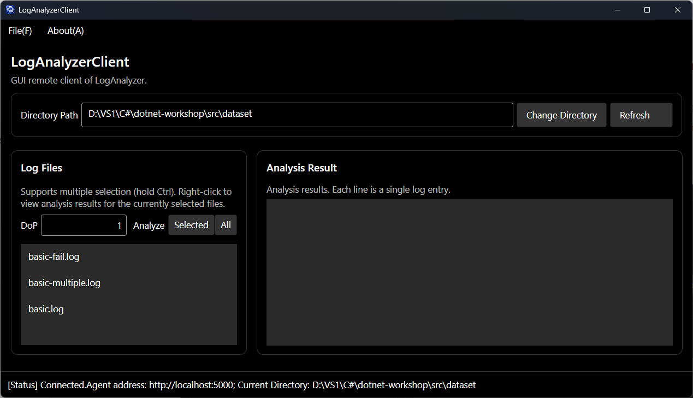
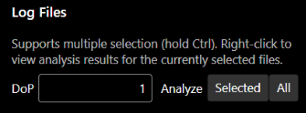
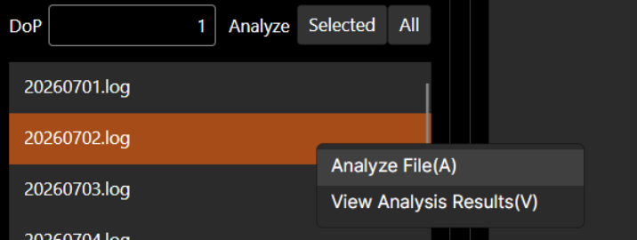
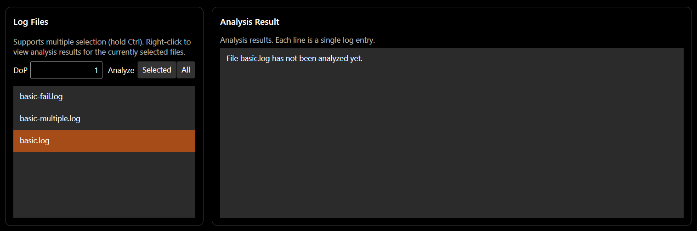

# Avalonia 指引

## 目錄

[TOC]

## 學習目標

+ 了解圖形介面應用程式
+ 初步掌握使用 Avalonia UI 架構進行圖形介面應用程式的編寫
+ 初步掌握使用 `CommunityToolkit.Mvvm` 進行 MVVM 模式的編寫

**意外的學習目標：**

+ 了解工廠方法模式的應用

## 背景介紹

本節的背景不需要太多介紹。上一節完成的主控台用戶端實在不夠好用，因此這次要製作一個美觀的 GUI 用戶端！

[Avalonia UI](https://avaloniaui.net/) 是以 .NET 為基礎的跨平台 GUI 架構，常被稱為「跨平台的 [WPF](https://learn.microsoft.com/zh-tw/dotnet/desktop/wpf/overview/)」。WPF 是 .NET 官方提供的 Windows GUI 架構；其採用的 MVVM 模式，如今也廣泛應用於網站前端，例如知名的 [Vue.js](https://cn.vuejs.org/) 就採用類似架構。

現在，就讓我們開始吧！

## 知識補充

為防止涉及到暑培的講解死角，我們在這裡先快速回顧一下本節任務用到的一些需要的知識，並對一些額外用到的知識進行補充。

### 工廠方法模式

我們在 `01-basic` 學過簡單工廠模式，但它有一項限制：所有物件都由同一工廠類別中的同一方法建立。如果不同類別的建立邏輯差異很大，必須分散在不同位置、由不同角色負責，就無法集中寫在一起，此時簡單工廠模式便不再適用。我們需要的是**工廠方法模式（Factory Method Pattern）**。

前一節 `03-async-grpc` 介紹 `ILogger` 時曾提到工廠方法模式。在這個模式中，不同類別分別由不同工廠建立執行個體，而這些工廠會實作一個共用介面。例如：

```csharp
abstract class Product {}
class ConcreteProductA : Product {}
class ConcreteProductB : Product {}

interface IFactory {
    Product CreateProduct(string args);
}

class ConcreteFactoryA : IFactory {
    Product CreateProduct(string args) {
        return new ConcreteProductA(args);
    }
}

class ConcreteFactoryB : IFactory {
    Product CreateProduct(string args) {
        return new ConcreteProductB(args);
    }
}
```

在使用時，我們可以：

```csharp
class FactoryMethodPatternDemo {
    private readonly IFactory _factory;
    
    public FactoryMethodPatternDemo(IFactory factory) {
        _factory = factory;
    }
    
    public void UseProduct(string args) {
        var product = _factory.CreateProduct(args);
        // 使用 product
    }
}
```

## 本節任務

### 任務描述

本節需要編寫一個圖形介面（GUI）用戶端，來代替上一節編寫的 `RemoteCli`。該用戶端需要包含 `RemoteCli` 的全部功能。

### （S4.1）Step 1：圖形介面用戶端的實作

本步驟的程式碼均位於 `src/LogAnalyzerClient` 目錄中，程式碼結構如下：

```shell
LogAnalyzerClient
|
+---LogAnalyzerClient            # 該專案用於編寫圖形介面，我們的幾乎全部圖形介面均在此專案中編寫
|   |   App.axaml                # 應用程式入口類別（XAML 部分）
|   |   App.axaml.cs             # 應用程式入口類別（C# 部分）
|   |   ViewLocator.cs
|   |
|   +---Services                 # gRPC 服務相關
|   |       IClientFactory.cs    # 用來定義 gRPC Client 工廠的介面
|   |       AppService.cs        # 用於註冊 gRPC Client 工廠
|   |
|   +---Views                    # 各種介面（檢視）
|   |       MainWindow.axaml     # 應用程式主視窗
|   |       MainWindow.axaml.cs
|   |       MainView.axaml       # 應用程式主視窗所顯示的介面
|   |       MainView.axaml.cs
|   |
|   +---Styles                   # 儲存樣式
|   |       Controls.axaml       # 各種控制項的樣式
|   |
|   +---ViewModels               # 各種 ViewModel
|   |       ViewModelBase.cs     # 所有 ViewModel 的共用基底類別
|   |       MainViewModel.cs     # MainView 的 ViewModel
|   |
|   +---Models                   # 用於定義一些儲存資料的資料結構
|   |       RemoteModels.cs      # 用於儲存記錄檔名和記錄解析結果的資料結構
|   |
|   +---Dialogs                         # 各種臨時快顯的對話框的定義
|   |       ConnectDialog.axaml         # 用於連接 Agent 的對話框
|   |       ConnectDialog.axaml.cs
|   |       MessageDialog.axaml         # 用於快顯臨時訊息的訊息方塊
|   |       MessageDialog.axaml.cs
|   \---Helpers                         # 一些工具類別
|           DialogHelper.cs             # 用於處理快顯對話框的相關邏輯，方便使用 Dialogs 中定義的對話框
|           ClientInternalException.cs  # 用於表示用戶端內部發生的例外狀況
|
\---LogAnalyzerClient.Desktop           # Desktop 平台（Windows、Linux、macOS）用戶端
        Program.cs                      # Desktop 程式總入口
                                        # 1. 註冊 gRPC Client 工廠，用於建立 gRPC 用戶端
                                        # 2. 呼叫 LogAnalyzerClient 開啟圖形介面
```

首先介紹如何建立 gRPC Client 並連線至 Agent。本 workshop 雖然只在 Desktop（Windows、Linux、macOS）上執行，但為了保留軟體的可擴充性，仍可在未來加入 Android、iOS 或瀏覽器等平台。由於不同平台建立 gRPC Client 的方式並不完全相同（有興趣的同學可參閱[開發札記](../../DEVLOG.md)中的「關於 AvaloniaUI 的網頁版和行動裝置端」及「關於編寫 WebAssembly 目標平台用戶端的額外難題」），因此我們將 Desktop 版 gRPC Client 的建立邏輯放在專門產生 Desktop 程式的 `LogAnalyzerClient.Desktop` 專案，而非跨平台的 `LogAnalyzerClient` 專案。

gRPC Client 可能需要建立多次，例如用戶端允許切換遠端 Agent 位址。因此，我們要在 `LogAnalyzerClient.Desktop` 中，將建立 gRPC Client 的邏輯封裝成可隨時呼叫的通用方法，並以**工廠方法**完成這項設計。

我們在 `LogAnalyzerClient/Services/IClientFactory.cs` 中定義了工廠具有的介面：

```csharp
using LogAnalyzerAgentServiceClient = LogAnalyzerAgentService.LogAnalyzerAgentServiceClient;

public interface IClientFactory {
    LogAnalyzerAgentServiceClient CreateClient(string address);
}
```

即輸入遠端 Agent 位址，傳回一個 gRPC Client。同時，我們在 `LogAnalyzerClient/Services/AppService.cs` 定義了用於註冊 Client 工廠的屬性：

```csharp
public static class AppService
{
    public static IClientFactory ClientFactory { get; set; } = new NullClientFactory();
}
```

在 `LogAnalyzerClient.Desktop` 專案中，我們於 `Program.cs` 中實作建立 Desktop 版的 gRPC Client 的工廠：

```csharp
internal class ClientFactory : IClientFactory {
    public LogAnalyzerAgentServiceClient CreateClient(string address) {
        var channel = GrpcChannel.ForAddress(address);
        var client = new LogAnalyzerAgentServiceClient(channel);
        return client;
    }
}
```

我們在程式啟動後且在 GUI 視窗啟動前，在 `Main` 方法中將該工廠建立執行個體並註冊給 `AppService`：

```csharp
[STAThread]
public static void Main(string[] args) {
    AppService.ClientFactory = new ClientFactory();  // 註冊工廠
    // 啟動 GUI 視窗
}
```

在 `LogAnalyzerClient` 已經寫好的部分介面。目前已經寫好的介面中已經完成的功能如下：

+ 選單欄：選單欄位於視窗頂部，已寫好

  + 連線至 Agent。`File(_F)` 選單中的 `Connect...(_C)` 可用來輸入位址並建立連線。該選單項目繫結至 `ConnectCommand` 這個 `RelayCommand`，後者會呼叫 `ViewModels` 中的 `ConnectAsync` 方法

+ 狀態欄：狀態欄位於視窗底部，已寫好，用於顯示目前連接狀態、遠端 Agent 位址，以及目前所選擇的記錄目錄

+ Change Directory 按鈕和輸入框：透過輸入框輸入 Agent 所在伺服器的記錄所在目錄，然後按一下 Change Directory 按鈕更改記錄

+ 平行處理程度輸入框：DoP 右側的輸入框用於輸入一個非負整數作為分析的平行處理程度

+ 顯示記錄目錄中的檔案清單：Log Files 區塊會列出記錄目錄中的檔案。如圖所示，其中包含 `basic.log`、`basic-fail.log`、`basic-multiple.log`：

  


請閱讀已完成的實作作為參考，再補齊其餘功能。


> [!IMPORTANT]
>
> + **圖形介面的呈現與使用者操作回應都由單一 UI 執行緒負責。為避免 UI 執行緒遭到封鎖，讓程式看似當機，所有 gRPC 要求都必須採用非同步版本並使用 `await`！！！** 詳細原理請參閱上一節 `03-async-grpc` 的「知識補充」。
> + **圖形介面程式絕對不能因無效的使用者輸入或內部錯誤而崩潰。請妥善進行輸入驗證與例外狀況處理，並以訊息方塊向使用者顯示錯誤資訊。**


你需要完成的功能如下：

+ Refresh 按鈕：用來重新整理記錄目錄中的檔案清單。基礎程式碼已在 `MainView.axaml` 中將按鈕繫結至 `RefreshCommand`；你需要完成 ViewModel 中的 `RefreshAsync`。

+ 分析多個選取檔案：Log Files 的檔案清單支援多選。按住 Ctrl 鍵，再以滑鼠左鍵按一下各個檔案即可，如下圖所示：

  

  在 MVVM 模式中，View Model 無法取得清單方塊的所有選取項，只能取得最近選取的項目，因此我們為該 `ListBox` 設定了 `LogFileListBox_SelectionChanged` 回呼方法。使用者以滑鼠選取多個項目時，`MainView.axaml.cs` 中的這個方法會更新 View Model 的 `SelectedFiles`。

  在 `MainView.axaml` 中，`Analyze` 右側的 `Selected` 按鈕已繫結至 `AnalyzeSelectedFilesCommand`。你要完成 `AnalyzeSelectedFilesAsync`，也就是以 `SelectedFiles` 為參數呼叫 `AnalyzeFiles` RPC。

+ 分析全部檔案：在 `Analyze` 右側的 `Selected` 按鈕後方新增 `All` 按鈕，如下圖所示：

  

  該 `All` 按鈕將用於呼叫 `AnalyzeAll` RPC，來分析全部檔案。

+ 分析指定檔案：基礎程式碼中的 Log Files 檔案清單已支援快顯功能表（`ListBox.ContextMenu`），其中包含 `Analyze File(A)` 選單項目，如下圖所示：

  

  `MainView.xaml` 已將該選單項目繫結至 `AnalyzeRightClickedFileCommand`，目前選取的檔案也透過 `SelectedItem="{Binding SelectedLogFile, Mode=OneWayToSource}"` 繫結至 `SelectedLogFile` 屬性。你需要完成 `AnalyzeRightClickedFileAsync`，實作分析單一檔案的功能。

+ 檢視分析結果：

  + 基礎程式碼中，Log Files 的檔案清單已支援快顯功能表（`ListBox.ContextMenu`）。其中的 `View Analysis Results(_V)` 選單項目已繫結至 `GetAnalysisResultCommand`。請完成 `GetAnalysisResultAsync`，讓使用者按一下該項目後能顯示所選記錄檔的分析結果。

  + 此外，你還需要完成的是記錄分析結果的顯示。記錄分析結果的顯示在 Analysis Result 下方的清單方塊中：

    ```xml
    <ListBox Name="ResultEntryListBox"
             Grid.Row="2"
             ItemsSource="{Binding ResultEntries, Mode=OneWay}">
        <ListBox.ItemTemplate>
            <DataTemplate x:DataType="models:LogFields">
                <TextBlock Text="{Binding Summary, Mode=OneWay}" TextWrapping="NoWrap" />
            </DataTemplate>
        </ListBox.ItemTemplate>
    </ListBox>
    ```

    該清單方塊的內容繫結至 `ResultEntries` 屬性，項目型別為 `LogFields`（定義於 `Models/RemoteModels.cs`），顯示內容取決於 `LogFields` 類別的 `Summary` 屬性。

    你需要完成檔案分析結果的顯示。下列範例可自由採用，分別對應分析成功、分析失敗與尚未分析三種情況：

    

    

    


> [!NOTE]
>
> **任務 4.1（T4.1）**
>
> 你需要實作以上所有功能。我們提供了[一個 UI 介面範例](https://eesast.github.io/dotnet-workshop/demo/)供參考。
>
> 完成實作後，請在 `docs/04-avalonia` 目錄新增 `report.md` 文字檔，介紹已實作的功能，並附上完整功能與強健性測試（各種無效輸入情況）的螢幕擷取畫面。
>
> **提示：** 你可以參考你上一節實作的 `RemoteCli` 的程式碼，將 `RemoteCli` 的 gRPC 呼叫相關程式碼移過來，並把你在 `RemoteCli` 中的輸出錯誤資訊修改為快顯訊息方塊，你將會節省相當多的時間和精力。

> [!IMPORTANT]
>
> Agent 是常駐服務，**絕對不能**因無效的使用者要求或內部錯誤而崩潰，否則服務就會中斷（也就是俗稱的「網站掛掉」）。因此，**務必妥善處理**例外狀況；可參考 `AgentSession` 提供的範例。


**可能會用到的 API：**

[`CommunityToolkit.Mvvm`](https://learn.microsoft.com/zh-tw/dotnet/communitytoolkit/mvvm/) 是方便我們編寫 MVVM 的工具。例如，我們要在 ViewModel 中建立一個公有屬性，可以直接給私有欄位加上 `[ObservableProperty]` 修飾：

```csharp
using CommunityToolkit.Mvvm.ComponentModel;

partial class MainViewModel {
    [ObservableProperty]
    private string _greeting = "Welcome to Avalonia!";
}
```

此時，`CommunityToolkit.Mvvm` 架構會在幕後自動產生以下程式碼，供我們直接呼叫：

```csharp
partial class MainViewModel {
    public partial string Greeting {
        get => _greeting;
        set => SetProperty(ref _greeting, value);
    }
}
```

其中 `SetProperty` 的內容大致意思如下：

```csharp
bool SetProperty<T>(ref T field, T newValue, string? propertyName = null)
{
    OnPropertyChanging(propertyName);
    field = newValue;
    OnPropertyChanged(propertyName);
    return true;
}
```

我們只需要使用架構為我們產生好的 `Greeting` 屬性即可。

若要建立一個回應函式，只要加上 `[RelayCommand]` 屬性即可：

```csharp
using CommunityToolkit.Mvvm.Input;

partial class MainViewModel {
    [RelayCommand]
    private async Task PressAsync() {
        // ...
    }
}
```

此時，`CommunityToolkit.Mvvm` 架構也會在幕後自動產生以下程式碼，供我們直接呼叫：

```csharp
partial class MainViewModel {
    private RelayCommand? pressCommand;
    public IRelayCommand PressCommand => pressCommand ??= new RelayCommand(PressAsync);
}
```

我們可以使用架構為我們產生好的 `PressCommand` 在 `.axaml` 檔案中直接繫結到控制項的 `Command` 屬性：

```xml
<Button Content="Press" Command="{Binding PressCommand}" />
```


## 問答題

請在 `docs/04-avalonia/report.md` 中回答問答題。本節皆為開放題，依個人真實感受作答即可。

### (Q4.1)

你認為開發 GUI 應用程式與過去開發主控台應用程式有何差異？GUI 開發有哪些額外的難點與複雜之處？編寫 GUI 應用程式是否讓你更深入理解非同步、`async` 和 `await`？非同步程式設計又帶來了哪些額外困擾？請說明你的看法。

### (Q4.2)

本次作業中，你是否使用了 AI？根據你的使用情況，在以下 (Q4.2.a) (Q4.2.b) 兩個問題中選擇一題作答：

#### (Q4.2.a)

如果沒有使用 AI，你大約花了多久完成整個 `04-avalonia`？是否曾使用傳統搜尋引擎協助？你認為本節是否明顯比一般主控台應用程式更難？是否曾在某個部分卡住較長時間（若有，是哪一部分）？

#### (Q4.2.b)

如果使用了 AI，你給予 AI 的提示詞是什麼？你對 AI 的使用是詢問 AI 一些介面的用法、gRPC 的使用，或是在某處的寫法，還是讓 AI 幫你寫一部分作業程式碼，又或是讓 AI 給你講解程式碼架構？AI 的解答是否出現過錯誤（如果有，是哪些）？你從 AI 那裡是否得知了一些關於非同步，或是 gRPC 等原本你不知道或是難以理解的知識？

關於本節的任務配分等資訊，請參閱 [tasks.md](./tasks.md)。

## 延伸閱讀

暫無，待補充

## 上一篇 / 下一篇

+ 上一篇：[非同步與 gRPC 任務](../03-async-grpc/tasks.md)
+ 下一篇：[Avalonia 任務](./tasks.md)

