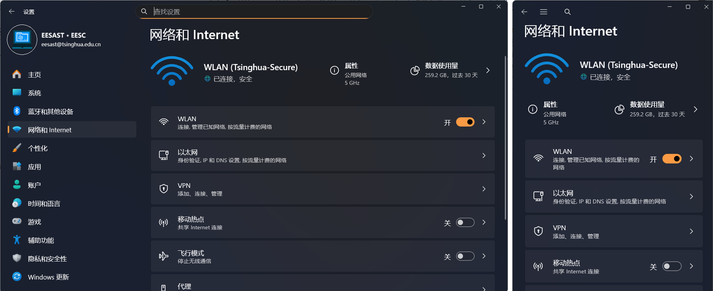

# 進階功能指引

## 目錄

[TOC]

## 學習目標

+ 透過同學的想像力與自由發揮，鍛鍊整體軟體工程能力

## 背景介紹

到目前為止，我們已完成雲端服務記錄分析系統的一些基礎功能。不過，同學先前都是沿著預先規劃的路徑開發，並依照指定要求撰寫程式碼。這有助於入門相關技術堆疊，卻不容易鍛鍊完整的軟體工程能力。

因此，本章將讓同學充分運用想像力、探索能力與自主學習能力，自由發揮並鍛鍊綜合能力。這也是整個 workshop 的精華所在。

## 本節任務

本章分為半命題與自由發揮兩部分。同學要從半命題部分挑選喜歡的功能實作，也可在自由發揮部分加入任何想完成的功能，最後撰寫專案介紹。

**注意：擴充本節功能時，部分功能可能必須調整原本過於簡單的介面，導致先前的單元測試無法通過，甚至無法編譯。因此，本節不要求通過先前提供的單元測試。** 如果發生編譯錯誤，可以手動修改 `dotnet-workshop.slnx`，從方案中移除以下單元測試專案：

```xml
<Solution>
  <Project Path="test-00-prepare/test-00-prepare.csproj" />
  <Project Path="test-01-basic/test-01-basic.csproj" />
  <Project Path="test-02-multithreading/test-02-multithreading.csproj" />
  <Project Path="test-03-async-grpc/test-03-async-grpc.csproj" />
  <Project Path="TestUtils/TestUtils.csproj" />
</Solution>
```

### （S5.1）Step 1：半命題部分

請從下列功能性與美觀性題目中**各選至少一題**實作；可以多選，但不會因此獲得額外分數。

#### （T5.1.a）功能性題目

功能型題目要求同學為系統加入更完整的新功能，並配合修改前端與後端。你將在 Agent 端編寫對應邏輯，視需要新增 RPC，再於 Client 端製作相應的使用者互動介面（只需實作圖形介面用戶端，不必再修改 `LocalCli` 與 `RemoteCli`）。

##### （T5.1.a.a）Parquet 檔案格式支援（Medium）

[Parquet](https://parquet.apache.org/) 是一種資料行式儲存格式，在雲端服務領域十分常用。無論是使用者資料或維運資料，許多人都會選擇這種格式。本課題的目標是讓雲端服務記錄解析系統支援 Parquet 檔案格式。同學需要參考 [Parquet 格式文件](https://parquet.apache.org/)，自行學習並了解該格式，再利用 .NET 社群的第三方實作（例如 [Parquet.Net](https://www.nuget.org/packages/Parquet.Net)、[ParquetSharp](https://www.nuget.org/packages/ParquetSharp)，或你在 [NuGet Gallery](https://www.nuget.org/) 找到的其他實作）完成以下功能：

+ 支援讀取與分析 Parquet 檔案：目前系統只支援格式固定的 `.log` 文字檔，請自行設計以 Parquet 為基礎的儲存格式，並支援讀取這類記錄檔
+ 支援產生 Parquet 檔案：將記錄分析結果寫入 Parquet 檔；用戶端可以向 Agent 指定要儲存的結果與路徑

##### （T5.1.a.b）用戶端身分驗證機制（Hard）

目前的系統存在許多問題。首先，用戶端缺乏身分驗證機制，任何人都能操控 Agent 進行記錄分析，因此很容易遭受攻擊。其次，如果多人同時連入 Agent 並進行操作，也會造成混亂。

本題要實作一套 token 機制。Agent 啟動時會產生一組隨機字串作為 token；用戶端的每項操作都必須攜帶有效 token。不同 token 代表不同使用者，各使用者的操作彼此獨立、互不干擾。

我們將 token 分為系統管理員與一般權限。一般權限 token 可執行各項記錄分析操作；系統管理員權限 token 除了具備所有一般權限外，還能建立或刪除其他 token，以及提升或降低其權限。Agent 啟動時產生的 token 具有系統管理員權限，並透過 `_logger` 以記錄形式輸出。

圖形介面用戶端也應加入相應的系統管理員視窗。

##### （T5.1.a.c）記錄的排序與查詢（Medium / Hard）

目前系統會一次顯示所有記錄，但實際上也可能需要排序與查詢，因此本題預計實作下列功能：

+ 依指定鍵排序記錄
+ 支援依條件查詢記錄：可依記錄類型（Call、Request、Internal）、時間範圍、來源服務（如 `gateway`）、記錄層級（如只查詢 `Warning`）或 Request ID 篩選

你需要在圖形介面程式中加入記錄排序功能，由 Agent 提供依不同條件查詢記錄的服務，並在顯示分析結果時加入條件查詢視窗。

實作方式與完成程度可依個人喜好自行決定。

##### （T5.1.a.d）雲端服務拓撲推斷及顯示（Medium / Hard）

在雲端服務的可觀測性領域，常見需求之一是：當服務之間的呼叫拓撲未知時，根據雲端服務記錄推斷其結構。本題的目標正是運用記錄完成這項推斷。

你需要實作下列功能：

+ 在 Agent 端，透過雲端服務的 Call 類型記錄，建置雲端服務的呼叫拓撲圖，推斷出雲端服務的拓撲結構，並記錄每一條邊都對應於哪些 Call 記錄
+ 在圖形介面用戶端加入雲端服務拓撲顯示功能。選取檔案後，使用者可透過按鈕或快顯功能表項目，從 Agent 取得拓撲資料並將其視覺化。每項雲端服務視為一個節點，服務之間的呼叫關係則視為有向邊。前端應使用簡單演算法安排合理的版面，避免顯示混亂。使用者也應能選取有向邊，從 Agent 取得並顯示該邊所對應的記錄。

#### （T5.1.b）美觀性題目

##### （T5.1.b.a）記錄更優顯示（Medium）

目前用戶端以清單方塊顯示記錄，但每一筆記錄都只是字串，不但不美觀，也不容易閱讀。

本題需要實作下列功能：

+ 以表格顯示記錄，每個鍵各占一欄。Message 中的 Method、Path、Exception Name、Target Service 等內容也各占一欄；
+ 醒目呈現不同的記錄層級。使用者在定位錯誤時，需要一眼辨識 Warning、Error 等層級。可讓表格中的 Severity 儲存格依層級使用不同背景色，也可用橢圓或圓角矩形包住層級文字：Info 使用藍色、Warning 使用橙色、Error 使用紅色。

##### （T5.1.b.b）控制項回應式版面配置（Medium）

在不同比例的顯示裝置上，相同的視窗與控制項版面配置會帶來不同的觀感。因此，許多應用程式與網站都會依顯示裝置的尺寸和比例調整控制項版面；行動裝置與桌面裝置的差異尤其明顯。例如，Windows 設定在不同視窗寬度下就採用不同的版面配置：



左側是寬視窗下的版面配置，右側是窄視窗下的版面配置。

現在請你實作這項功能：針對不同視窗寬度採用不同的版面配置，避免原有配置在窄視窗中難以操作。例如，視窗寬度大於或等於 640 時可沿用原配置，小於 640 時則切換至你設計的窄視窗配置。

##### （T5.1.b.c）美化與多佈景主題（Medium / Hard）

目前的控制項樣式定義於 `LogAnalyzerClient` 專案的 `Styles/Controls.axaml`，外觀相當簡單。本題要美化介面並支援多種佈景主題。

+ 美化圖形介面的色彩、按下效果、外框、漸層等元素。你也可以使用第三方程式庫提供的 UI 控制項，例如 [Material.Avalonia](https://github.com/AvaloniaCommunity/Material.Avalonia)、[FluentTheme](https://docs.avaloniaui.net/docs/styling/themes#fluent)、[其他第三方程式庫](https://docs.avaloniaui.net/docs/styling/themes)，或自行尋找合適的選擇
+ 介面必須支援切換多種佈景主題，讓使用者從選單列選擇白天、夜間、高對比、天空、海洋、星空或其他自訂主題；至少須提供三種佈景主題。

> [!NOTE]
>
> **任務 5.1（T5.1）**
>
> 請同學選擇適當的題目完成，在命題中的功能性和美觀性題目中分別各選擇至少一個命題來實作（即在功能性題目中至少選擇一個題目、美觀性題目中至少選擇一個題目）。
>

### （S5.2）Step 2：自由部分

本節可以自由選擇想要實作的功能：你可以自行設計喜歡的功能，也可以挑選半開放題目中尚未實作的一項，或在其中某項功能上進一步擴充。

此處對實作的功能難度要求並不高，難度與基礎功能部分中的 Medium 難度作業相似即可。

> [!NOTE]
>
> **任務 5.2（T5.2）**
>
> 請同學自由探索一個功能完成。

### （S5.3）Step 3：專案介紹

在完成前兩個步驟後，請同學寫一個專案介紹，裡面包括：

+ 程式如何編譯執行
+ 你實作了哪些功能？每個功能如何使用？必要時可以附上螢幕擷取畫面。
+ 你在實作的過程中，有多大程度上使用了 AI？如果使用了，你使用了什麼 AI？給了哪些提示詞？你認為 AI 給你提供的便利體現在哪些方面？
+ 其他在開發中取得到的經驗和心得。

> [!NOTE]
>
> **任務 5.3（T5.3）**
>
> 完成實作後，請將專案介紹寫入 `docs/05-advanced/report.md`。

> [!IMPORTANT]
>
> **關於大模型的使用**
>
> 大型語言模型確實帶來許多便利，未來能否熟練運用它也會是一項重要技能。但若未經思考便完全採用模型產生的文字，內容往往會充滿明顯的 AI 痕跡，最常見的問題是 **空泛、華而不實，而且文件不易閱讀**。因此，同學應確保自己的專案介紹清楚易讀，不要只依靠模型堆砌華麗詞藻而失去重點。當然，如果同學能妥善運用大型語言模型提升文件品質，我們十分鼓勵；辨別並改善文件品質（無論內容由人或大型語言模型撰寫）也是一項重要技能。

關於本節的任務配分等資訊，請參閱 [tasks.md](./tasks.md)。

## 結語

至此，你的開發之旅暫時告一段落，衷心希望你能夠從中得到一些收獲。

此外，也非常希望你在日後的開發工作中遇到相關的需求不知道怎麼寫或者 API 怎麼呼叫的時候，也能夠回來看一眼本 workshop 當初是如何寫的，這也是本 workshop 的目標之一。

最後，祝你愛上程式碼、開發愉快！

## 延伸閱讀

暫無，待補充

## 上一篇 / 下一篇

+ 上一篇：[Avalonia 任務](../04-avalonia/tasks.md)
+ 下一篇：[進階功能任務](./tasks.md)

